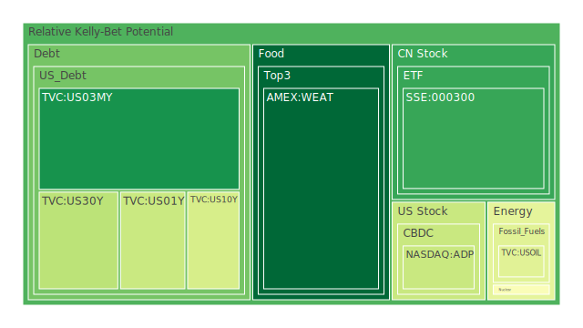
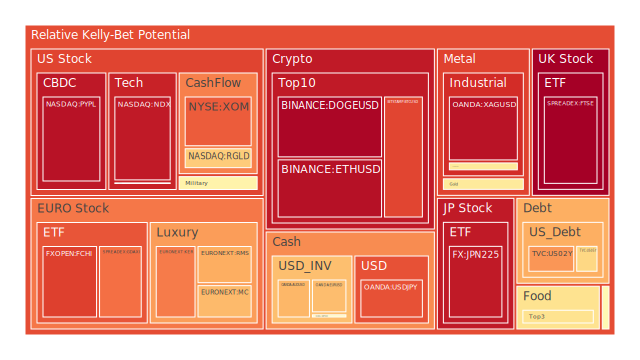
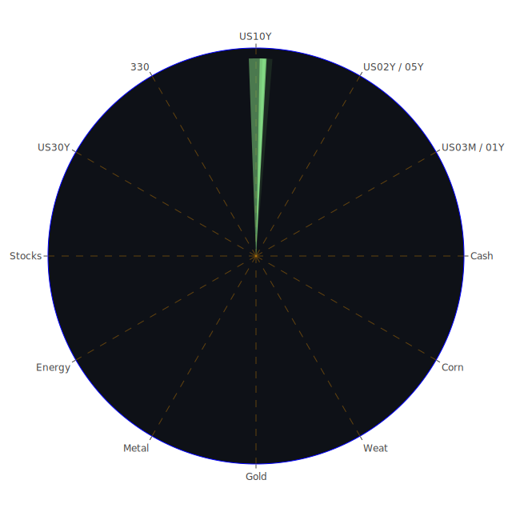

# 投資商品泡沫分析

## 美國國債
在過去三天內，美國國債的泡沫機率變化不大。30年期美國國債（TVC:US30Y）的泡沫機率從0.234136上升至0.343611，顯示出投資者對長期債券的需求有所增加。這可能與近期美國經濟數據顯示的經濟放緩有關，投資者轉向較為安全的資產。

## 加密貨幣
比特幣（BITSTAMP:BTCUSD）和以太坊（BINANCE:ETHUSD）的泡沫機率均持續上升，分別達到0.857914和0.956242。這表明市場對加密貨幣的投機情緒依然高漲。然而，近期新聞顯示，Salesforce和Walmart等大型企業的業績不佳，可能會對整體市場情緒產生負面影響，進而影響加密貨幣的價格。

## 美國科技股
納斯達克指數（NASDAQ:NDX）的泡沫機率高達0.937906，顯示出科技股存在較高的泡沫風險。Salesforce的業績不佳進一步加劇了市場對科技股的擔憂。建議投資者謹慎對待科技股，特別是那些泡沫機率較高的個股。

## 金/銀/銅
黃金（OANDA:XAUUSD）和白銀（OANDA:XAGUSD）的泡沫機率分別為0.566207和0.950340，顯示出貴金屬市場存在一定的泡沫風險。銅（FX:COPPER）的泡沫機率也有所上升，達到0.567565。近期的市場波動和經濟不確定性可能會推動貴金屬價格進一步上漲。

## 石油/鈾期貨
石油（TVC:USOIL）的泡沫機率穩定在0.419549，顯示出市場對能源價格的預期較為穩定。鈾期貨（COMEX:UX1!）的泡沫機率有所下降，從0.704024降至0.484291，這可能與能源市場的整體穩定有關。

## 各國大盤指數
德國DAX指數（SPREADEX:GDAXI）和法國CAC指數（FXOPEN:FCHI）的泡沫機率分別為0.789650和0.866573，顯示出歐洲主要股市存在較高的泡沫風險。英國FTSE指數（SPREADEX:FTSE）的泡沫機率更是高達0.990253，建議投資者謹慎對待歐洲股市。

## 美國軍工股
雷神技術公司（NYSE:RTX）和洛克希德馬丁（NYSE:LMT）的泡沫機率分別為0.510860和0.546994，顯示出軍工股的泡沫風險較低。近期美國國防部與Palantir簽訂的合同可能會進一步推動軍工股的表現。

## 各國外匯市場
美元兌日元（OANDA:USDJPY）的泡沫機率為0.838711，顯示出日元的貶值壓力較大。英鎊兌美元（OANDA:GBPUSD）的泡沫機率為0.524420，顯示出英鎊的市場情緒較為穩定。

## 美國電子支付股
PayPal（NASDAQ:PYPL）的泡沫機率高達0.953335，顯示出電子支付股存在較高的泡沫風險。建議投資者謹慎對待此類股票，特別是在市場情緒不穩定的情況下。

## 黃豆 / 小麥 / 玉米
黃豆（AMEX:SOYB）和玉米（AMEX:CORN）的泡沫機率分別為0.601626和0.559343，顯示出農產品市場存在一定的泡沫風險。小麥（AMEX:WEAT）的泡沫機率較低，為0.005666，顯示出市場對小麥價格的預期較為穩定。

## 石油防禦股
埃克森美孚（NYSE:XOM）的泡沫機率為0.820192，顯示出石油防禦股存在較高的泡沫風險。近期油價的波動可能會進一步影響這類股票的表現。

## 金礦防禦股
皇家黃金公司（NASDAQ:RGLD）的泡沫機率為0.635513，顯示出金礦防禦股存在一定的泡沫風險。近期黃金價格的上漲可能會推動這類股票的表現。

## 歐洲奢侈品股
歐洲奢侈品股如LVMH（EURONEXT:MC）和Kering（EURONEXT:KER）的泡沫機率分別為0.670632和0.771815，顯示出奢侈品市場存在較高的泡沫風險。近期的市場波動可能會對這類股票產生影響。

# 投資建議

1. **賣出建議**
   - **加密貨幣**：比特幣和以太坊的泡沫機率均高於0.85，建議投資者考慮賣出，以避免未來價格下跌的風險。
   - **美國科技股**：納斯達克指數的泡沫機率高達0.937906，建議投資者謹慎對待科技股，特別是那些泡沫機率較高的個股。
   - **歐洲股市**：德國DAX指數和法國CAC指數的泡沫機率均較高，建議投資者謹慎對待歐洲股市。

2. **買入建議**
   - **小麥**：小麥的泡沫機率僅為0.005666，顯示出市場對小麥價格的預期較為穩定，適合作為買入選項。

3. **觀望建議**
   - **美國國債**：美國國債的泡沫機率變化不大，建議投資者觀望。
   - **軍工股**：雷神技術公司和洛克希德馬丁的泡沫機率較低，建議投資者觀望。

# 風險提示

投資有風險，市場總是充滿不確定性。我們的建議僅供參考，投資者應根據自身的風險承受能力和投資目標，做出獨立的投資決策。

---

以上報告根據泡沫分數、FED關鍵數據及新聞現況進行綜合分析，旨在為投資者提供有價值的參考意見。請投資者謹慎決策，避免因市場波動而造成不必要的損失。
 
Daily Buy Map:

 
Daily Sell Map:

 
Daily Radar Chart:

 
