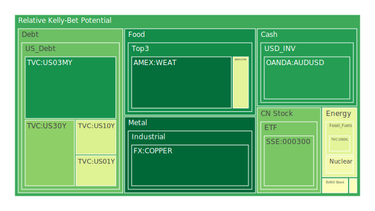
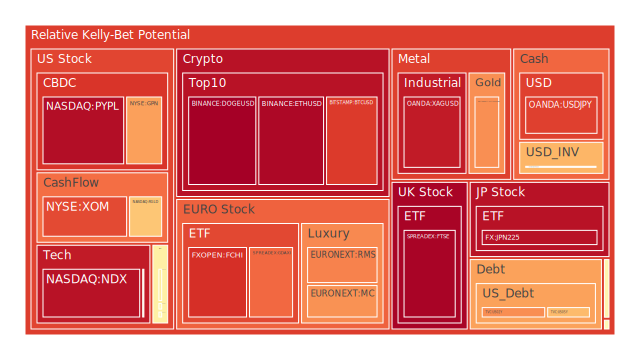
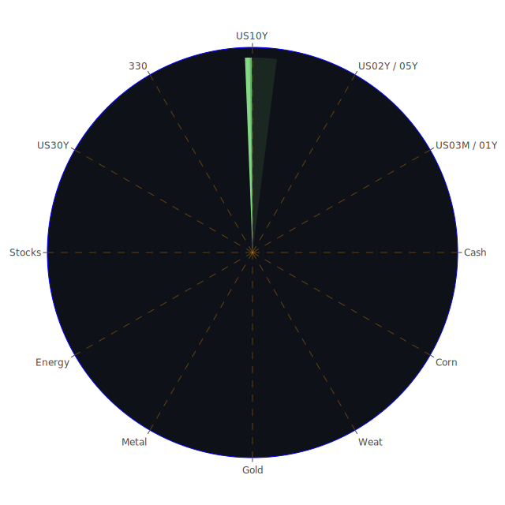

# 投資商品泡沫分析

## 美國國債
美國國債的泡沫機率在過去三天內有所波動，但整體趨勢相對穩定。根據FED的數據顯示，美國國債的長期收益率（10年期和30年期）在過去一週內略有上升，但短期收益率（1年期和2年期）則有所下降。這表明市場對於短期經濟前景的擔憂有所減少，但長期經濟不確定性依然存在。

## 加密貨幣
比特幣（BTCUSD）和以太坊（ETHUSD）的泡沫機率在過去三天內持續上升，且均高於0.85。新聞報導顯示，前德意志銀行投資銀行家因加密貨幣詐騙被判刑，這對市場情緒產生了負面影響。此外，特朗普媒體股價因特朗普被定罪而下跌，也對加密貨幣市場造成了一定的負面影響。

## 美國科技股
美國科技股（如NASDAQ:NDX）的泡沫機率在過去三天內持續上升，且均高於0.93。Salesforce和Dell的財報不佳，導致科技股整體下跌。這些負面新聞顯示出市場對於科技股的信心正在減弱。

## 金/銀/銅
黃金（XAUUSD）和白銀（XAGUSD）的泡沫機率在過去三天內均高於0.7，且有上升趨勢。銅（COPPER）的泡沫機率則相對較低，並且有下降趨勢。這表明市場對於避險資產的需求有所增加，而對於工業金屬的需求則有所減少。

## 石油/鈾期貨
石油（USOIL）的泡沫機率相對穩定，約為0.42。鈾期貨（UX1!）的泡沫機率在過去三天內有所下降，但仍高於0.45。這表明市場對於能源商品的需求相對穩定，但對於鈾的需求有所減少。

## 各國大盤指數
德國DAX指數（GDAXI）和法國CAC指數（FCHI）的泡沫機率均高於0.78，且有上升趨勢。這表明歐洲市場的風險正在增加。中國滬深300指數（000300）的泡沫機率則相對較低，但有上升趨勢。

## 美國軍工股
美國軍工股（如NYSE:RTX和NYSE:LMT）的泡沫機率相對穩定，約為0.51。這表明市場對於軍工股的需求相對穩定。

## 各國外匯市場
美元兌日元（USDJPY）和歐元兌美元（EURUSD）的泡沫機率均高於0.85，且有上升趨勢。這表明市場對於美元的需求有所增加，而對於其他主要貨幣的需求則有所減少。

## 美國電子支付股
美國電子支付股（如NASDAQ:PYPL）的泡沫機率在過去三天內持續上升，且均高於0.94。這表明市場對於電子支付股的信心正在減弱。

## 黃豆/小麥/玉米
黃豆（SOYB）和玉米（CORN）的泡沫機率在過去三天內有所下降，但仍高於0.5。小麥（WEAT）的泡沫機率則相對較低，且有下降趨勢。這表明市場對於農產品的需求相對穩定。

## 石油防禦股
石油防禦股（如NYSE:XOM）的泡沫機率在過去三天內有所下降，但仍高於0.83。這表明市場對於石油防禦股的需求有所減少。

## 金礦防禦股
金礦防禦股（如NASDAQ:RGLD）的泡沫機率在過去三天內有所下降，但仍高於0.63。這表明市場對於金礦防禦股的需求有所減少。

## 歐洲奢侈品股
歐洲奢侈品股（如EURONEXT:MC和EURONEXT:RMS）的泡沫機率均高於0.72，且有上升趨勢。這表明市場對於奢侈品股的需求有所增加。

# 投資建議

1. **賣出建議**：
   - **加密貨幣（BTCUSD, ETHUSD）**：由於泡沫機率持續上升且高於0.85，加上市場負面新聞影響，建議投資者考慮賣出以避免未來價格下跌時的損失。
   - **美國科技股（NASDAQ:NDX）**：由於泡沫機率持續上升且高於0.93，加上Salesforce和Dell的財報不佳，建議投資者考慮賣出。
   - **歐洲奢侈品股（EURONEXT:MC, EURONEXT:RMS）**：由於泡沫機率持續上升且高於0.72，建議投資者考慮賣出。

2. **買入建議**：
   - **小麥（WEAT）**：由於泡沫機率下降且低於0.5，加上市場對於農產品的需求相對穩定，建議投資者考慮買入。
   - **銅（COPPER）**：由於泡沫機率下降且低於0.3，建議投資者考慮買入。

3. **觀望建議**：
   - **美國國債**：由於泡沫機率相對穩定，建議投資者觀望，不要有任何動作。
   - **美國軍工股（NYSE:RTX, NYSE:LMT）**：由於泡沫機率相對穩定，建議投資者觀望，不要有任何動作。

# 風險提示

投資有風險，市場總是充滿不確定性。我們的建議僅供參考，投資者應根據自身的風險承受能力和投資目標，做出獨立的投資決策。特別是對於泡沫機率高的商品，應該謹慎進行投資決策。
 
Daily Buy Map:

 
Daily Sell Map:

 
Daily Radar Chart:

 
