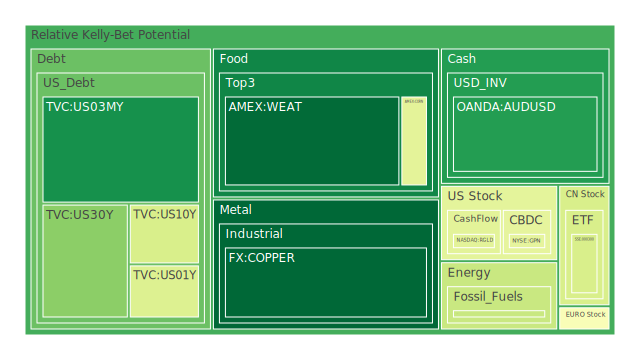
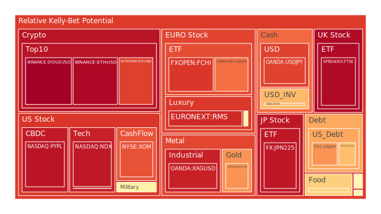
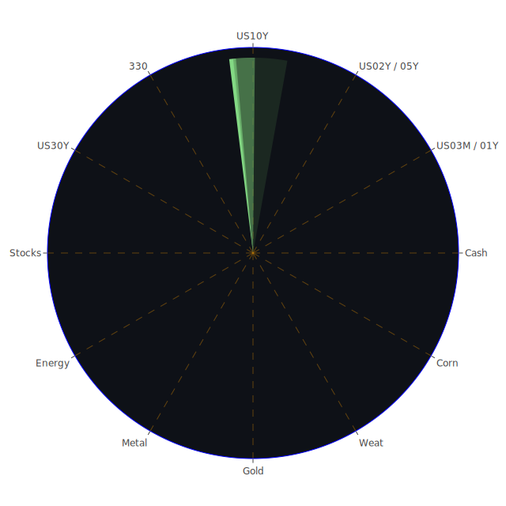

# 投資商品泡沫分析

## 美國國債

根據最新的泡沫分數數據，美國國債的泡沫機率在過去三天內有所波動。30年期國債（TVC:US30Y）的泡沫機率在0.25左右，10年期國債（TVC:US10Y）則在0.29左右，顯示出相對穩定的趨勢。聯邦儲備系統（FED）的關鍵數據顯示，總資產處於較低水平，這可能會對國債市場產生一定的壓力。

## 加密貨幣

比特幣（BITSTAMP:BTCUSD）和以太坊（BINANCE:ETHUSD）的泡沫機率分別為0.86和0.95，顯示出高泡沫風險。近期新聞顯示，加密貨幣市場受到多重負面消息影響，包括特朗普的刑事定罪和美國股市的波動，這些因素可能進一步加劇市場的不確定性。

## 美國科技股

美國科技股的泡沫機率普遍較高，納斯達克指數（NASDAQ:NDX）的泡沫機率在0.93左右。新聞報導顯示，Salesforce和Dell的財報不如預期，導致科技股普遍下跌。這些負面消息可能會進一步影響市場情緒，建議投資者謹慎操作。

## 金/銀/銅

黃金（OANDA:XAUUSD）的泡沫機率在0.73左右，銀（OANDA:XAGUSD）則高達0.92，顯示出較高的泡沫風險。銅（FX:COPPER）的泡沫機率則顯著下降至0.002，顯示出投資機會。近期新聞顯示，金屬市場受到多重因素影響，包括地緣政治風險和市場需求波動。

## 石油/鈾期貨UX!

石油（TVC:USOIL）的泡沫機率在0.36左右，顯示出相對穩定的趨勢。鈾期貨（COMEX:UX1!）的泡沫機率在0.50左右，建議觀望。近期新聞顯示，石油市場受到供應鏈問題和地緣政治風險影響，投資者應謹慎操作。

## 各國大盤指數

德國DAX指數（SPREADEX:GDAXI）的泡沫機率在0.78左右，顯示出較高的泡沫風險。法國CAC指數（FXOPEN:FCHI）和日本日經指數（FX:JPN225）的泡沫機率分別為0.87和0.93，顯示出高泡沫風險。近期新聞顯示，歐洲和亞洲市場受到多重負面消息影響，包括地緣政治風險和經濟數據不佳。

## 美國軍工股

雷神技術公司（NYSE:RTX）和洛克希德·馬丁公司（NYSE:LMT）的泡沫機率在0.51左右，顯示出相對穩定的趨勢。近期新聞顯示，軍工股受到美國國防部合同的積極影響，這可能會對市場情緒產生正面影響。

## 各國外匯市場

美元兌日元（OANDA:USDJPY）的泡沫機率在0.85左右，顯示出高泡沫風險。歐元兌美元（OANDA:EURUSD）的泡沫機率在0.66左右，顯示出相對穩定的趨勢。近期新聞顯示，外匯市場受到多重因素影響，包括地緣政治風險和經濟數據波動。

## 美國電子支付股

PayPal（NASDAQ:PYPL）的泡沫機率在0.94左右，顯示出高泡沫風險。近期新聞顯示，電子支付市場受到多重負面消息影響，包括技術股的普遍下跌和市場需求波動。

## 黃豆 / 小麥 / 玉米

黃豆（AMEX:SOYB）的泡沫機率在0.62左右，小麥（AMEX:WEAT）和玉米（AMEX:CORN）的泡沫機率分別在0.01和0.42左右，顯示出相對穩定的趨勢。近期新聞顯示，農產品市場受到供應鏈問題和氣候變化影響，投資者應謹慎操作。

## 石油防禦股

埃克森美孚（NYSE:XOM）的泡沫機率在0.83左右，顯示出高泡沫風險。近期新聞顯示，石油市場受到供應鏈問題和地緣政治風險影響，投資者應謹慎操作。

## 金礦防禦股

Royal Gold（NASDAQ:RGLD）的泡沫機率在0.42左右，顯示出相對穩定的趨勢。近期新聞顯示，金礦市場受到多重因素影響，包括地緣政治風險和市場需求波動。

## 歐洲奢侈品股

歐洲奢侈品股的泡沫機率普遍較高，LVMH（EURONEXT:MC）的泡沫機率在0.53左右，Kering（EURONEXT:KER）和Hermès（EURONEXT:RMS）的泡沫機率分別在0.47和0.90左右。近期新聞顯示，奢侈品市場受到多重因素影響，包括經濟數據波動和市場需求變化。

# 投資建議

1. **賣出建議**：對於泡沫機率持續上升且遠大於0.5的商品，如比特幣、以太坊、美國科技股和歐洲奢侈品股，建議投資者考慮賣出，以避免未來價格下跌時的損失。近期新聞顯示，這些市場受到多重負面消息影響，投資者應謹慎操作。

2. **買入建議**：對於泡沫機率下降且遠小於0.5的商品，如銅和黃豆，建議投資者考慮買入。近期新聞顯示，這些市場受到供應鏈問題和市場需求波動影響，投資者可以考慮在價格較低時買入。

3. **觀望建議**：對於泡沫分數在0.5左右的商品，如美國國債和軍工股，建議投資者觀望，不要有任何動作。近期新聞顯示，這些市場相對穩定，投資者可以等待更明確的市場信號再做決定。

# 風險提示

投資有風險，市場總是充滿不確定性。我們的建議僅供參考，投資者應根據自身的風險承受能力和投資目標，做出獨立的投資決策。特別是對於泡沫機率高的商品，應該謹慎進行投資決策。
 
Daily Buy Map:

 
Daily Sell Map:

 
Daily Radar Chart:

 
