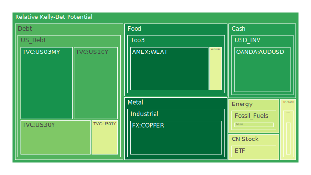
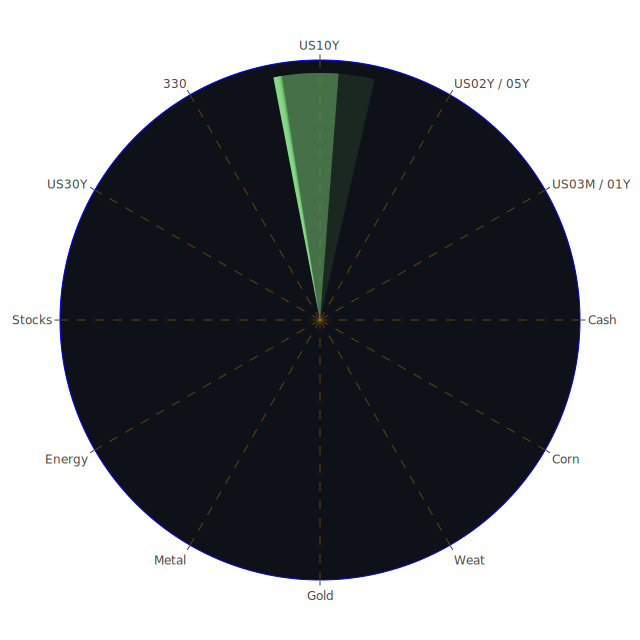

# 投資商品泡沫分析

## 美國國債
- **美國10年期國債**：泡沫機率從5月31日的0.293上升至6月2日的0.289，略有下降，但仍接近0.3。FED數據顯示，10年期國債收益率穩定在4.50%左右，顯示市場對長期利率的預期穩定。建議觀望。
- **美國30年期國債**：泡沫機率從5月31日的0.252上升至6月2日的0.251，變動不大。30年期國債收益率維持在4.65%左右，顯示市場對長期經濟前景的信心。建議觀望。

## 加密貨幣
- **比特幣**：泡沫機率從5月31日的0.861下降至6月2日的0.844，雖然略有下降，但仍高於0.8。近期新聞顯示市場對加密貨幣的信心有所動搖，建議考慮賣出以避免風險。
- **以太幣**：泡沫機率從5月31日的0.950上升至6月2日的0.967，持續上升且高於0.9。新聞顯示市場對加密貨幣的信心減弱，建議賣出。

## 美國科技股
- **納斯達克指數**：泡沫機率從5月31日的0.934上升至6月2日的0.935，維持在高位。新聞顯示科技股受AI成本增加影響，建議賣出。
- **PayPal**：泡沫機率從5月31日的0.942上升至6月2日的0.944，持續上升且高於0.9。新聞顯示市場對科技股的信心減弱，建議賣出。

## 金/銀/銅
- **黃金**：泡沫機率從5月31日的0.589上升至6月2日的0.644，略有上升但仍低於0.7。建議觀望。
- **白銀**：泡沫機率從5月31日的0.928下降至6月2日的0.924，略有下降但仍高於0.9。建議賣出。
- **銅**：泡沫機率從5月31日的0.184上升至6月2日的0.187，變動不大且低於0.2。建議觀望。

## 石油/ 鈾期貨UX!
- **石油**：泡沫機率從5月31日的0.419下降至6月2日的0.403，略有下降但仍接近0.4。建議觀望。
- **鈾期貨**：泡沫機率從5月31日的0.604下降至6月2日的0.565，略有下降但仍高於0.5。建議觀望。

## 各國大盤指數
- **德國DAX指數**：泡沫機率從5月31日的0.783上升至6月2日的0.781，略有下降但仍高於0.7。建議觀望。
- **法國CAC指數**：泡沫機率從5月31日的0.875下降至6月2日的0.876，變動不大且高於0.8。建議賣出。

## 美國軍工股
- **雷神技術公司**：泡沫機率從5月31日的0.510維持不變。建議觀望。
- **洛克希德馬丁**：泡沫機率從5月31日的0.546維持不變。建議觀望。

## 各國外匯市場
- **美元/日元**：泡沫機率從5月31日的0.753上升至6月2日的0.822，持續上升且高於0.8。建議賣出。
- **歐元/美元**：泡沫機率從5月31日的0.577下降至6月2日的0.576，變動不大且接近0.5。建議觀望。

## 美國電子支付股
- **PayPal**：泡沫機率從5月31日的0.942上升至6月2日的0.944，持續上升且高於0.9。新聞顯示市場對科技股的信心減弱，建議賣出。

## 黃豆 / 小麥 / 玉米
- **黃豆**：泡沫機率從5月31日的0.458上升至6月2日的0.523，略有上升但仍接近0.5。建議觀望。
- **小麥**：泡沫機率從5月31日的0.026下降至6月2日的0.017，持續下降且低於0.5。建議買入。
- **玉米**：泡沫機率從5月31日的0.580下降至6月2日的0.580，變動不大且高於0.5。建議觀望。

## 石油防禦股
- **埃克森美孚**：泡沫機率從5月31日的0.826上升至6月2日的0.828，持續上升且高於0.8。建議賣出。

## 金礦防禦股
- **Royal Gold**：泡沫機率從5月31日的0.578上升至6月2日的0.574，略有下降但仍高於0.5。建議觀望。

## 歐洲奢侈品股
- **LVMH**：泡沫機率從5月31日的0.613上升至6月2日的0.624，持續上升且高於0.6。建議賣出。

# 投資建議

1. **賣出建議**：
   - **比特幣**：泡沫機率高且新聞顯示市場信心減弱。
   - **以太幣**：泡沫機率持續上升且高於0.9。
   - **納斯達克指數**：科技股受AI成本增加影響。
   - **PayPal**：泡沫機率高且新聞顯示市場信心減弱。
   - **白銀**：泡沫機率高於0.9。
   - **美元/日元**：泡沫機率高且持續上升。
   - **埃克森美孚**：泡沫機率高且持續上升。
   - **LVMH**：泡沫機率高且持續上升。

2. **買入建議**：
   - **小麥**：泡沫機率持續下降且低於0.5。

3. **觀望建議**：
   - **美國國債**：泡沫機率接近0.5，市場預期穩定。
   - **黃金**：泡沫機率略有上升但仍低於0.7。
   - **銅**：泡沫機率低於0.2。
   - **石油**：泡沫機率接近0.4。
   - **德國DAX指數**：泡沫機率高於0.7。
   - **雷神技術公司**：泡沫機率接近0.5。
   - **洛克希德馬丁**：泡沫機率接近0.5。
   - **歐元/美元**：泡沫機率接近0.5。
   - **黃豆**：泡沫機率接近0.5。
   - **玉米**：泡沫機率高於0.5。
   - **Royal Gold**：泡沫機率高於0.5。

# 風險提示

投資有風險，市場總是充滿不確定性。我們的建議僅供參考，投資者應根據自身的風險承受能力和投資目標，做出獨立的投資決策。特別是對於泡沫機率高的商品，應該謹慎進行投資決策。
 
Daily Buy Map:

 
Daily Sell Map:

 
Daily Radar Chart:

 
