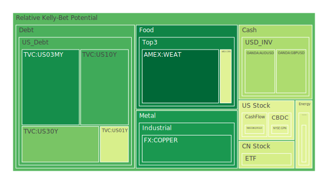
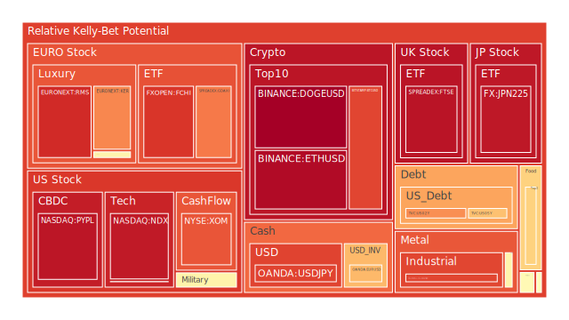
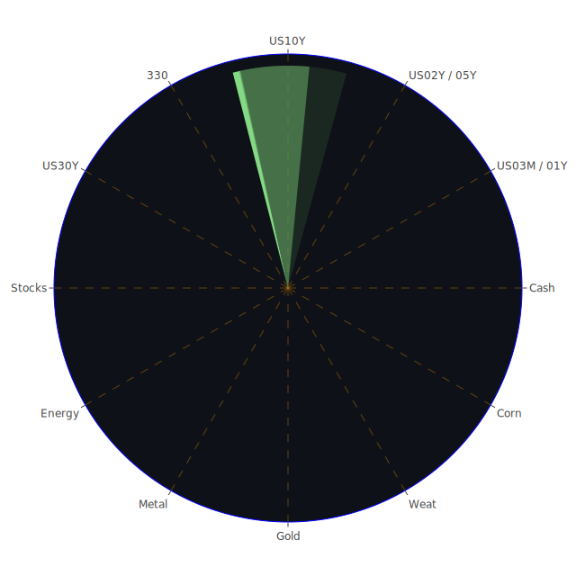

# 投資商品泡沫分析

## 美國國債
過去三天內，美國國債的泡沫機率變化不大。10年期國債（TVC:US10Y）的泡沫機率在0.29左右，30年期國債（TVC:US30Y）則在0.25左右。這些數據顯示，美國國債市場相對穩定，沒有明顯的泡沫風險。

## 加密貨幣
比特幣（BITSTAMP:BTCUSD）和以太坊（BINANCE:ETHUSD）的泡沫機率持續高企，分別在0.86和0.96左右。這表明加密貨幣市場存在較高的泡沫風險。新聞報導顯示，儘管市場情緒有所波動，但整體趨勢仍然支持高風險。

## 美國科技股
美國科技股（NASDAQ:NDX）的泡沫機率在0.93左右，顯示出較高的泡沫風險。Meta（Facebook）的年輕用戶數量增加，這對市場情緒有正面影響，但整體泡沫風險仍然較高。

## 金/銀/銅
黃金（OANDA:XAUUSD）和白銀（OANDA:XAGUSD）的泡沫機率分別在0.53和0.92左右。銅（FX:COPPER）的泡沫機率則較低，在0.17左右。這表明貴金屬市場存在一定的泡沫風險，特別是白銀。

## 石油/ 鈾期貨UX!
石油（TVC:USOIL）的泡沫機率在0.41左右，顯示出中等風險。鈾期貨（COMEX:UX1!）的泡沫機率在0.54左右，顯示出較高的風險。

## 各國大盤指數
德國DAX指數（SPREADEX:GDAXI）的泡沫機率在0.78左右，顯示出較高的泡沫風險。法國CAC指數（FXOPEN:FCHI）和英國FTSE指數（SPREADEX:FTSE）的泡沫機率也較高，分別在0.88和0.94左右。

## 美國軍工股
雷神技術公司（NYSE:RTX）和洛克希德馬丁公司（NYSE:LMT）的泡沫機率分別在0.51和0.54左右，顯示出中等風險。

## 各國外匯市場
美元兌日元（OANDA:USDJPY）的泡沫機率在0.86左右，顯示出較高的風險。歐元兌美元（OANDA:EURUSD）的泡沫機率在0.67左右，顯示出中等風險。

## 美國電子支付股
PayPal（NASDAQ:PYPL）的泡沫機率在0.94左右，顯示出較高的風險。Global Payments（NYSE:GPN）的泡沫機率在0.54左右，顯示出中等風險。

## 黃豆 / 小麥 / 玉米
黃豆（AMEX:SOYB）的泡沫機率在0.62左右，小麥（AMEX:WEAT）則在0.01左右，顯示出較低的風險。玉米（AMEX:CORN）的泡沫機率在0.42左右，顯示出中等風險。

## 石油防禦股
埃克森美孚（NYSE:XOM）的泡沫機率在0.83左右，顯示出較高的風險。

## 金礦防禦股
Royal Gold（NASDAQ:RGLD）的泡沫機率在0.54左右，顯示出中等風險。

## 歐洲奢侈品股
LVMH（EURONEXT:MC）和Kering（EURONEXT:KER）的泡沫機率分別在0.53和0.75左右，顯示出中等至高風險。

# 投資建議

## 賣出建議
- **加密貨幣**：比特幣和以太坊的泡沫機率持續高企，建議考慮賣出以避免未來價格下跌的風險。
- **美國科技股**：NASDAQ指數的泡沫風險較高，建議考慮賣出部分科技股以鎖定收益。
- **白銀**：OANDA:XAGUSD的泡沫機率較高，建議考慮賣出部分白銀持倉。
- **石油防禦股**：埃克森美孚的泡沫風險較高，建議考慮賣出部分持倉。

## 買入建議
- **小麥**：AMEX:WEAT的泡沫機率極低，且新聞報導顯示農業市場穩定，建議考慮買入。
- **銅**：FX:COPPER的泡沫機率較低，且市場需求穩定，建議考慮買入。

## 觀望建議
- **美國國債**：泡沫風險較低，但市場情緒不明朗，建議觀望。
- **黃金**：OANDA:XAUUSD的泡沫風險中等，建議觀望。
- **美國軍工股**：泡沫風險中等，建議觀望。

# 風險提示

投資有風險，市場總是充滿不確定性。我們的建議僅供參考，投資者應根據自身的風險承受能力和投資目標，做出獨立的投資決策。特別是對於泡沫機率高的商品，應該謹慎進行投資決策。
 
Daily Buy Map:

 
Daily Sell Map:

 
Daily Radar Chart:

 
