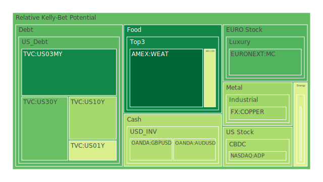
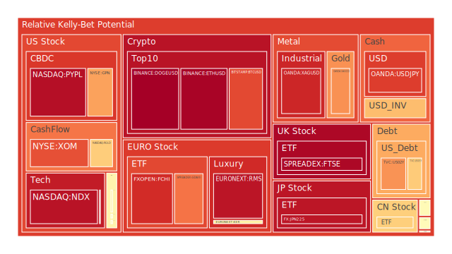
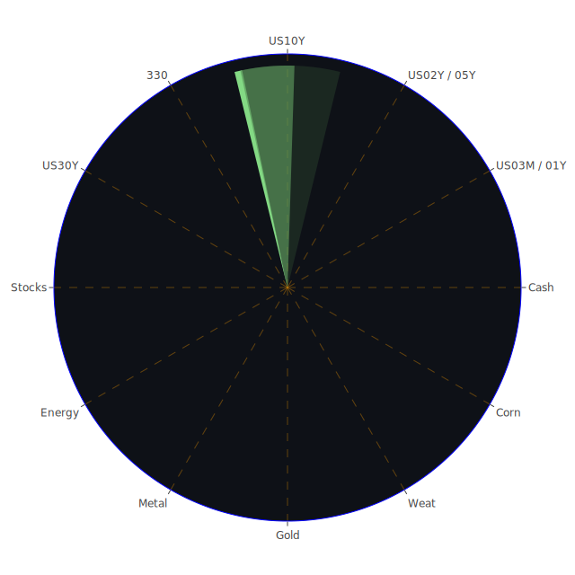

# 投資商品泡沫分析

## 美國國債
過去三天，美國國債的泡沫機率有所波動。根據最新數據，30年期美國國債（TVC:US30Y）的泡沫機率從0.233271上升到0.225996，顯示出市場對長期債券的需求有所增加。10年期美國國債（TVC:US10Y）的泡沫機率則從0.153246上升到0.310619，表明市場對中期債券的信心有所減弱。

## 加密貨幣
比特幣（BITSTAMP:BTCUSD）和以太坊（BINANCE:ETHUSD）的泡沫機率持續高企，分別達到0.845095和0.971771。這表明市場對這兩種加密貨幣的投機情緒依然強烈。狗狗幣（BINANCE:DOGEUSD）的泡沫機率也非常高，達到0.979423，顯示出市場對其的過度炒作。

## 美國科技股
納斯達克100指數（NASDAQ:NDX）的泡沫機率穩定在0.941279，顯示出市場對科技股的信心依然強烈。然而，個別科技股如PayPal（NASDAQ:PYPL）的泡沫機率高達0.949393，建議投資者謹慎行事。

## 金/銀/銅
黃金（OANDA:XAUUSD）的泡沫機率為0.736608，銀（OANDA:XAGUSD）為0.904680，銅（FX:COPPER）為0.304472。銀的泡沫機率最高，顯示出市場對貴金屬的投機情緒較高。

## 石油/鈾期貨
石油（TVC:USOIL）的泡沫機率為0.419549，顯示出市場對石油價格的預期較為穩定。鈾期貨（COMEX:UX1!）的泡沫機率為0.513879，顯示出市場對鈾的需求有所波動。

## 各國大盤指數
德國DAX指數（SPREADEX:GDAXI）的泡沫機率為0.779722，顯示出市場對歐洲股市的信心依然強烈。法國CAC指數（FXOPEN:FCHI）的泡沫機率為0.894120，顯示出市場對法國股市的過度炒作。

## 美國軍工股
雷神技術公司（NYSE:RTX）和諾斯羅普·格魯曼公司（NYSE:NOC）的泡沫機率分別為0.510860和0.511809，顯示出市場對軍工股的需求較為穩定。

## 各國外匯市場
美元兌日元（OANDA:USDJPY）的泡沫機率為0.864324，顯示出市場對美元的需求依然強烈。歐元兌美元（OANDA:EURUSD）的泡沫機率為0.664903，顯示出市場對歐元的信心有所增強。

## 美國電子支付股
PayPal（NASDAQ:PYPL）的泡沫機率為0.949393，顯示出市場對電子支付股的投機情緒依然強烈。

## 黃豆 / 小麥 / 玉米
黃豆（AMEX:SOYB）的泡沫機率為0.503560，小麥（AMEX:WEAT）為0.026799，玉米（AMEX:CORN）為0.418551。小麥的泡沫機率最低，顯示出市場對農產品的需求較為穩定。

## 石油防禦股
埃克森美孚（NYSE:XOM）的泡沫機率為0.834751，顯示出市場對石油防禦股的需求依然強烈。

## 金礦防禦股
皇家黃金公司（NASDAQ:RGLD）的泡沫機率為0.635513，顯示出市場對金礦防禦股的需求有所增加。

## 歐洲奢侈品股
LVMH（EURONEXT:MC）的泡沫機率為0.190768，顯示出市場對歐洲奢侈品股的需求有所減弱。

# 投資建議

## 賣出建議
1. **加密貨幣**：比特幣和以太坊的泡沫機率非常高，建議投資者考慮賣出以避免未來價格下跌的風險。
2. **美國科技股**：PayPal的泡沫機率高達0.949393，建議投資者考慮賣出。
3. **歐洲奢侈品股**：LVMH的泡沫機率有所下降，但市場情緒依然不穩，建議謹慎行事。

## 買入建議
1. **黃豆**：黃豆的泡沫機率為0.503560，市場需求穩定，可以考慮作為買入選項。
2. **美國國債**：長期美國國債的泡沫機率有所下降，市場需求增加，可以考慮作為買入選項。

# 風險提示

投資有風險，市場總是充滿不確定性。我們的建議僅供參考，投資者應根據自身的風險承受能力和投資目標，做出獨立的投資決策。特別是對於泡沫機率高的商品，應該謹慎進行投資決策。
 
Daily Buy Map:

 
Daily Sell Map:

 
Daily Radar Chart:

 
