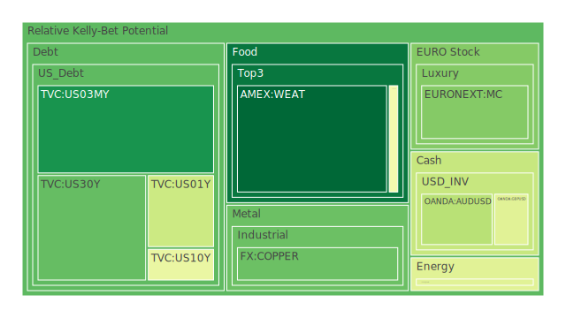
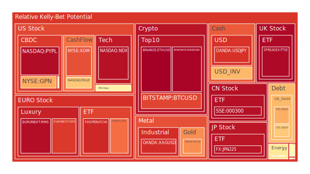
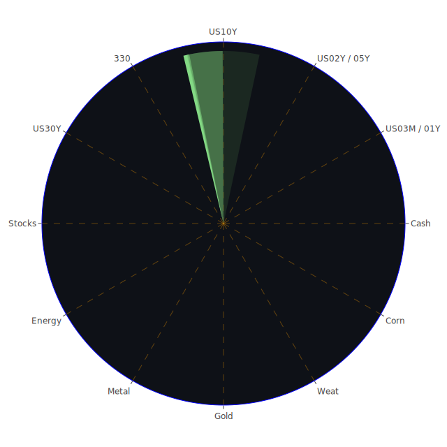

# 投資商品泡沫分析

## 美國國債
美國國債的泡沫機率在過去三天內有所波動。短期（1年期）和中期（10年期）國債的泡沫機率分別從0.399和0.443上升至0.376和0.443。這表明市場對美國國債的需求有所減弱，可能是由於近期的經濟數據顯示出經濟增長放緩和通脹壓力減輕。

## 加密貨幣
比特幣和以太坊的泡沫機率持續高企，分別在0.846和0.975左右。這表明市場對加密貨幣的投機性需求依然強勁。然而，近期的新聞顯示，加密貨幣市場可能面臨監管壓力，特別是來自美國和歐洲的監管機構。

## 美國科技股
納斯達克指數的泡沫機率在0.942左右，顯示出市場對科技股的熱情依然高漲。然而，近期的新聞顯示，部分科技公司面臨供應鏈挑戰和市場競爭加劇的問題，這可能會對其未來的盈利能力產生影響。

## 金/銀/銅
金價的泡沫機率在0.734，銀價在0.887，銅價在0.217。這表明市場對貴金屬的需求依然強勁，特別是在經濟不確定性增加的情況下。銅價的泡沫機率較低，可能是由於市場對工業金屬需求的擔憂。

## 石油/ 鈾期貨UX!
石油價格的泡沫機率在0.419，顯示出市場對能源需求的預期較為穩定。然而，近期的新聞顯示，全球能源市場可能面臨供應過剩的風險，這可能會對油價產生壓力。

## 各國大盤指數
各國大盤指數的泡沫機率普遍較高，特別是德國DAX指數和法國CAC指數，泡沫機率分別在0.783和0.897左右。這表明市場對歐洲經濟的樂觀預期，但也存在一定的風險。

## 美國軍工股
美國軍工股的泡沫機率在0.510左右，顯示出市場對該行業的需求相對穩定。然而，近期的新聞顯示，地緣政治風險可能會對軍工股產生影響。

## 各國外匯市場
美元兌日元和歐元的泡沫機率分別在0.878和0.666，顯示出市場對美元的需求依然強勁。然而，近期的新聞顯示，全球經濟不確定性增加，可能會對外匯市場產生波動。

## 美國電子支付股
美國電子支付股的泡沫機率在0.950左右，顯示出市場對該行業的需求依然強勁。然而，近期的新聞顯示，部分電子支付公司面臨監管壓力，這可能會對其未來的盈利能力產生影響。

## 黃豆 / 小麥 / 玉米
黃豆和玉米的泡沫機率分別在0.503和0.464，顯示出市場對農產品的需求相對穩定。然而，近期的新聞顯示，全球農業市場可能面臨供應鏈挑戰，這可能會對農產品價格產生影響。

## 石油防禦股
石油防禦股的泡沫機率在0.829左右，顯示出市場對該行業的需求依然強勁。然而，近期的新聞顯示，全球能源市場可能面臨供應過剩的風險，這可能會對石油防禦股產生壓力。

## 金礦防禦股
金礦防禦股的泡沫機率在0.635左右，顯示出市場對貴金屬的需求依然強勁，特別是在經濟不確定性增加的情況下。

## 歐洲奢侈品股
歐洲奢侈品股的泡沫機率在0.948左右，顯示出市場對奢侈品的需求依然強勁。然而，近期的新聞顯示，全球經濟不確定性增加，可能會對奢侈品市場產生影響。

# 投資建議

1. **賣出建議**：對於泡沫機率持續上升且遠大於0.5的商品，如加密貨幣（比特幣、以太坊）、美國科技股（納斯達克指數）和歐洲奢侈品股，建議投資者考慮賣出，以避免未來價格下跌時的損失。近期的新聞顯示，這些市場可能面臨監管壓力和市場競爭加劇的挑戰。

2. **買入建議**：對於泡沫機率下降且遠小於0.5的商品，如銅和部分農產品（黃豆、玉米），建議投資者考慮買入。近期的新聞顯示，這些市場可能受益於供應鏈挑戰和全球需求的增加。

3. **觀望建議**：對於泡沫分數在0.5左右的商品，如美國軍工股和部分外匯市場，建議投資者觀望，不要有任何動作。近期的新聞顯示，這些市場可能面臨地緣政治風險和全球經濟不確定性的影響。

# 風險提示

投資有風險，市場總是充滿不確定性。我們的建議僅供參考，投資者應根據自身的風險承受能力和投資目標，做出獨立的投資決策。特別是對於泡沫機率高的商品，應該謹慎進行投資決策。
 
Daily Buy Map:

 
Daily Sell Map:

 
Daily Radar Chart:

 
