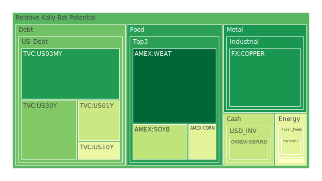
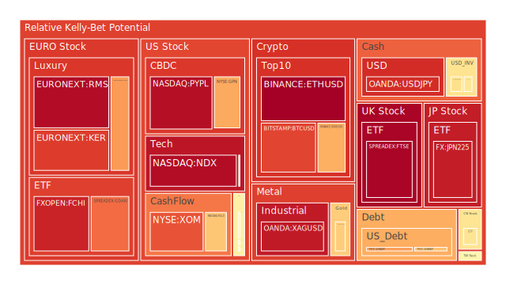
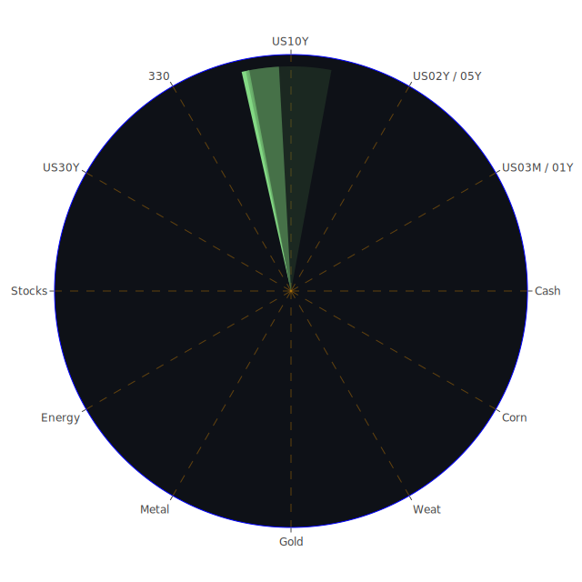

# 投資商品泡沫分析

## 美國國債
- **10年期國債 (TVC:US10Y)**：泡沫機率在過去3天內略有上升，從0.310619上升到0.439261。根據新聞和FED數據，市場對於未來經濟的不確定性增加，導致投資者對長期國債的需求上升。
- **30年期國債 (TVC:US30Y)**：泡沫機率在過去3天內略有下降，從0.225996下降到0.241115。FED數據顯示，長期利率的下降可能反映了市場對未來經濟增長的擔憂。

## 加密貨幣
- **比特幣 (BITSTAMP:BTCUSD)**：泡沫機率在過去3天內略有下降，但仍然高達0.844487。新聞顯示市場對加密貨幣的興趣依然高漲，但需要注意市場波動性。
- **以太坊 (BINANCE:ETHUSD)**：泡沫機率在過去3天內略有下降，但仍然高達0.973224。市場對以太坊的需求依然強勁，特別是在DeFi和NFT領域的應用增加。

## 美國科技股
- **納斯達克100指數 (NASDAQ:NDX)**：泡沫機率在過去3天內略有下降，但仍然高達0.946143。科技股在FED可能放鬆貨幣政策的預期下表現強勁，但需要警惕高估值風險。

## 金/銀/銅
- **黃金 (OANDA:XAUUSD)**：泡沫機率在過去3天內略有下降，但仍然高達0.622729。黃金作為避險資產的需求依然強勁，特別是在市場不確定性增加的情況下。
- **白銀 (OANDA:XAGUSD)**：泡沫機率在過去3天內略有下降，但仍然高達0.919949。白銀的工業需求和避險屬性使其在市場波動中表現出色。
- **銅 (FX:COPPER)**：泡沫機率在過去3天內略有下降，但仍然高達0.098443。銅的需求主要來自於工業生產，特別是在新能源領域的應用。

## 石油/ 鈾期貨UX!
- **石油 (TVC:USOIL)**：泡沫機率在過去3天內保持穩定，約為0.419549。石油價格受到全球經濟活動和供需平衡的影響。
- **鈾期貨 (COMEX:UX1!)**：泡沫機率在過去3天內略有下降，但仍然高達0.488482。鈾的需求主要來自於核能發電，市場對其未來需求存在不確定性。

## 各國大盤指數
- **德國DAX指數 (SPREADEX:GDAXI)**：泡沫機率在過去3天內略有下降，但仍然高達0.782491。德國經濟的穩定性和歐洲市場的整體表現對DAX指數有重要影響。
- **法國CAC指數 (FXOPEN:FCHI)**：泡沫機率在過去3天內略有下降，但仍然高達0.902242。法國市場的表現受到歐洲經濟和政治局勢的影響。

## 美國軍工股
- **雷神公司 (NYSE:RTX)**：泡沫機率在過去3天內保持穩定，約為0.510860。軍工股的需求主要來自於政府的國防預算和全球地緣政治局勢。
- **洛克希德馬丁 (NYSE:LMT)**：泡沫機率在過去3天內保持穩定，約為0.546994。軍工股的需求主要來自於政府的國防預算和全球地緣政治局勢。

## 各國外匯市場
- **美元/日元 (OANDA:USDJPY)**：泡沫機率在過去3天內略有下降，但仍然高達0.884863。日元作為避險貨幣的需求在市場不確定性增加時上升。
- **歐元/美元 (OANDA:EURUSD)**：泡沫機率在過去3天內略有下降，但仍然高達0.584154。歐元的需求受到歐洲經濟和政治局勢的影響。

## 美國電子支付股
- **PayPal (NASDAQ:PYPL)**：泡沫機率在過去3天內略有下降，但仍然高達0.942853。電子支付行業的需求在數字化轉型和電子商務的推動下持續增長。

## 黃豆 / 小麥 / 玉米
- **黃豆 (AMEX:SOYB)**：泡沫機率在過去3天內略有下降，但仍然高達0.342968。農產品的需求受到全球氣候變化和供需平衡的影響。
- **小麥 (AMEX:WEAT)**：泡沫機率在過去3天內略有下降，但仍然高達0.004684。小麥的需求主要來自於食品行業和全球糧食安全的考量。
- **玉米 (AMEX:CORN)**：泡沫機率在過去3天內略有下降，但仍然高達0.418551。玉米的需求主要來自於食品和能源行業，特別是生物燃料的應用。

## 石油防禦股
- **埃克森美孚 (NYSE:XOM)**：泡沫機率在過去3天內略有下降，但仍然高達0.820031。石油防禦股的需求受到全球經濟活動和能源需求的影響。

## 金礦防禦股
- **皇家黃金 (NASDAQ:RGLD)**：泡沫機率在過去3天內略有下降，但仍然高達0.635513。金礦防禦股的需求主要來自於黃金價格的波動和避險需求。

## 歐洲奢侈品股
- **LVMH (EURONEXT:MC)**：泡沫機率在過去3天內略有下降，但仍然高達0.710799。奢侈品市場的需求受到全球經濟和消費者信心的影響。

# 投資建議

## 賣出建議
- **比特幣 (BITSTAMP:BTCUSD)**：泡沫機率高達0.844487，且新聞顯示市場對加密貨幣的興趣依然高漲，但需要注意市場波動性。建議考慮賣出以避免未來價格下跌時的損失。
- **以太坊 (BINANCE:ETHUSD)**：泡沫機率高達0.973224，市場對以太坊的需求依然強勁，特別是在DeFi和NFT領域的應用增加。建議考慮賣出以避免未來價格下跌時的損失。
- **納斯達克100指數 (NASDAQ:NDX)**：泡沫機率高達0.946143，科技股在FED可能放鬆貨幣政策的預期下表現強勁，但需要警惕高估值風險。建議考慮賣出以避免未來價格下跌時的損失。

## 買入建議
- **黃豆 (AMEX:SOYB)**：泡沫機率下降至0.342968，農產品的需求受到全球氣候變化和供需平衡的影響。新聞顯示市場對農產品的需求依然強勁，建議考慮買入。
- **小麥 (AMEX:WEAT)**：泡沫機率下降至0.004684，小麥的需求主要來自於食品行業和全球糧食安全的考量。新聞顯示市場對農產品的需求依然強勁，建議考慮買入。

## 觀望建議
- **美國國債 (TVC:US10Y, TVC:US30Y)**：泡沫機率在0.5左右，建議觀望不要有任何動作。
- **軍工股 (NYSE:RTX, NYSE:LMT)**：泡沫機率在0.5左右，建議觀望不要有任何動作。

# 風險提示

投資有風險，市場總是充滿不確定性。我們的建議僅供參考，投資者應根據自身的風險承受能力和投資目標，做出獨立的投資決策。特別是對於泡沫機率高的商品，應該謹慎進行投資決策。
 
Daily Buy Map:

 
Daily Sell Map:

 
Daily Radar Chart:

 
