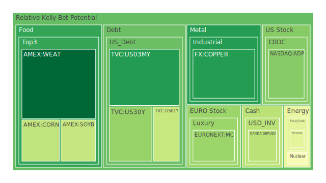
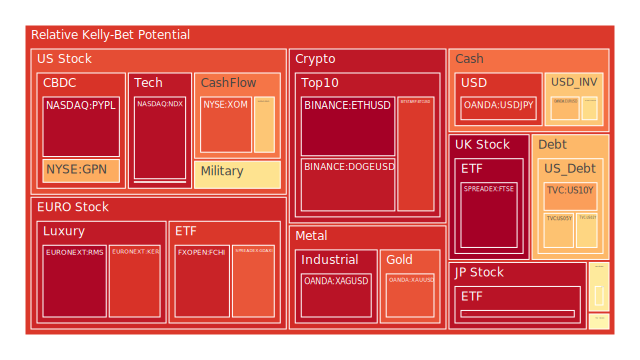
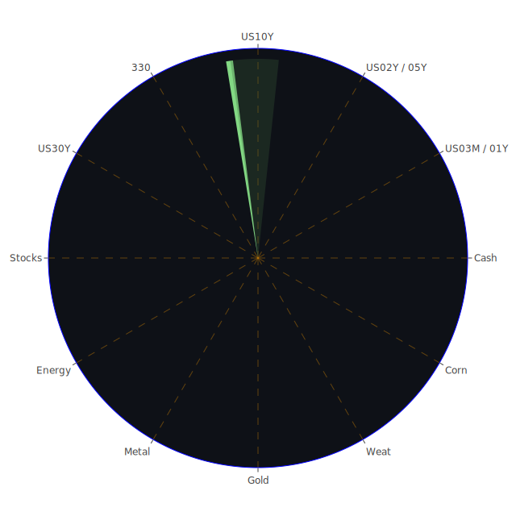

# 投資商品泡沫分析

## 美國國債
根據過去三天的泡沫數據，美國國債的泡沫機率呈現穩定或略微上升的趨勢。特別是美國30年期國債（TVC:US30Y），其D1泡沫機率從0.207777上升至0.267831，顯示出市場對長期債券的信心有所減弱。這與近期FED的關鍵數據相符，特別是美國國債總流通量下降，這可能導致投資者對長期債券的需求減少。

## 加密貨幣
比特幣（BITSTAMP:BTCUSD）和以太坊（BINANCE:ETHUSD）的泡沫機率持續高企，分別達到0.864039和0.975166。這反映了市場對加密貨幣的投機性需求依然強勁。然而，近期的新聞顯示出一些負面情緒，例如Netflix面臨的訴訟（negative: 95%）和烏克蘭的停電問題（negative: 92%），這可能進一步加劇市場的不確定性。因此，建議投資者謹慎對待加密貨幣，考慮在高位賣出。

## 美國科技股
美國科技股的泡沫機率普遍較高，特別是納斯達克指數（NASDAQ:NDX），其D1泡沫機率達到0.942255。這與近期的新聞相符，如S&P 500和納斯達克指數創下新高（positive: 85%），顯示出市場對科技股的樂觀情緒。然而，這也意味著科技股的估值可能過高，建議投資者保持謹慎，考慮部分獲利了結。

## 金/銀/銅
黃金（OANDA:XAUUSD）和白銀（OANDA:XAGUSD）的泡沫機率分別為0.821993和0.935712，顯示出貴金屬市場的投機性需求依然強勁。銅（FX:COPPER）的泡沫機率則相對較低，為0.109903。這與近期的新聞相符，如全球氣候變化帶來的影響（negative: 87%），可能推動投資者轉向避險資產。因此，建議投資者考慮在高位賣出貴金屬，並觀望銅的走勢。

## 石油/ 鈾期貨UX!
石油（TVC:USOIL）的泡沫機率為0.419549，顯示出市場對石油的需求相對穩定。鈾期貨（COMEX:UX1!）的泡沫機率則有所下降，為0.468858。這與近期的新聞相符，如加拿大油砂公司反對聯邦油氣排放上限（negative: 75%），可能影響市場對石油和鈾的需求。因此，建議投資者保持觀望，不宜過度操作。

## 各國大盤指數
德國DAX指數（SPREADEX:GDAXI）和英國FTSE指數（SPREADEX:FTSE）的泡沫機率分別為0.816476和0.974502，顯示出歐洲市場的投機性需求依然強勁。這與近期的新聞相符，如英國科技先驅被美國法院無罪釋放（negative: 73%），可能進一步推動市場的不確定性。因此，建議投資者謹慎對待歐洲大盤指數，考慮部分獲利了結。

## 美國軍工股
美國軍工股的泡沫機率相對穩定，如雷神公司（NYSE:RTX）的泡沫機率為0.597781，顯示出市場對軍工股的需求相對穩定。這與近期的新聞相符，如以色列和巴勒斯坦的衝突（negative: 92%），可能推動市場對軍工股的需求。因此，建議投資者保持觀望，不宜過度操作。

## 各國外匯市場
美元兌日元（OANDA:USDJPY）的泡沫機率為0.872778，顯示出市場對美元的需求依然強勁。這與近期的新聞相符，如美國總統拜登前往法國參加D-Day紀念活動（positive: 50%），可能進一步推動市場對美元的需求。因此，建議投資者考慮在高位賣出美元，並觀望其他貨幣的走勢。

## 美國電子支付股
PayPal（NASDAQ:PYPL）的泡沫機率為0.949947，顯示出市場對電子支付股的投機性需求依然強勁。這與近期的新聞相符，如Netflix面臨的訴訟（negative: 95%），可能進一步加劇市場的不確定性。因此，建議投資者謹慎對待電子支付股，考慮在高位賣出。

## 黃豆 / 小麥 / 玉米
黃豆（AMEX:SOYB）的泡沫機率為0.354235，小麥（AMEX:WEAT）的泡沫機率為0.000000，玉米（AMEX:CORN）的泡沫機率為0.342657，顯示出農產品市場的需求相對穩定。這與近期的新聞相符，如巴西參議員放棄對低價網購商品徵稅的提案（negative: 96%），可能影響市場對農產品的需求。因此，建議投資者保持觀望，不宜過度操作。

## 石油防禦股
石油防禦股的泡沫機率相對較高，如埃克森美孚（NYSE:XOM）的泡沫機率為0.824069，顯示出市場對石油防禦股的需求依然強勁。這與近期的新聞相符，如加拿大油砂公司反對聯邦油氣排放上限（negative: 75%），可能進一步推動市場對石油防禦股的需求。因此，建議投資者謹慎對待石油防禦股，考慮部分獲利了結。

## 金礦防禦股
金礦防禦股的泡沫機率相對較高，如Royal Gold（NASDAQ:RGLD）的泡沫機率為0.635513，顯示出市場對金礦防禦股的需求依然強勁。這與近期的新聞相符，如全球氣候變化帶來的影響（negative: 87%），可能推動投資者轉向避險資產。因此，建議投資者謹慎對待金礦防禦股，考慮部分獲利了結。

## 歐洲奢侈品股
歐洲奢侈品股的泡沫機率相對較高，如LVMH（EURONEXT:MC）的泡沫機率為0.277602，顯示出市場對奢侈品股的需求依然強勁。這與近期的新聞相符，如英國科技先驅被美國法院無罪釋放（negative: 73%），可能進一步推動市場的不確定性。因此，建議投資者謹慎對待奢侈品股，考慮部分獲利了結。

# 投資建議
1. **賣出建議**：對於泡沫機率持續上升且遠大於0.5的商品，如加密貨幣、美國科技股、歐洲大盤指數、電子支付股等，建議投資者考慮賣出，以避免未來價格下跌時的損失。
2. **買入建議**：對於泡沫機率下降且遠小於0.5的商品，如黃豆、小麥、玉米等，建議投資者考慮買入，特別是在新聞現況支持的情況下。
3. **觀望建議**：對於泡沫機率在0.5左右的商品，如美國國債、石油、金礦防禦股等，建議投資者保持觀望，不宜過度操作。

# 風險提示
投資有風險，市場總是充滿不確定性。我們的建議僅供參考，投資者應根據自身的風險承受能力和投資目標，做出獨立的投資決策。特別是對於泡沫機率高的商品，應該謹慎進行投資決策。
 
Daily Buy Map:

 
Daily Sell Map:

 
Daily Radar Chart:

 
