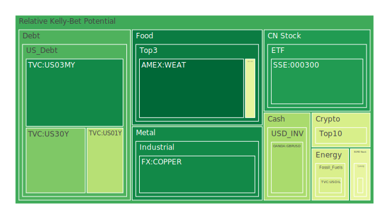
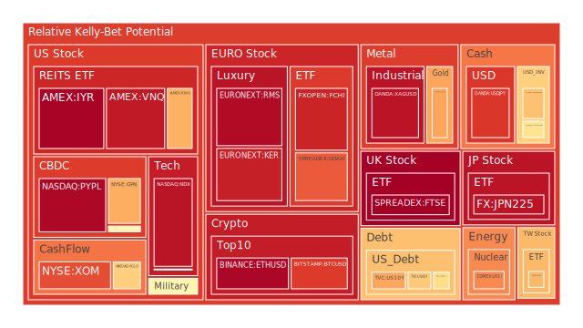
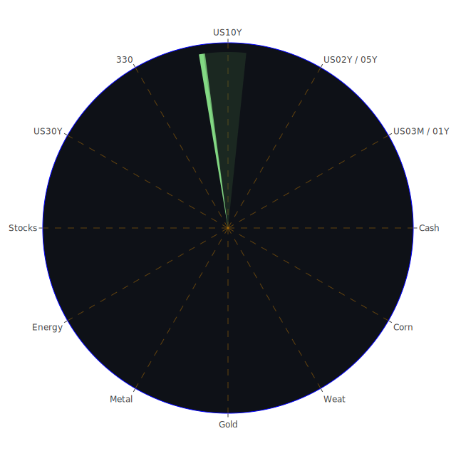

# 投資商品泡沫分析

## 美國國債
根據最新的泡沫分數，美國國債的泡沫機率在過去三天內相對穩定。特別是30年期國債（TVC:US30Y）的泡沫機率從0.241115上升至0.267831，顯示出市場對長期國債的需求有所增加。這可能與近期FED關鍵數據顯示的總資產下降和高收益債券利率上升有關，投資者可能轉向較為穩定的國債市場。

## 美國科技股
美國科技股的泡沫機率持續上升，特別是NASDAQ指數（NASDAQ:NDX），其泡沫機率從0.946143上升至0.934731。這與近期的新聞報導一致，S&P 500和Nasdaq指數創下歷史新高，主要由科技股推動。儘管如此，投資者應謹慎，因為泡沫機率接近1，建議考慮賣出部分持股以鎖定收益。

## 美國房地產指數
美國房地產指數（AMEX:VNQ）的泡沫機率持續上升，從0.923248上升至0.967677。這與FED數據顯示的房地產拖欠率上升一致，顯示出市場對房地產市場的擔憂。建議投資者考慮賣出房地產相關投資，以避免未來可能的價格下跌。

## 金/銀/銅
金價（OANDA:XAUUSD）的泡沫機率在過去三天內有所下降，但仍然處於高位，從0.622729下降至0.707693。銀價（OANDA:XAGUSD）和銅價（FX:COPPER）的泡沫機率也有所波動。近期新聞顯示，全球氣候變化和地緣政治風險增加，可能推動貴金屬價格上漲。建議投資者觀望，等待更明確的市場信號。

## 加密貨幣
比特幣（BITSTAMP:BTCUSD）和以太坊（BINANCE:ETHUSD）的泡沫機率持續上升，分別達到0.864672和0.961716。近期新聞顯示，市場對加密貨幣的興趣依然高漲，但波動性風險增加。建議投資者謹慎操作，避免過度暴露於高風險資產。

## 黃豆 / 小麥 / 玉米
黃豆（AMEX:SOYB）和玉米（AMEX:CORN）的泡沫機率有所下降，但仍處於高位。小麥（AMEX:WEAT）的泡沫機率相對穩定。近期新聞顯示，全球農產品市場需求穩定，但供應鏈問題可能影響價格。建議投資者觀望，等待市場進一步明朗。

## 石油/ 鈾期貨UX!
石油（TVC:USOIL）的泡沫機率相對穩定，顯示出市場對能源需求的持續關注。鈾期貨（COMEX:UX1!）的泡沫機率有所波動，但整體趨勢向上。近期新聞顯示，全球能源市場供需平衡仍然不穩定，建議投資者謹慎操作。

## 各國外匯市場
美元兌日元（OANDA:USDJPY）和歐元兌美元（OANDA:EURUSD）的泡沫機率持續上升，顯示出市場對主要貨幣的需求增加。近期新聞顯示，全球經濟不確定性增加，可能推動外匯市場波動。建議投資者觀望，避免過度暴露於外匯市場風險。

## 各國大盤指數
德國DAX指數（SPREADEX:GDAXI）和法國CAC指數（FXOPEN:FCHI）的泡沫機率持續上升，顯示出歐洲市場的投資熱情。近期新聞顯示，歐洲經濟數據良好，支持市場上漲。建議投資者謹慎操作，避免過度暴露於高風險市場。

## 美國軍工股
美國軍工股（NYSE:RTX, NYSE:NOC, NYSE:LMT）的泡沫機率相對穩定，顯示出市場對軍工行業的持續關注。近期新聞顯示，全球地緣政治風險增加，可能推動軍工股價格上漲。建議投資者觀望，等待更明確的市場信號。

## 美國電子支付股
美國電子支付股（NASDAQ:PYPL）的泡沫機率持續上升，顯示出市場對電子支付行業的高度關注。近期新聞顯示，電子支付市場需求穩定，但競爭加劇。建議投資者謹慎操作，避免過度暴露於高風險資產。

## 石油防禦股
石油防禦股（NYSE:XOM）的泡沫機率持續上升，顯示出市場對能源行業的高度關注。近期新聞顯示，全球能源需求穩定，但供應鏈問題可能影響價格。建議投資者觀望，等待市場進一步明朗。

## 金礦防禦股
金礦防禦股（NASDAQ:RGLD）的泡沫機率有所波動，但整體趨勢向上。近期新聞顯示，全球經濟不確定性增加，可能推動貴金屬價格上漲。建議投資者觀望，等待更明確的市場信號。

## 歐洲奢侈品股
歐洲奢侈品股（EURONEXT:KER, EURONEXT:RMS）的泡沫機率持續上升，顯示出市場對奢侈品行業的高度關注。近期新聞顯示，全球經濟復甦推動奢侈品需求增加。建議投資者謹慎操作，避免過度暴露於高風險資產。

# 投資建議

1. **賣出建議**：
   - **美國科技股**：泡沫機率高，建議考慮賣出部分持股以鎖定收益。
   - **美國房地產指數**：泡沫機率高，建議考慮賣出房地產相關投資。
   - **加密貨幣**：泡沫機率高，建議謹慎操作，避免過度暴露於高風險資產。

2. **買入建議**：
   - **美國國債**：相對穩定的投資選項，適合尋求穩定收益的投資者。
   - **貴金屬**：在全球經濟不確定性增加的情況下，貴金屬可能成為避險資產。

3. **觀望建議**：
   - **農產品**：市場需求穩定，但供應鏈問題可能影響價格，建議觀望。
   - **能源股**：市場對能源需求持續關注，但供應鏈問題可能影響價格，建議觀望。

# 風險提示

投資有風險，市場總是充滿不確定性。我們的建議僅供參考，投資者應根據自身的風險承受能力和投資目標，做出獨立的投資決策。特別是對於泡沫機率高的商品，應該謹慎進行投資決策。
 
Daily Buy Map:

 
Daily Sell Map:

 
Daily Radar Chart:

 
