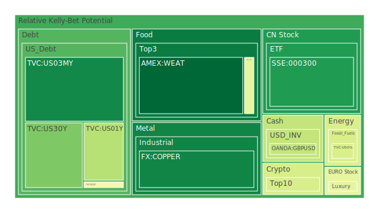
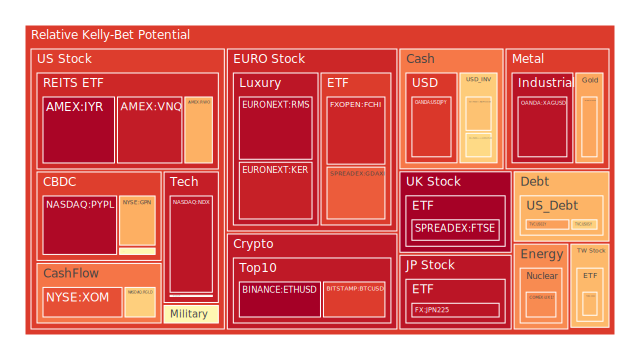
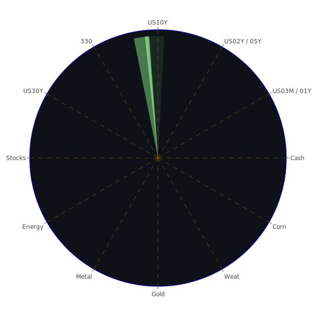

# 投資商品泡沫分析

## 美國國債
過去三天，美國國債的泡沫機率變化不大，特別是30年期國債（US30Y）和10年期國債（US10Y）。根據FED的關鍵數據顯示，長期國債收益率有所下降，這表明市場對於長期經濟前景的擔憂有所增加。這種情況下，建議投資者對於長期國債保持觀望。

## 美國科技股
美國科技股（如NASDAQ:NDX）的泡沫機率持續高企，接近0.94，這表明市場對科技股的過度樂觀情緒。新聞中提到Netflix面臨重大訴訟，GameStop股價暴跌等負面消息，進一步加劇了市場的不安情緒。建議投資者考慮減持科技股，以避免潛在的價格回調風險。

## 美國房地產指數
美國房地產指數（AMEX:RWO）的泡沫機率也較高，接近0.89。隨著房地產違約率上升和消費者違約率高企，市場對房地產市場的信心減弱。建議投資者謹慎行事，避免在此時大量投資房地產相關資產。

## 金/銀/銅
金價（OANDA:XAUUSD）和銀價（OANDA:XAGUSD）的泡沫機率均較高，分別為0.71和0.94。銅價（FX:COPPER）的泡沫機率相對較低，約為0.15。由於市場避險情緒上升，金銀價格可能會繼續上漲，但投資者應謹慎操作，避免在高位追高。

## 加密貨幣
比特幣（BITSTAMP:BTCUSD）和以太坊（BINANCE:ETHUSD）的泡沫機率均高於0.85，顯示出市場對加密貨幣的過度投機情緒。新聞中提到特朗普支持加密貨幣，這可能會短期內推動價格上漲，但長期風險依然存在。建議投資者考慮減持部分加密貨幣，以降低風險。

## 黃豆 / 小麥 / 玉米
黃豆（AMEX:SOYB）和玉米（AMEX:CORN）的泡沫機率分別為0.50和0.45，處於中等水平。小麥（AMEX:WEAT）的泡沫機率較低，約為0.04。由於農產品價格波動較大，建議投資者保持觀望，等待更明確的市場信號。

## 石油/ 鈾期貨UX!
石油（TVC:USOIL）的泡沫機率約為0.42，處於中等水平。鈾期貨（COMEX:UX1!）的泡沫機率較高，約為0.75。由於全球能源需求的不確定性，建議投資者對石油和鈾期貨保持謹慎。

## 各國外匯市場
美元兌日元（OANDA:USDJPY）和歐元兌美元（OANDA:EURUSD）的泡沫機率分別為0.87和0.66，顯示出市場對美元的強勢預期。隨著美國經濟數據的變化，外匯市場波動加劇，建議投資者謹慎操作，避免過度投機。

## 各國大盤指數
德國DAX指數（SPREADEX:GDAXI）和法國CAC指數（FXOPEN:FCHI）的泡沫機率均較高，分別為0.82和0.90。這表明歐洲市場存在較大的泡沫風險。建議投資者考慮減持部分歐洲股票，以降低風險。

## 美國軍工股
美國軍工股（如NYSE:LMT和NYSE:RTX）的泡沫機率均在0.51左右，處於中等水平。由於地緣政治風險增加，軍工股可能會有一定的防禦性，但投資者應保持觀望，避免過度投資。

## 美國電子支付股
美國電子支付股（如NASDAQ:PYPL）的泡沫機率較高，約為0.95。隨著市場對科技股的擔憂增加，電子支付股可能面臨較大的回調風險。建議投資者考慮減持部分電子支付股。

## 石油防禦股
石油防禦股（如NYSE:XOM）的泡沫機率較高，約為0.83。由於全球能源市場的不確定性，石油防禦股可能會面臨較大的波動風險。建議投資者謹慎行事，避免過度投資。

## 金礦防禦股
金礦防禦股（如NASDAQ:RGLD）的泡沫機率約為0.63，處於中等水平。隨著金價的上漲，金礦股可能會有一定的上行空間，但投資者應謹慎操作，避免在高位追高。

## 歐洲奢侈品股
歐洲奢侈品股（如EURONEXT:KER和EURONEXT:RMS）的泡沫機率均較高，分別為0.91和0.95。由於全球經濟的不確定性，奢侈品市場可能會面臨較大的回調風險。建議投資者考慮減持部分奢侈品股。

# 投資建議

1. **減持高泡沫機率的資產**：如美國科技股、加密貨幣、歐洲奢侈品股等，這些資產的泡沫機率均較高，市場風險較大。
2. **保持觀望**：對於泡沫機率在0.5左右的資產，如美國軍工股、黃豆等，建議投資者保持觀望，等待更明確的市場信號。
3. **謹慎操作**：對於泡沫機率較低的資產，如小麥、銅等，投資者可以考慮適量買入，但應謹慎操作，避免過度投資。

# 風險提示

投資有風險，市場總是充滿不確定性。我們的建議僅供參考，投資者應根據自身的風險承受能力和投資目標，做出獨立的投資決策。特別是對於泡沫機率高的商品，應該謹慎進行投資決策。
 
Daily Buy Map:

 
Daily Sell Map:

 
Daily Radar Chart:

 
