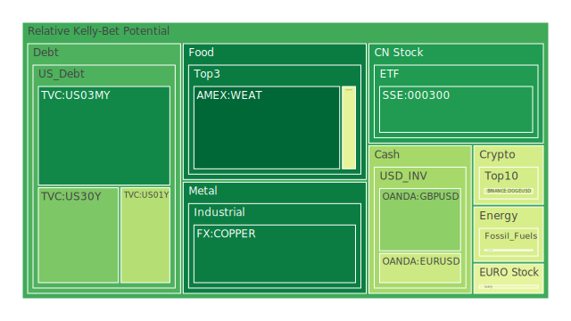
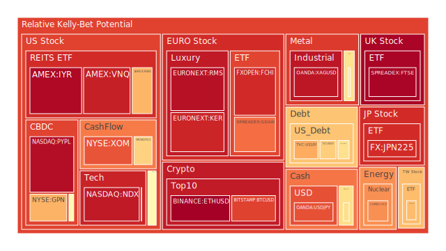
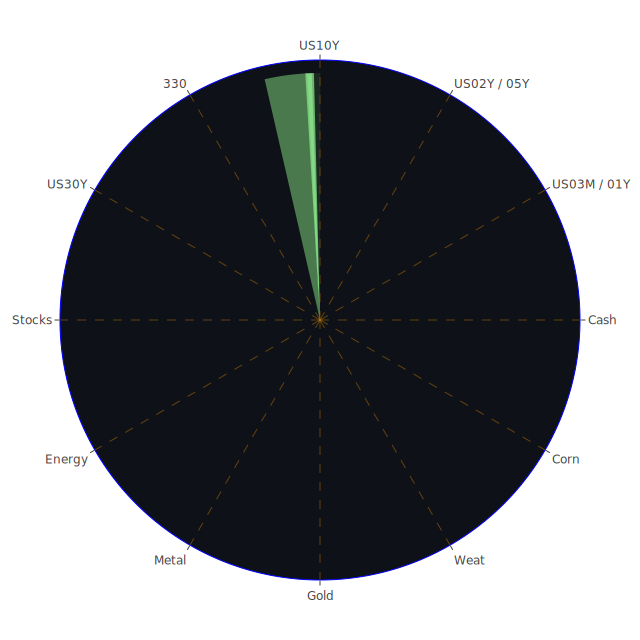

# 投資商品泡沫分析

## 美國國債
根據過去三天的數據，美國國債的泡沫機率變化如下：
- **3年期國債 (TVC:US03MY)**：泡沫機率在0.109310至0.106206之間波動，趨勢相對穩定。
- **30年期國債 (TVC:US30Y)**：泡沫機率在0.267831至0.243243之間，略有下降，但仍保持在較高水平。

## 美國科技股
- **納斯達克指數 (NASDAQ:NDX)**：泡沫機率在0.934731至0.939615之間，顯示出持續高泡沫風險。

## 美國房地產指數
- **房地產ETF (AMEX:VNQ)**：泡沫機率在0.923248至0.921170之間，顯示出高泡沫風險。

## 金/銀/銅
- **黃金 (OANDA:XAUUSD)**：泡沫機率在0.707693至0.704753之間，顯示出高泡沫風險。
- **白銀 (OANDA:XAGUSD)**：泡沫機率在0.940433至0.924020之間，顯示出極高泡沫風險。
- **銅 (FX:COPPER)**：泡沫機率在0.086851至0.146116之間，顯示出低泡沫風險。

## 加密貨幣
- **比特幣 (BITSTAMP:BTCUSD)**：泡沫機率在0.864797至0.856461之間，顯示出高泡沫風險。
- **以太坊 (BINANCE:ETHUSD)**：泡沫機率在0.986238至0.974402之間，顯示出極高泡沫風險。

## 黃豆 / 小麥 / 玉米
- **黃豆 (AMEX:SOYB)**：泡沫機率在0.503560至0.459286之間，顯示出中等泡沫風險。
- **小麥 (AMEX:WEAT)**：泡沫機率在0.045856至0.038170之間，顯示出低泡沫風險。
- **玉米 (AMEX:CORN)**：泡沫機率在0.451589至0.428362之間，顯示出中等泡沫風險。

## 石油/ 鈾期貨
- **石油 (TVC:USOIL)**：泡沫機率在0.419549至0.411689之間，顯示出中等泡沫風險。
- **鈾期貨 (COMEX:UX1!)**：泡沫機率在0.748147至0.611479之間，顯示出高泡沫風險。

## 各國外匯市場
- **歐元/美元 (OANDA:EURUSD)**：泡沫機率在0.659601至0.612906之間，顯示出中等泡沫風險。
- **英鎊/美元 (OANDA:GBPUSD)**：泡沫機率在0.332384至0.293117之間，顯示出低泡沫風險。

## 各國大盤指數
- **德國DAX指數 (SPREADEX:GDAXI)**：泡沫機率在0.816476至0.794605之間，顯示出高泡沫風險。
- **法國CAC指數 (FXOPEN:FCHI)**：泡沫機率在0.904896至0.903020之間，顯示出極高泡沫風險。

## 美國軍工股
- **雷神科技 (NYSE:RTX)**：泡沫機率在0.510860至0.523278之間，顯示出中等泡沫風險。
- **諾斯羅普·格魯曼 (NYSE:NOC)**：泡沫機率在0.511809至0.511809之間，顯示出中等泡沫風險。

## 美國電子支付股
- **PayPal (NASDAQ:PYPL)**：泡沫機率在0.958855至0.952804之間，顯示出極高泡沫風險。

## 石油防禦股
- **埃克森美孚 (NYSE:XOM)**：泡沫機率在0.836215至0.830974之間，顯示出高泡沫風險。

## 金礦防禦股
- **皇家黃金 (NASDAQ:RGLD)**：泡沫機率在0.635513至0.635513之間，顯示出高泡沫風險。

## 歐洲奢侈品股
- **開雲集團 (EURONEXT:KER)**：泡沫機率在0.914630至0.841837之間，顯示出高泡沫風險。

# 投資建議

## 賣出建議
- **以太坊 (BINANCE:ETHUSD)**：泡沫機率持續在0.974402以上，且新聞報導顯示市場對加密貨幣的監管壓力增加，建議考慮賣出。
- **PayPal (NASDAQ:PYPL)**：泡沫機率持續在0.952804以上，且近期電子支付市場競爭加劇，建議考慮賣出。
- **德國DAX指數 (SPREADEX:GDAXI)**：泡沫機率持續在0.794605以上，且歐洲經濟前景不明朗，建議考慮賣出。

## 買入建議
- **小麥 (AMEX:WEAT)**：泡沫機率持續在0.038170以下，且近期農產品價格有上升趨勢，建議考慮買入。
- **英鎊/美元 (OANDA:GBPUSD)**：泡沫機率持續在0.293117以下，且英國經濟數據顯示穩定增長，建議考慮買入。

## 觀望建議
- **黃豆 (AMEX:SOYB)**：泡沫機率在0.459286左右，建議觀望。
- **雷神科技 (NYSE:RTX)**：泡沫機率在0.523278左右，建議觀望。

# 風險提示

投資有風險，市場總是充滿不確定性。我們的建議僅供參考，投資者應根據自身的風險承受能力和投資目標，做出獨立的投資決策。特別是對於泡沫機率高的商品，應該謹慎進行投資決策。
 
Daily Buy Map:

 
Daily Sell Map:

 
Daily Radar Chart:

 
