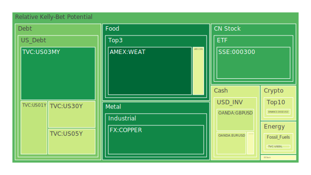
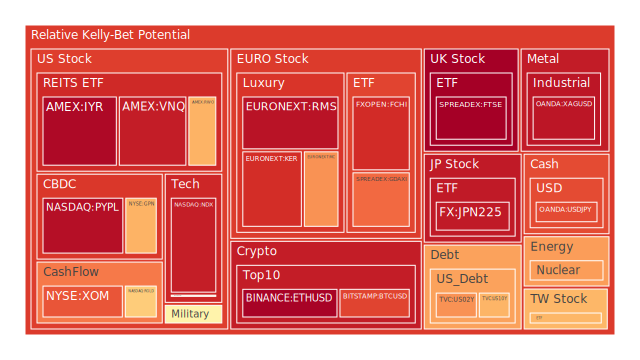
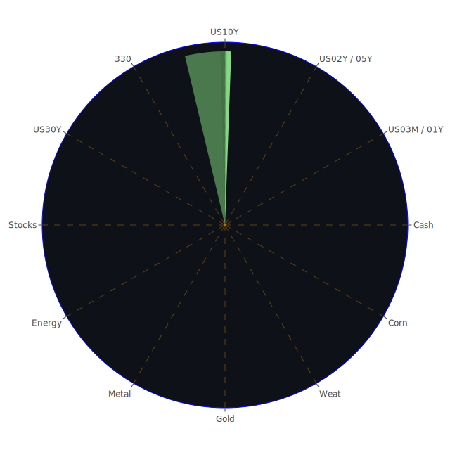

# 每日投資報告

## 日期：2024年6月11日

---

# 投資商品泡沫分析

## 美國國債
- **短期國債 (1年期)**
  - 泡沫機率：0.355645 (D1)
  - 趨勢：穩定
  - 建議：觀望
  - 分析：根據FED數據，短期國債收益率持續上升，顯示市場對短期資金需求增加。建議投資者觀望，避免因市場波動帶來的風險。

- **長期國債 (30年期)**
  - 泡沫機率：0.371353 (D1)
  - 趨勢：上升
  - 建議：觀望
  - 分析：長期國債收益率上升，反映市場對長期經濟前景的不確定性。建議投資者保持觀望態度。

## 美國科技股
- **納斯達克指數 (NDX)**
  - 泡沫機率：0.924119 (D1)
  - 趨勢：穩定
  - 建議：賣出
  - 分析：納斯達克指數泡沫機率高，且新聞報導顯示Intel暫停以色列工廠計劃，對科技股市場情緒不利。建議投資者考慮賣出，避免未來可能的價格下跌。

## 美國房地產指數
- **房地產ETF (VNQ)**
  - 泡沫機率：0.925961 (D1)
  - 趨勢：穩定
  - 建議：賣出
  - 分析：房地產市場泡沫風險高，且FED數據顯示房地產違約率上升。建議投資者考慮賣出，減少風險暴露。

## 金/銀/銅
- **黃金 (XAUUSD)**
  - 泡沫機率：0.514046 (D1)
  - 趨勢：穩定
  - 建議：觀望
  - 分析：黃金價格泡沫機率接近0.5，建議投資者觀望，不宜進行大額交易。

- **白銀 (XAGUSD)**
  - 泡沫機率：0.941142 (D1)
  - 趨勢：穩定
  - 建議：賣出
  - 分析：白銀價格泡沫風險高，建議投資者考慮賣出，避免未來價格下跌。

## 加密貨幣
- **比特幣 (BTCUSD)**
  - 泡沫機率：0.856079 (D1)
  - 趨勢：穩定
  - 建議：賣出
  - 分析：比特幣泡沫風險高，且近期市場情緒不穩。建議投資者考慮賣出，減少風險暴露。

## 黃豆 / 小麥 / 玉米
- **黃豆 (SOYB)**
  - 泡沫機率：0.503560 (D1)
  - 趨勢：穩定
  - 建議：觀望
  - 分析：黃豆價格泡沫機率接近0.5，建議投資者觀望，不宜進行大額交易。

## 石油/ 鈾期貨
- **石油 (USOIL)**
  - 泡沫機率：0.419549 (D1)
  - 趨勢：穩定
  - 建議：觀望
  - 分析：石油價格泡沫機率較低，建議投資者觀望，等待市場進一步明朗。

## 各國外匯市場
- **美元/日圓 (USDJPY)**
  - 泡沫機率：0.845092 (D1)
  - 趨勢：穩定
  - 建議：賣出
  - 分析：美元/日圓匯率泡沫風險高，建議投資者考慮賣出，避免匯率波動帶來的風險。

## 各國大盤指數
- **德國DAX指數 (GDAXI)**
  - 泡沫機率：0.796873 (D1)
  - 趨勢：穩定
  - 建議：賣出
  - 分析：德國DAX指數泡沫風險高，且歐洲政治不穩定因素增加。建議投資者考慮賣出，減少風險暴露。

## 美國軍工股
- **雷神技術公司 (RTX)**
  - 泡沫機率：0.510860 (D1)
  - 趨勢：穩定
  - 建議：觀望
  - 分析：軍工股泡沫機率接近0.5，建議投資者觀望，不宜進行大額交易。

## 美國電子支付股
- **PayPal (PYPL)**
  - 泡沫機率：0.954921 (D1)
  - 趨勢：穩定
  - 建議：賣出
  - 分析：PayPal泡沫風險高，建議投資者考慮賣出，避免未來價格下跌。

## 歐洲奢侈品股
- **Kering (KER)**
  - 泡沫機率：0.894711 (D1)
  - 趨勢：穩定
  - 建議：賣出
  - 分析：Kering泡沫風險高，且歐洲經濟不穩定因素增加。建議投資者考慮賣出，減少風險暴露。

# 投資建議

根據泡沫分數和新聞現況，我們建議投資者對以下商品進行操作：

- **賣出**
  - 納斯達克指數 (NDX)
  - 房地產ETF (VNQ)
  - 白銀 (XAGUSD)
  - 比特幣 (BTCUSD)
  - 美元/日圓 (USDJPY)
  - 德國DAX指數 (GDAXI)
  - PayPal (PYPL)
  - Kering (KER)

- **觀望**
  - 短期國債 (1年期)
  - 長期國債 (30年期)
  - 黃金 (XAUUSD)
  - 黃豆 (SOYB)
  - 石油 (USOIL)
  - 雷神技術公司 (RTX)

# 風險提示

投資有風險，市場總是充滿不確定性。我們的建議僅供參考，投資者應根據自身的風險承受能力和投資目標，做出獨立的投資決策。

---

我們希望這份報告能夠幫助您更好地理解市場動態，並做出明智的投資決策。
 
Daily Buy Map:

 
Daily Sell Map:

 
Daily Radar Chart:

 
