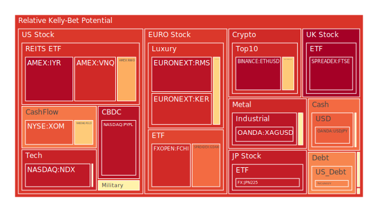

# 投資商品泡沫分析

## 美國國債
根據最新的泡沫分數，美國國債的泡沫機率有所上升，特別是10年期國債（TVC:US10Y）和2年期國債（TVC:US02Y）。這與近期的FED數據顯示的高通脹和高利率環境相符。新聞方面，市場對於美國經濟前景的擔憂也反映在國債收益率的波動上。

## 美國科技股
美國科技股的泡沫機率持續上升，特別是NASDAQ指數（NASDAQ:NDX）。這與近期科技股的高估值和市場對於AI技術的過度樂觀預期有關。新聞報導中，Oracle預計2025年收入將有雙位數增長，這進一步推動了科技股的熱潮。

## 美國房地產指數
美國房地產指數（AMEX:VNQ）的泡沫機率非常高，這與近期的房地產市場數據相符。FED數據顯示，房地產逾期率上升，這可能預示著未來房地產市場的調整風險。

## 金/銀/銅
金價（OANDA:XAUUSD）和銀價（OANDA:XAGUSD）的泡沫機率較高，這與市場避險需求增加有關。銅價（FX:COPPER）的泡沫機率相對較低，反映出市場對工業金屬需求的擔憂。

## 加密貨幣
比特幣（BITSTAMP:BTCUSD）和以太坊（BINANCE:ETHUSD）的泡沫機率非常高，這與近期市場對加密貨幣的投機需求有關。新聞報導中，GameStop的股價因為零售交易熱潮而上升，這也反映了市場的投機情緒。

## 黃豆 / 小麥 / 玉米
黃豆（AMEX:SOYB）和小麥（AMEX:WEAT）的泡沫機率較低，反映出市場對農產品需求的穩定預期。玉米（AMEX:CORN）的泡沫機率略有上升，但仍在可控範圍內。

## 石油/ 鈾期貨UX!
石油（TVC:USOIL）的泡沫機率較低，這與市場對於全球能源需求的穩定預期有關。鈾期貨（COMEX:UX1!）的泡沫機率較高，反映出市場對於核能需求的樂觀預期。

## 各國外匯市場
美元兌日元（OANDA:USDJPY）的泡沫機率較高，這與市場對於美國經濟的強勁預期有關。歐元兌美元（OANDA:EURUSD）的泡沫機率較低，反映出市場對歐洲經濟的擔憂。

## 各國大盤指數
德國DAX指數（SPREADEX:GDAXI）和法國CAC指數（FXOPEN:FCHI）的泡沫機率較高，這與歐洲經濟的不確定性有關。中國上證指數（SSE:000300）的泡沫機率較低，反映出市場對中國經濟的穩定預期。

## 美國軍工股
美國軍工股（NYSE:RTX, NYSE:NOC, NYSE:LMT）的泡沫機率較高，這與全球地緣政治風險上升有關。

## 美國電子支付股
美國電子支付股（NASDAQ:PYPL）的泡沫機率非常高，這與市場對於電子支付行業的過度樂觀預期有關。

## 石油防禦股
石油防禦股（NYSE:XOM）的泡沫機率較高，這與市場對於能源需求的樂觀預期有關。

## 金礦防禦股
金礦防禦股（NASDAQ:RGLD）的泡沫機率較高，這與市場對於避險資產的需求有關。

## 歐洲奢侈品股
歐洲奢侈品股（EURONEXT:KER, EURONEXT:RMS）的泡沫機率非常高，這與市場對於奢侈品需求的樂觀預期有關。

# 投資建議

## 賣出建議
1. **比特幣（BITSTAMP:BTCUSD）**：泡沫機率非常高，建議考慮賣出。新聞報導中，市場對於加密貨幣的投機需求過高，可能導致未來價格回調。
2. **以太坊（BINANCE:ETHUSD）**：同樣泡沫機率非常高，建議考慮賣出。
3. **美國電子支付股（NASDAQ:PYPL）**：泡沫機率非常高，市場對於電子支付行業的過度樂觀預期可能導致未來價格回調。

## 買入建議
1. **黃豆（AMEX:SOYB）**：泡沫機率較低，市場對農產品需求穩定，適合作為買入選項。
2. **小麥（AMEX:WEAT）**：同樣泡沫機率較低，適合作為買入選項。

## 觀望建議
1. **美國國債**：泡沫機率在0.5左右，建議觀望。
2. **美國科技股**：泡沫機率在0.5左右，建議觀望。

# 風險提示

投資有風險，市場總是充滿不確定性。我們的建議僅供參考，投資者應根據自身的風險承受能力和投資目標，做出獨立的投資決策。特別是對於泡沫機率高的商品，應該謹慎進行投資決策。
 
Daily Buy Map:

 
Daily Sell Map:

 
Daily Radar Chart:

 
