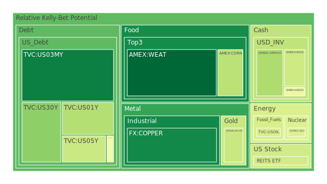
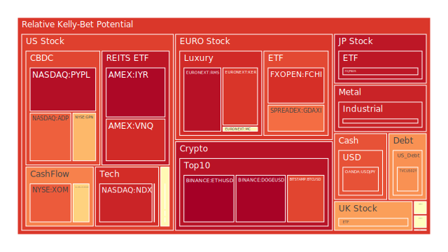
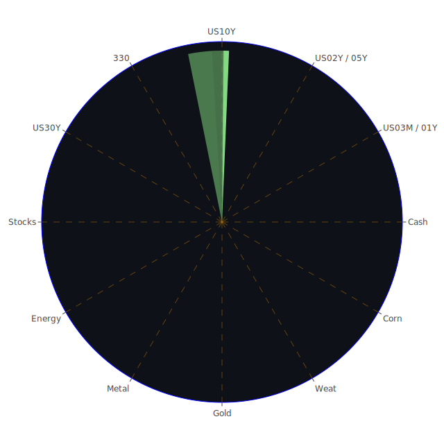

# 投資商品泡沫分析

## 美國國債
近期美國國債的泡沫機率有所上升，特別是短期國債（如1年期和2年期國債）。根據FED的數據顯示，儘管總資產有所下降，但美國國債的收益率仍然保持在較高水平，這可能是由於市場對未來經濟不確定性的擔憂所致。建議投資者謹慎對待短期國債，特別是在泡沫機率高於0.5的情況下。

## 美國科技股
美國科技股的泡沫機率持續上升，特別是NASDAQ指數（NDX）的泡沫機率已達到0.912185。近期的新聞顯示，儘管有些公司如Oracle因AI需求強勁而預期收入增長，但整體市場對科技股的過度依賴可能帶來風險。建議投資者考慮減少在科技股的持倉，以避免潛在的市場調整。

## 美國房地產指數
美國房地產指數（如VNQ）的泡沫機率非常高，達到0.899808。根據FED的數據顯示，房地產違約率正在上升，這可能對房地產市場造成負面影響。建議投資者考慮賣出房地產相關的投資，以避免未來價格下跌的風險。

## 金/銀/銅
黃金（XAUUSD）的泡沫機率有所下降，目前為0.395077，這可能與市場對避險資產需求增加有關。銀（XAGUSD）的泡沫機率仍然較高，達到0.913432。銅（COPPER）的泡沫機率則較低，為0.116103。建議投資者可以考慮增加黃金的持倉，作為避險資產，而對於銀則應謹慎。

## 加密貨幣
比特幣（BTCUSD）的泡沫機率仍然較高，達到0.856902。近期新聞顯示，加密貨幣市場仍然存在較大波動性，特別是一些負面新聞如比特幣礦業公司Riot Platforms的收購爭議。建議投資者謹慎對待加密貨幣的投資。

## 黃豆 / 小麥 / 玉米
黃豆（SOYB）的泡沫機率接近0.5，建議觀望。小麥（WEAT）的泡沫機率較低，為0.051497，近期價格穩定。玉米（CORN）的泡沫機率有所下降，為0.367570。建議投資者可以考慮增加小麥和玉米的持倉，特別是在新聞支持的情況下。

## 石油/ 鈾期貨UX!
石油（USOIL）的泡沫機率穩定在0.419549，近期新聞顯示需求預期強勁。鈾期貨（UX1!）的泡沫機率有所下降，目前為0.436169。建議投資者可以考慮增加石油和鈾的持倉，特別是在需求預期強勁的情況下。

## 各國外匯市場
美元兌日元（USDJPY）的泡沫機率較高，為0.836242。歐元兌美元（EURUSD）的泡沫機率為0.402212，較為穩定。建議投資者可以考慮減少美元兌日元的持倉，而增加歐元兌美元的持倉。

## 各國大盤指數
德國DAX指數（GDAXI）的泡沫機率較高，為0.795117。英國FTSE指數（FTSE）的泡沫機率也較高，為0.724257。建議投資者謹慎對待歐洲大盤指數的投資。

## 美國軍工股
軍工股如雷神公司（RTX）和洛克希德馬丁公司（LMT）的泡沫機率接近0.5，建議觀望。

## 美國電子支付股
PayPal（PYPL）的泡沫機率非常高，達到0.952770。近期新聞顯示，市場對電子支付股的預期較高，但也存在較大風險。建議投資者考慮減少電子支付股的持倉。

## 石油防禦股
埃克森美孚（XOM）的泡沫機率較高，為0.822141。建議投資者謹慎對待石油防禦股的投資。

## 金礦防禦股
金礦股如Royal Gold（RGLD）的泡沫機率較高，為0.635513。建議投資者謹慎對待金礦防禦股的投資。

## 歐洲奢侈品股
歐洲奢侈品股如LVMH（MC）和愛馬仕（RMS）的泡沫機率較高，分別為0.539605和0.947756。建議投資者謹慎對待歐洲奢侈品股的投資。

# 投資建議

1. **減少持倉**：對於泡沫機率高於0.5的商品，如美國科技股、房地產指數、電子支付股等，建議投資者考慮賣出，以避免未來價格下跌時的損失。
2. **增加持倉**：對於泡沫機率低於0.5的商品，如黃金、小麥、玉米等，建議投資者可以考慮增加持倉，特別是在新聞支持的情況下。
3. **觀望**：對於泡沫機率接近0.5的商品，如軍工股、黃豆等，建議投資者觀望，不要有任何動作。

# 風險提示

投資有風險，市場總是充滿不確定性。我們的建議僅供參考，投資者應根據自身的風險承受能力和投資目標，做出獨立的投資決策。特別是對於泡沫機率高的商品，應該謹慎進行投資決策。
 
Daily Buy Map:

 
Daily Sell Map:

 
Daily Radar Chart:

 
