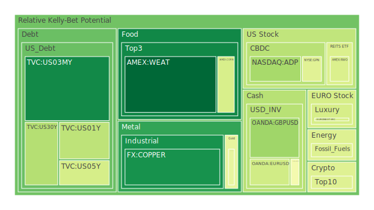
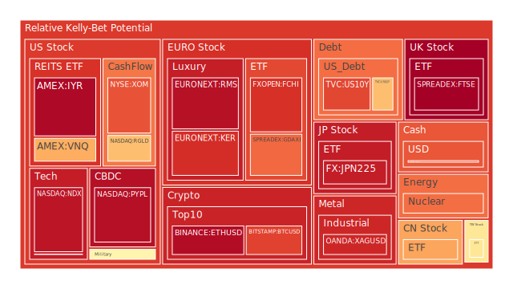
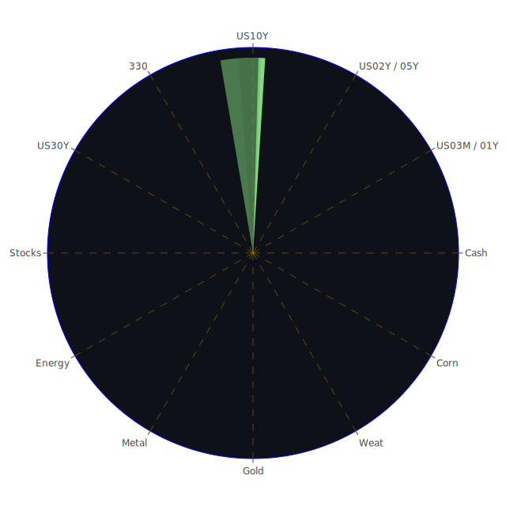

# 投資商品泡沫分析

## 美國國債
過去三天的數據顯示，美國國債的泡沫機率在不同年期的債券中有所變化。短期（1年期）和中期（5年期）債券的泡沫機率相對穩定，但長期（10年期和30年期）債券的泡沫機率呈現下降趨勢。根據FED的關鍵數據，美國國債的收益率普遍下降，這可能是由於市場對經濟前景的不確定性增加，投資者轉向避險資產所致。

## 美國科技股
美國科技股的泡沫機率持續上升，特別是NASDAQ指數（NDX）的泡沫機率已經接近0.94。這表明市場對科技股的過度樂觀情緒可能導致價格過高。根據新聞報導，Oracle預期2025財年的收入將因AI需求強勁而實現兩位數增長，這進一步推動了科技股的上漲。然而，這種樂觀情緒可能過於激進，建議投資者謹慎行事。

## 美國房地產指數
美國房地產指數（VNQ）的泡沫機率在過去三天內持續上升，已接近0.97。這表明房地產市場存在過熱風險。根據FED數據，房地產違約率上升，這可能進一步加劇市場風險。建議投資者考慮適時賣出，以避免未來價格回調帶來的損失。

## 金/銀/銅
金價（XAUUSD）的泡沫機率在過去三天內有所下降，但仍處於較高水平（約0.61）。銀價（XAGUSD）的泡沫機率則持續上升，接近0.93。銅價（COPPER）的泡沫機率相對穩定。根據新聞報導，油價上升預示著需求強勁，這可能對金屬價格形成支撐。建議投資者對金銀保持觀望態度，而銅價則可考慮適時買入。

## 加密貨幣
比特幣（BTCUSD）和以太坊（ETHUSD）的泡沫機率均處於高位，分別接近0.83和0.97。這表明加密貨幣市場存在較高的泡沫風險。根據新聞報導，比特幣礦業公司Riot Platforms對Bitfarms的收購計劃引發爭議，這可能進一步加劇市場的不確定性。建議投資者謹慎行事，考慮減持加密貨幣。

## 黃豆 / 小麥 / 玉米
黃豆（SOYB）和小麥（WEAT）的泡沫機率相對穩定，均在0.5左右，建議投資者保持觀望。玉米（CORN）的泡沫機率則有所下降，建議投資者可以考慮適時買入。

## 石油/ 鈾期貨UX!
石油（USOIL）的泡沫機率相對穩定，建議投資者保持觀望。鈾期貨（UX1!）的泡沫機率有所下降，但仍處於較高水平，建議投資者謹慎行事。

## 各國外匯市場
美元兌日元（USDJPY）的泡沫機率持續上升，接近0.84，建議投資者謹慎行事。歐元兌美元（EURUSD）的泡沫機率有所下降，但仍處於較高水平，建議投資者保持觀望。

## 各國大盤指數
德國DAX指數（GDAXI）和法國CAC指數（FCHI）的泡沫機率均處於高位，建議投資者謹慎行事。中國上證300指數（000300）的泡沫機率有所下降，建議投資者可以考慮適時買入。

## 美國軍工股
美國軍工股（如RTX、NOC）的泡沫機率相對穩定，建議投資者保持觀望。

## 美國電子支付股
美國電子支付股（如PYPL）的泡沫機率持續上升，接近0.95，建議投資者考慮減持。

## 石油防禦股
石油防禦股（如XOM）的泡沫機率相對穩定，建議投資者保持觀望。

## 金礦防禦股
金礦防禦股（如RGLD）的泡沫機率有所下降，建議投資者可以考慮適時買入。

## 歐洲奢侈品股
歐洲奢侈品股（如KER、RMS）的泡沫機率持續上升，建議投資者考慮減持。

# 投資建議
1. **賣出建議**：對於泡沫機率持續上升且遠大於0.5的商品，如美國科技股（NDX）、美國房地產指數（VNQ）、加密貨幣（BTCUSD、ETHUSD），建議投資者考慮賣出，以避免未來價格下跌時的損失。
2. **買入建議**：對於泡沫機率下降且遠小於0.5的商品，如中國上證300指數（000300）、金礦防禦股（RGLD），建議投資者可以考慮適時買入。
3. **觀望建議**：對於泡沫分數0.5左右的部分，如黃豆（SOYB）、小麥（WEAT）、石油（USOIL），建議投資者保持觀望，不要有任何動作。

# 風險提示
投資有風險，市場總是充滿不確定性。我們的建議僅供參考，投資者應根據自身的風險承受能力和投資目標，做出獨立的投資決策。特別是對於泡沫機率高的商品，應該謹慎進行投資決策。
 
Daily Buy Map:

 
Daily Sell Map:

 
Daily Radar Chart:

 
