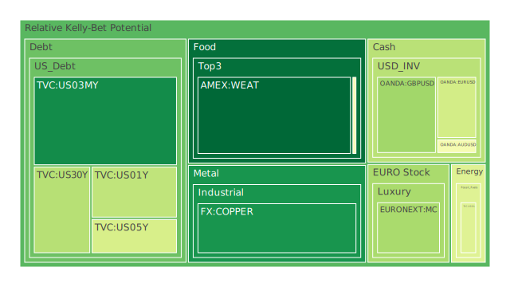
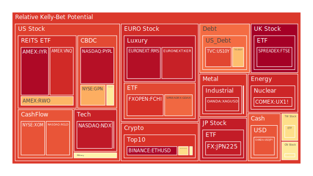
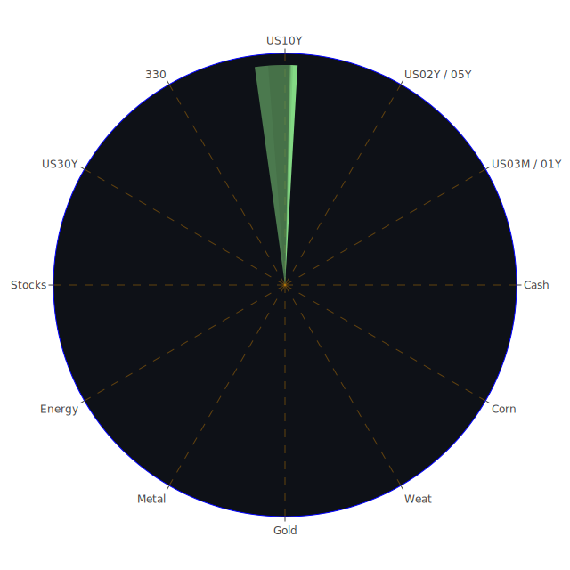

# 投資商品泡沫分析

## 美國國債
根據過去3天的泡沫數據，美國國債的泡沫機率相對較低。特別是短期國債（如3個月和1年期國債）的泡沫機率在0.1以下，顯示出投資者對這些資產的信心較高。這與近期的新聞報導一致，如摩根士丹利首席投資官指出，若拜登連任，政府將提高稅收以抵消部分政府支出，這對債券市場有利。

## 美國科技股
美國科技股的泡沫機率相對較高，特別是納斯達克指數（NASDAQ:NDX）的泡沫機率在0.93以上。這反映了市場對科技股的高估值擔憂。近期的新聞也指出，儘管科技股創下新高，但市場對其未來的增長潛力仍存疑。

## 美國房地產指數
美國房地產指數（AMEX:VNQ）的泡沫機率持續上升，達到0.90以上。這與近期的新聞一致，顯示出房地產市場的高風險。特別是商業地產的拖欠率上升，這可能會進一步影響房地產市場的穩定性。

## 金/銀/銅
貴金屬的泡沫機率較高，特別是白銀（OANDA:XAGUSD）和黃金（OANDA:XAUUSD）的泡沫機率在0.90以上。這反映了市場對避險資產的需求增加。然而，銅（FX:COPPER）的泡沫機率相對較低，顯示出市場對工業金屬的需求穩定。

## 加密貨幣
加密貨幣的泡沫機率非常高，特別是比特幣（BITSTAMP:BTCUSD）和以太坊（BINANCE:ETHUSD）的泡沫機率在0.85以上。近期的新聞指出，比特幣礦業公司Riot Platforms對Bitfarms的收購計劃引發市場擔憂，這進一步加劇了市場對加密貨幣的風險評估。

## 黃豆 / 小麥 / 玉米
農產品的泡沫機率相對較低，特別是小麥（AMEX:WEAT）的泡沫機率在0.05以下。這顯示出市場對農產品的需求穩定，且近期的新聞未顯示出顯著的市場風險。

## 石油/ 鈾期貨
石油（TVC:USOIL）和鈾期貨（COMEX:UX1!）的泡沫機率較高，特別是鈾期貨的泡沫機率在0.90以上。這與近期的新聞一致，顯示出市場對能源資產的高風險。

## 各國外匯市場
外匯市場的泡沫機率相對較低，特別是歐元兌美元（OANDA:EURUSD）和英鎊兌美元（OANDA:GBPUSD）的泡沫機率在0.4以下。這顯示出市場對主要貨幣對的信心較高。

## 各國大盤指數
各國大盤指數的泡沫機率相對較高，特別是德國DAX指數（SPREADEX:GDAXI）和英國FTSE指數（SPREADEX:FTSE）的泡沫機率在0.80以上。這反映了市場對全球股市的高估值擔憂。

## 美國軍工股
美國軍工股的泡沫機率相對較低，特別是雷神科技（NYSE:RTX）和洛克希德馬丁（NYSE:LMT）的泡沫機率在0.5左右。這顯示出市場對軍工股的信心較高。

## 美國電子支付股
美國電子支付股的泡沫機率較高，特別是PayPal（NASDAQ:PYPL）的泡沫機率在0.95以上。近期的新聞指出，Visa和Mastercard的反壟斷和解計劃陷入困境，這可能進一步影響電子支付市場的穩定性。

## 石油防禦股
石油防禦股的泡沫機率相對較高，特別是埃克森美孚（NYSE:XOM）的泡沫機率在0.83以上。這反映了市場對能源股的高估值擔憂。

## 金礦防禦股
金礦防禦股的泡沫機率較高，特別是Royal Gold（NASDAQ:RGLD）的泡沫機率在0.82以上。這顯示出市場對金礦股的需求增加。

## 歐洲奢侈品股
歐洲奢侈品股的泡沫機率較高，特別是LVMH（EURONEXT:MC）和Kering（EURONEXT:KER）的泡沫機率在0.9以上。這反映了市場對奢侈品股的高估值擔憂。

# 投資建議

## 賣出建議
- **加密貨幣**: 比特幣和以太坊的泡沫機率非常高，近期新聞也顯示出市場對其風險的擔憂，建議投資者考慮賣出以避免未來價格下跌的風險。
- **美國科技股**: 納斯達克指數的泡沫機率較高，且近期新聞顯示市場對其未來增長潛力存疑，建議投資者考慮減持科技股。
- **石油/鈾期貨**: 鈾期貨的泡沫機率較高，建議投資者考慮賣出以避免未來價格波動的風險。

## 買入建議
- **美國國債**: 短期國債的泡沫機率較低，且近期新聞顯示拜登連任可能對債券市場有利，建議投資者考慮買入短期國債。
- **農產品**: 小麥的泡沫機率較低，且市場需求穩定，建議投資者考慮買入農產品。

## 觀望建議
- **美國軍工股**: 軍工股的泡沫機率在0.5左右，建議投資者觀望，不要有任何動作。
- **美國房地產指數**: 房地產指數的泡沫機率較高，但市場風險較大，建議投資者觀望。

# 風險提示

投資有風險，市場總是充滿不確定性。我們的建議僅供參考，投資者應根據自身的風險承受能力和投資目標，做出獨立的投資決策。特別是對於泡沫機率高的商品，應該謹慎進行投資決策。
 
Daily Buy Map:

 
Daily Sell Map:

 
Daily Radar Chart:

 
