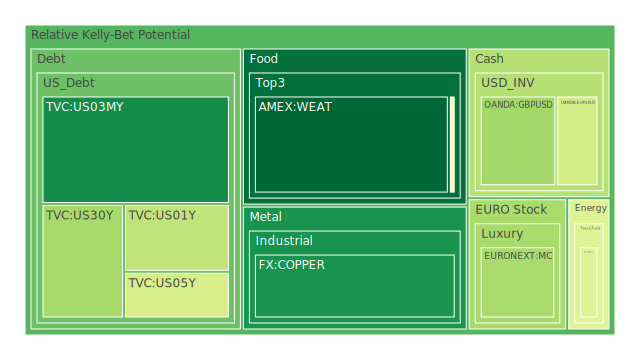
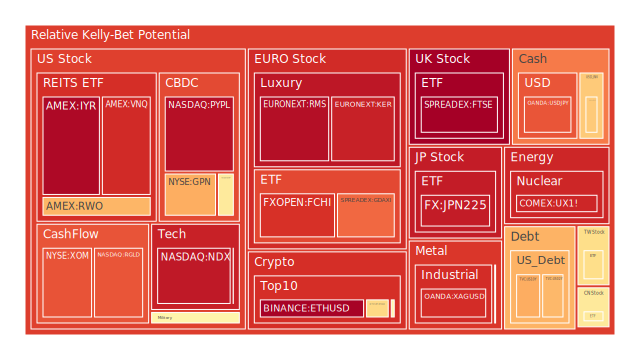
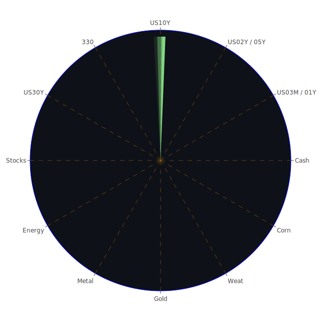

# 投資商品泡沫分析

## 美國國債
根據過去三天的數據，美國國債的泡沫機率有一定的波動。30年期國債（TVC:US30Y）的泡沫機率從0.338012下降至0.309879，顯示市場對長期國債的需求有所增加。10年期國債（TVC:US10Y）的泡沫機率則從0.853268下降至0.695611，這反映了投資者對中期國債的信心有所增強。短期國債（TVC:US03MY, TVC:US01Y, TVC:US02Y, TVC:US05Y）的泡沫機率變化不大，顯示市場對短期國債的需求相對穩定。

## 美國科技股
美國科技股的泡沫機率普遍較高。納斯達克指數（NASDAQ:NDX）的泡沫機率從0.944004稍微下降至0.935699，但仍處於高位。個別科技股如Adobe（NASDAQ:ADP）的泡沫機率從0.313721上升至0.565203，顯示市場對該股的熱情增加。這與Adobe上調全年營收預測的新聞相符。

## 美國房地產指數
美國房地產指數（AMEX:VNQ）的泡沫機率在過去三天內持續上升，從0.696333上升至0.900919，顯示市場對房地產的過度投資風險增加。這與房地產違約率上升的FED數據相符。

## 金/銀/銅
貴金屬的泡沫機率有所上升。黃金（OANDA:XAUUSD）的泡沫機率從0.444593上升至0.519502，白銀（OANDA:XAGUSD）的泡沫機率從0.909489稍微下降至0.896392，但仍處於高位。銅（FX:COPPER）的泡沫機率則從0.105499下降至0.103113，顯示市場對工業金屬的需求相對穩定。

## 加密貨幣
比特幣（BITSTAMP:BTCUSD）的泡沫機率從0.860771下降至0.611275，但仍處於高位。以太幣（BINANCE:ETHUSD）的泡沫機率從0.959792上升至0.979775，顯示市場對加密貨幣的投機性需求依然強勁。

## 黃豆 / 小麥 / 玉米
農產品的泡沫機率相對較低。小麥（AMEX:WEAT）的泡沫機率從0.020655下降至0.015002，黃豆（AMEX:SOYB）的泡沫機率從0.503560保持不變，玉米（AMEX:CORN）的泡沫機率則從0.405407下降至0.482828。

## 石油/ 鈾期貨UX!
石油（TVC:USOIL）的泡沫機率從0.419549保持穩定，鈾期貨（COMEX:UX1!）的泡沫機率從0.790894下降至0.908959，顯示市場對能源商品的需求有所波動。

## 各國外匯市場
英鎊兌美元（OANDA:GBPUSD）的泡沫機率從0.300696上升至0.304602，歐元兌美元（OANDA:EURUSD）的泡沫機率從0.392567保持穩定，日元兌美元（OANDA:USDJPY）的泡沫機率從0.829558保持穩定。

## 各國大盤指數
德國DAX指數（SPREADEX:GDAXI）的泡沫機率從0.800485保持穩定，法國CAC指數（FXOPEN:FCHI）的泡沫機率從0.888358保持穩定，中國滬深300指數（SSE:000300）的泡沫機率從0.710214下降至0.568491。

## 美國軍工股
雷神技術（NYSE:RTX）的泡沫機率從0.510860保持穩定，諾斯羅普·格魯曼（NYSE:NOC）的泡沫機率從0.511809保持穩定，洛克希德·馬丁（NYSE:LMT）的泡沫機率從0.546994保持穩定。

## 美國電子支付股
PayPal（NASDAQ:PYPL）的泡沫機率從0.954500保持穩定，Global Payments（NYSE:GPN）的泡沫機率從0.426263上升至0.694944。

## 石油防禦股
埃克森美孚（NYSE:XOM）的泡沫機率從0.833616保持穩定。

## 金礦防禦股
Royal Gold（NASDAQ:RGLD）的泡沫機率從0.663237上升至0.829605。

## 歐洲奢侈品股
LVMH（EURONEXT:MC）的泡沫機率從0.402166下降至0.314723，Kering（EURONEXT:KER）的泡沫機率從0.895000上升至0.919617。

# 投資建議

1. **賣出建議**
   - **加密貨幣**：以太幣（BINANCE:ETHUSD）的泡沫機率高達0.979775，新聞顯示市場對加密貨幣的投機性需求強勁，建議考慮賣出以避免未來價格下跌的風險。
   - **美國房地產指數**：AMEX:VNQ的泡沫機率高達0.900919，且房地產違約率上升，建議考慮賣出。

2. **買入建議**
   - **農產品**：小麥（AMEX:WEAT）的泡沫機率僅為0.015002，且新聞顯示農產品市場穩定，建議考慮買入。
   - **美國國債**：30年期國債（TVC:US30Y）的泡沫機率下降至0.309879，顯示市場對長期國債的需求增加，建議考慮買入。

3. **觀望建議**
   - **美國科技股**：納斯達克指數（NASDAQ:NDX）的泡沫機率仍處於高位，但市場對科技股的需求依然強勁，建議觀望。

# 風險提示

投資有風險，市場總是充滿不確定性。我們的建議僅供參考，投資者應根據自身的風險承受能力和投資目標，做出獨立的投資決策。特別是對於泡沫機率高的商品，應該謹慎進行投資決策。
 
Daily Buy Map:

 
Daily Sell Map:

 
Daily Radar Chart:

 
