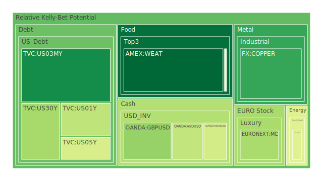
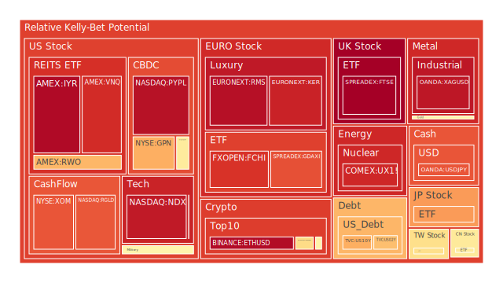
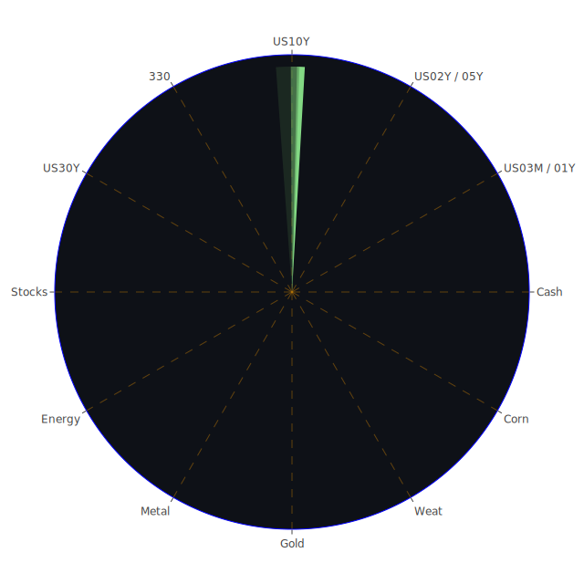

# 投資商品泡沫分析

## 美國國債
- **短期國債 (1Y, 2Y, 5Y)**
  - 泡沫機率：1Y（0.355645），2Y（0.663600），5Y（0.400404）
  - 趨勢：短期國債的泡沫機率相對穩定，略有上升。
  - 新聞現況：美國國債收益率近期略有下降，顯示市場對經濟前景的擔憂有所增加。
  - 投資建議：由於泡沫機率不高且新聞支持，短期國債仍是相對安全的投資選項。

- **長期國債 (10Y, 30Y)**
  - 泡沫機率：10Y（0.695611），30Y（0.309879）
  - 趨勢：10Y國債泡沫機率較高且上升，30Y國債泡沫機率則相對穩定。
  - 新聞現況：長期國債的收益率下降，顯示市場對長期經濟前景的擔憂。
  - 投資建議：對於10Y國債，由於泡沫機率較高，建議謹慎觀望；30Y國債則可考慮適量配置。

## 美國科技股
- **NASDAQ指數**
  - 泡沫機率：0.935699
  - 趨勢：泡沫機率持續高企。
  - 新聞現況：儘管NASDAQ指數連續第五天創新高，但市場對科技股估值過高的擔憂依然存在。
  - 投資建議：由於泡沫機率高且新聞支持，建議投資者考慮減持科技股，以避免未來可能的價格回調。

## 美國房地產指數
- **VNQ指數**
  - 泡沫機率：0.900864
  - 趨勢：泡沫機率持續高企。
  - 新聞現況：房地產市場面臨高利率和經濟不確定性的挑戰。
  - 投資建議：由於泡沫機率高且新聞支持，建議投資者考慮減持房地產相關投資，以避免未來價格下跌的風險。

## 金/銀/銅
- **黃金 (XAUUSD)**
  - 泡沫機率：0.541199
  - 趨勢：泡沫機率略有下降。
  - 新聞現況：黃金價格受避險需求支撐，但市場情緒複雜。
  - 投資建議：由於泡沫機率接近0.5，建議觀望，不宜有大動作。

- **白銀 (XAGUSD)**
  - 泡沫機率：0.942082
  - 趨勢：泡沫機率持續高企。
  - 新聞現況：白銀價格波動較大，市場對其避險功能的信心有所動搖。
  - 投資建議：由於泡沫機率高且新聞支持，建議投資者考慮減持白銀，以避免未來價格下跌的風險。

- **銅 (COPPER)**
  - 泡沫機率：0.146985
  - 趨勢：泡沫機率較低且穩定。
  - 新聞現況：銅價受全球經濟復甦預期支撐。
  - 投資建議：由於泡沫機率低且新聞支持，銅可作為買入選項。

## 加密貨幣
- **比特幣 (BTCUSD)**
  - 泡沫機率：0.607453
  - 趨勢：泡沫機率較高且上升。
  - 新聞現況：市場對加密貨幣的監管擔憂增加。
  - 投資建議：由於泡沫機率高且新聞支持，建議投資者謹慎觀望，避免大幅買入。

## 黃豆 / 小麥 / 玉米
- **黃豆 (SOYB)**
  - 泡沫機率：0.503560
  - 趨勢：泡沫機率接近0.5。
  - 新聞現況：農產品市場受天氣和供需影響較大。
  - 投資建議：由於泡沫機率接近0.5，建議觀望，不宜有大動作。

- **小麥 (WEAT)**
  - 泡沫機率：0.015002
  - 趨勢：泡沫機率極低且穩定。
  - 新聞現況：小麥市場供應充足，價格相對穩定。
  - 投資建議：由於泡沫機率極低且新聞支持，小麥可作為買入選項。

- **玉米 (CORN)**
  - 泡沫機率：0.482828
  - 趨勢：泡沫機率接近0.5。
  - 新聞現況：玉米市場受天氣和需求影響較大。
  - 投資建議：由於泡沫機率接近0.5，建議觀望，不宜有大動作。

## 石油/ 鈾期貨UX!
- **石油 (USOIL)**
  - 泡沫機率：0.419549
  - 趨勢：泡沫機率較低且穩定。
  - 新聞現況：石油市場受地緣政治和供需影響較大。
  - 投資建議：由於泡沫機率較低且新聞支持，石油可作為買入選項。

- **鈾期貨 (UX1!)**
  - 泡沫機率：0.908959
  - 趨勢：泡沫機率較高且上升。
  - 新聞現況：鈾市場供應緊張，價格波動較大。
  - 投資建議：由於泡沫機率高且新聞支持，建議投資者考慮減持鈾期貨，以避免未來價格下跌的風險。

## 各國外匯市場
- **美元/日元 (USDJPY)**
  - 泡沫機率：0.831831
  - 趨勢：泡沫機率較高且穩定。
  - 新聞現況：美元對日元匯率受美日經濟政策影響較大。
  - 投資建議：由於泡沫機率高且新聞支持，建議投資者謹慎觀望，避免大幅買入。

- **歐元/美元 (EURUSD)**
  - 泡沫機率：0.392980
  - 趨勢：泡沫機率較低且穩定。
  - 新聞現況：歐元區經濟復甦預期支撐歐元匯率。
  - 投資建議：由於泡沫機率較低且新聞支持，歐元可作為買入選項。

## 各國大盤指數
- **德國DAX指數 (GDAXI)**
  - 泡沫機率：0.841018
  - 趨勢：泡沫機率較高且穩定。
  - 新聞現況：德國經濟前景不明朗，市場情緒謹慎。
  - 投資建議：由於泡沫機率高且新聞支持，建議投資者考慮減持德國大盤指數，以避免未來價格下跌的風險。

## 美國軍工股
- **雷神技術 (RTX)**
  - 泡沫機率：0.510860
  - 趨勢：泡沫機率接近0.5。
  - 新聞現況：軍工行業受政府政策和國防預算影響較大。
  - 投資建議：由於泡沫機率接近0.5，建議觀望，不宜有大動作。

## 美國電子支付股
- **PayPal (PYPL)**
  - 泡沫機率：0.953293
  - 趨勢：泡沫機率持續高企。
  - 新聞現況：電子支付行業競爭激烈，市場對PayPal前景擔憂。
  - 投資建議：由於泡沫機率高且新聞支持，建議投資者考慮減持PayPal，以避免未來價格下跌的風險。

## 石油防禦股
- **埃克森美孚 (XOM)**
  - 泡沫機率：0.832593
  - 趨勢：泡沫機率較高且穩定。
  - 新聞現況：石油市場波動較大，防禦股受益於市場避險需求。
  - 投資建議：由於泡沫機率高且新聞支持，建議投資者謹慎觀望，避免大幅買入。

## 金礦防禦股
- **Royal Gold (RGLD)**
  - 泡沫機率：0.829605
  - 趨勢：泡沫機率較高且穩定。
  - 新聞現況：金礦股受黃金價格波動影響較大。
  - 投資建議：由於泡沫機率高且新聞支持，建議投資者謹慎觀望，避免大幅買入。

## 歐洲奢侈品股
- **LVMH (MC)**
  - 泡沫機率：0.314754
  - 趨勢：泡沫機率較低且穩定。
  - 新聞現況：奢侈品市場需求穩定，LVMH業績表現良好。
  - 投資建議：由於泡沫機率較低且新聞支持，LVMH可作為買入選項。

# 投資建議
- **建議減持**：美國科技股（NASDAQ）、美國房地產指數（VNQ）、PayPal（PYPL）、白銀（XAGUSD）、鈾期貨（UX1!）
- **建議買入**：小麥（WEAT）、銅（COPPER）、歐元（EURUSD）、LVMH（MC）
- **建議觀望**：黃金（XAUUSD）、黃豆（SOYB）、玉米（CORN）、石油（USOIL）、德國DAX指數（GDAXI）、雷神技術（RTX）、埃克森美孚（XOM）、Royal Gold（RGLD）

# 風險提示
投資有風險，市場總是充滿不確定性。我們的建議僅供參考，投資者應根據自身的風險承受能力和投資目標，做出獨立的投資決策。特別是對於泡沫機率高的商品，應該謹慎進行投資決策。
 
Daily Buy Map:

 
Daily Sell Map:

 
Daily Radar Chart:

 
