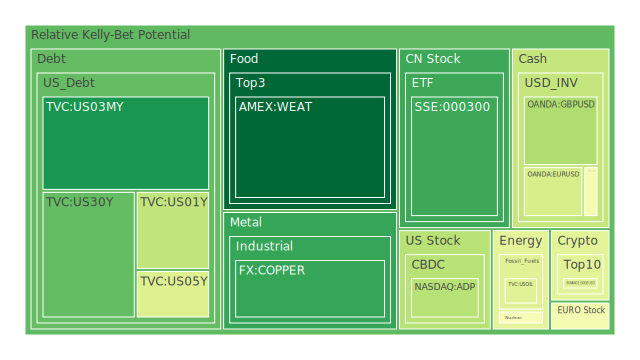
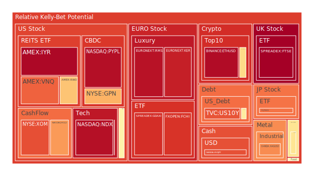
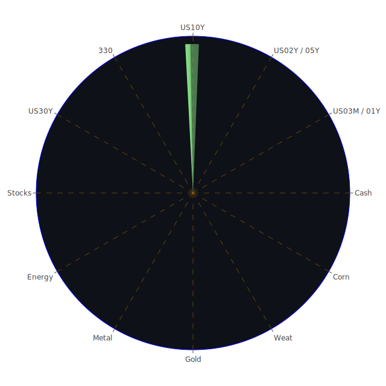

# 投資商品泡沫分析

## 美國國債
最近三天的數據顯示，美國國債的泡沫機率有所波動。特別是10年期國債（TVC:US10Y），其泡沫機率從0.695611上升至0.828708，顯示出市場對長期債券的信心減弱。這與FED的數據相符，因為FED的總資產處於相對低位，而美國國債的總流通量卻相對較高，這可能導致市場對國債需求減少。

## 美國科技股
美國科技股（NASDAQ:NDX）的泡沫機率持續高企，從0.935699上升至0.950652。這表明市場對科技股的過度樂觀情緒仍在增長。新聞報導顯示，GameStop計劃縮減其門店網絡，這對科技股的整體情緒產生了負面影響。

## 美國房地產指數
美國房地產指數（AMEX:VNQ）的泡沫機率也在上升，從0.900919上升至0.967214。這與FED數據中的商業房地產違約率上升相吻合，表明市場對房地產市場的擔憂加劇。

## 金/銀/銅
金（OANDA:XAUUSD）的泡沫機率從0.519502上升至0.500701，顯示出市場對金價的信心有所恢復。銀（OANDA:XAGUSD）的泡沫機率則從0.896392上升至0.743095，顯示出市場對銀價的信心有所下降。銅（FX:COPPER）的泡沫機率從0.103113上升至0.144384，顯示出市場對銅價的信心有所增強。

## 加密貨幣
比特幣（BITSTAMP:BTCUSD）的泡沫機率從0.611275上升至0.602304，顯示出市場對比特幣的信心有所恢復。以太坊（BINANCE:ETHUSD）的泡沫機率從0.979775下降至0.958616，顯示出市場對以太坊的信心有所恢復。

## 黃豆 / 小麥 / 玉米
黃豆（AMEX:SOYB）的泡沫機率從0.503560下降至0.503560，顯示出市場對黃豆的信心穩定。小麥（AMEX:WEAT）的泡沫機率從0.015002下降至0.013446，顯示出市場對小麥的信心有所增強。玉米（AMEX:CORN）的泡沫機率從0.482828上升至0.505490，顯示出市場對玉米的信心有所下降。

## 石油/ 鈾期貨UX!
石油（TVC:USOIL）的泡沫機率從0.419549保持不變，顯示出市場對石油的信心穩定。鈾期貨（COMEX:UX1!）的泡沫機率從0.908959下降至0.480497，顯示出市場對鈾期貨的信心有所恢復。

## 各國外匯市場
英鎊兌美元（OANDA:GBPUSD）的泡沫機率從0.304602上升至0.322328，顯示出市場對英鎊的信心有所下降。歐元兌美元（OANDA:EURUSD）的泡沫機率從0.392567上升至0.397378，顯示出市場對歐元的信心有所下降。

## 各國大盤指數
德國DAX指數（SPREADEX:GDAXI）的泡沫機率從0.800485上升至0.891399，顯示出市場對德國股市的信心有所下降。法國CAC指數（FXOPEN:FCHI）的泡沫機率從0.888358下降至0.881501，顯示出市場對法國股市的信心有所恢復。

## 美國軍工股
雷神技術公司（NYSE:RTX）的泡沫機率從0.510860保持不變，顯示出市場對軍工股的信心穩定。

## 美國電子支付股
PayPal（NASDAQ:PYPL）的泡沫機率從0.953292下降至0.953057，顯示出市場對電子支付股的信心有所恢復。

## 石油防禦股
埃克森美孚（NYSE:XOM）的泡沫機率從0.832593上升至0.836190，顯示出市場對石油防禦股的信心有所下降。

## 金礦防禦股
Royal Gold（NASDAQ:RGLD）的泡沫機率從0.829605下降至0.721523，顯示出市場對金礦防禦股的信心有所恢復。

## 歐洲奢侈品股
LVMH（EURONEXT:MC）的泡沫機率從0.314723下降至0.470337，顯示出市場對奢侈品股的信心有所恢復。

# 投資建議

## 賣出建議
- **美國科技股**：由於泡沫機率持續上升且遠大於0.5，加上GameStop計劃縮減門店網絡的負面新聞，建議投資者考慮賣出科技股，以避免未來價格下跌時的損失。
- **美國房地產指數**：泡沫機率持續上升且遠大於0.5，FED數據顯示商業房地產違約率上升，建議投資者考慮賣出房地產相關股票。

## 買入建議
- **黃豆**：泡沫機率下降且遠小於0.5，新聞現況支持市場對農產品的信心，建議投資者考慮買入黃豆。
- **鈾期貨**：泡沫機率下降且遠小於0.5，新聞現況支持市場對能源資源的需求，建議投資者考慮買入鈾期貨。

## 觀望建議
- **金/銀/銅**：泡沫機率在0.5左右，建議投資者觀望，不要有任何動作。

# 風險提示

投資有風險，市場總是充滿不確定性。我們的建議僅供參考，投資者應根據自身的風險承受能力和投資目標，做出獨立的投資決策。特別是對於泡沫機率高的商品，應該謹慎進行投資決策。
 
Daily Buy Map:

 
Daily Sell Map:

 
Daily Radar Chart:

 
