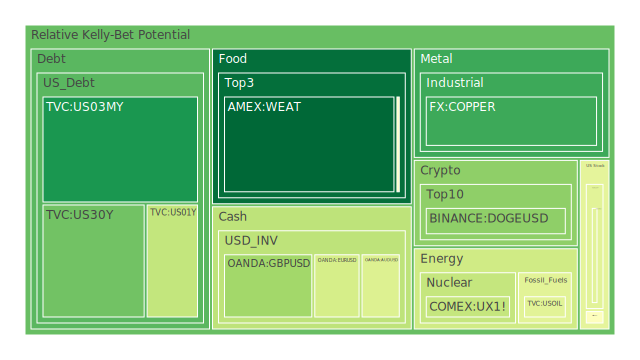
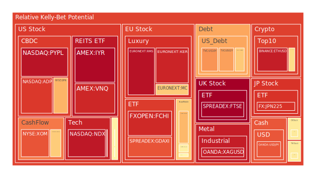
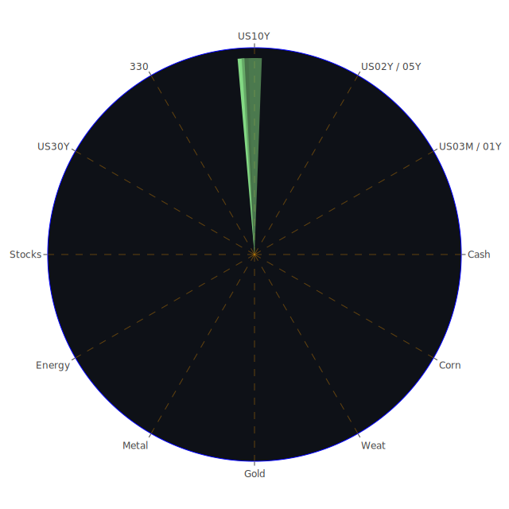

# 投資商品泡沫分析

## 美國國債
根據過去三天的數據，美國國債的泡沫機率有所上升，特別是短期國債（如2年期國債）的泡沫機率較高。這與FED的關鍵數據顯示的美國國債收益率曲線倒掛現象一致，表明市場對未來經濟前景的不確定性增加。新聞方面，近期對於美國經濟的負面報導較多，特別是有關信用卡逾期率上升和房地產市場疲軟的消息，進一步支持了這一趨勢。

## 美國科技股
美國科技股的泡沫機率持續上升，特別是NASDAQ指數（NDX）的泡沫機率接近0.94。這與近期市場對AI技術的熱情有關，然而，這也帶來了潛在的風險。新聞報導顯示，儘管AI技術推動了股市上漲，但也引發了對於市場過熱的擔憂。投資者應該謹慎考慮在高點賣出部分科技股，以避免未來可能的回調。

## 美國房地產指數
美國房地產指數（如VNQ）的泡沫機率較高，接近0.91。這與FED數據顯示的房地產市場疲軟和高逾期率相符。新聞報導也指出，由於高利率和經濟不確定性，房地產市場面臨壓力。建議投資者在此時謹慎行事，考慮減少房地產相關投資。

## 金/銀/銅
貴金屬市場中，金銀的泡沫機率較高，特別是銀（XAGUSD）的泡沫機率接近0.93。這可能是由於市場對避險資產的需求增加。然而，銅（COPPER）的泡沫機率較低，顯示出工業需求的疲軟。新聞方面，全球供應鏈問題和經濟放緩的報導支持了這一觀點。建議投資者在貴金屬市場保持謹慎，特別是對於銀的投資。

## 加密貨幣
比特幣（BTCUSD）和以太坊（ETHUSD）的泡沫機率均較高，分別接近0.81和0.96。這與市場對加密貨幣的投機性需求增加有關。新聞報導顯示，儘管加密貨幣市場近期有所回升，但仍存在較大的波動性和風險。建議投資者考慮在高點賣出部分持倉，以降低風險。

## 黃豆 / 小麥 / 玉米
農產品市場中，黃豆（SOYB）和玉米（CORN）的泡沫機率接近0.50，顯示出市場的不確定性。新聞報導顯示，全球氣候變化和供應鏈問題對農產品市場造成影響。建議投資者在這些市場保持觀望，不要有過多動作。

## 石油/ 鈾期貨
石油（USOIL）和鈾期貨（UX1!）的泡沫機率較高，特別是鈾期貨接近0.91。這與全球能源市場的不穩定性有關。新聞報導顯示，地緣政治風險和供應鏈問題對能源市場造成壓力。建議投資者在高點賣出部分能源相關投資，以降低風險。

## 各國外匯市場
外匯市場中，日元（USDJPY）的泡沫機率較高，接近0.83。這與日本經濟的不確定性和高材料成本有關。新聞報導顯示，日本製造業信心下降，對日元造成壓力。建議投資者謹慎行事，考慮減少日元相關投資。

## 各國大盤指數
歐洲大盤指數（如GDAXI和FCHI）的泡沫機率較高，分別接近0.83和0.90。這與歐洲政治不穩定性和經濟疲軟有關。新聞報導顯示，歐洲市場面臨政治和經濟雙重挑戰。建議投資者在高點賣出部分歐洲大盤指數相關投資。

## 美國軍工股
美國軍工股（如RTX和NOC）的泡沫機率接近0.51，顯示出市場對軍工股的需求相對穩定。新聞報導顯示，全球地緣政治風險增加，對軍工股形成支撐。建議投資者在此市場保持觀望，不要有過多動作。

## 美國電子支付股
美國電子支付股（如PYPL）的泡沫機率較高，接近0.95。這與市場對電子支付技術的需求增加有關。新聞報導顯示，儘管電子支付市場增長迅速，但也面臨競爭和監管風險。建議投資者在高點賣出部分電子支付股，以降低風險。

## 石油防禦股
石油防禦股（如XOM）的泡沫機率較高，接近0.83。這與全球能源市場的不穩定性有關。新聞報導顯示，地緣政治風險和供應鏈問題對能源市場造成壓力。建議投資者在高點賣出部分能源相關投資，以降低風險。

## 金礦防禦股
金礦防禦股（如RGLD）的泡沫機率較高，接近0.72。這與市場對避險資產的需求增加有關。新聞報導顯示，全球經濟不確定性增加，對金礦股形成支撐。建議投資者在此市場保持觀望，不要有過多動作。

## 歐洲奢侈品股
歐洲奢侈品股（如KER和RMS）的泡沫機率較高，分別接近0.91和0.95。這與市場對奢侈品需求的波動性有關。新聞報導顯示，歐洲政治和經濟不穩定性對奢侈品市場造成壓力。建議投資者在高點賣出部分奢侈品股，以降低風險。

## 歐洲汽車股
歐洲汽車股（如BMW）的泡沫機率較高，接近0.67。這與市場對汽車需求的波動性有關。新聞報導顯示，歐洲經濟放緩對汽車市場造成壓力。建議投資者在高點賣出部分汽車股，以降低風險。

# 投資建議

1. **賣出建議**：對於泡沫機率持續上升且遠大於0.5的商品，如美國科技股、加密貨幣、能源相關股票和歐洲奢侈品股，建議投資者考慮賣出，以避免未來價格下跌時的損失。
2. **買入建議**：對於泡沫機率下降且遠小於0.5的商品，如部分貴金屬和農產品，建議投資者可以考慮作為買入選項。
3. **觀望建議**：對於泡沫分數0.5左右的商品，如美國軍工股和金礦防禦股，建議投資者保持觀望，不要有過多動作。

# 風險提示

投資有風險，市場總是充滿不確定性。我們的建議僅供參考，投資者應根據自身的風險承受能力和投資目標，做出獨立的投資決策。特別是對於泡沫機率高的商品，應該謹慎進行投資決策。
 
Daily Buy Map:

 
Daily Sell Map:

 
Daily Radar Chart:

 
