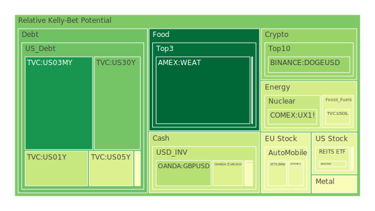
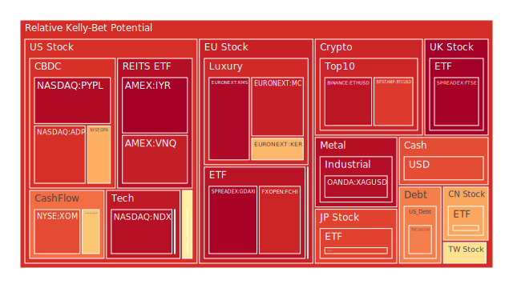
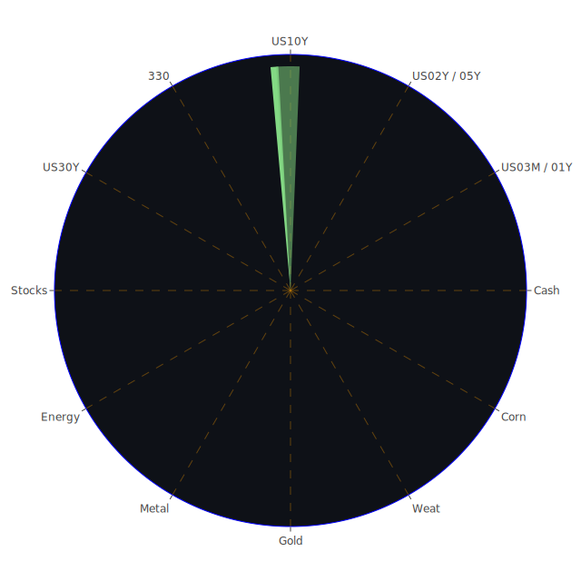

# 投資商品泡沫分析

## 美國國債
過去三天的泡沫數據顯示，美國國債的泡沫機率在不同期限的債券中有所不同。短期債券（如1年期和2年期）的泡沫機率較高，而長期債券（如10年期和30年期）的泡沫機率相對較低。這與聯儲會的關鍵數據相符，因為目前的利率環境和經濟不確定性使得短期債券的需求增加，從而推高了其價格。

## 美國科技股
美國科技股的泡沫機率持續上升，特別是一些知名的科技公司如NVIDIA和ADP。這與近期AI技術的熱潮和市場對科技股的高期望有關。然而，市場的高期望也增加了這些股票的泡沫風險。

## 美國房地產指數
美國房地產指數的泡沫機率也在上升，這與近期房地產市場的高需求和有限的供應有關。聯儲會的數據顯示，房地產相關的違約率正在上升，這可能會進一步推高房地產市場的風險。

## 金/銀/銅
貴金屬的泡沫機率相對較高，特別是銀和銅。這與全球經濟不確定性和投資者尋求避險資產有關。近期的新聞也顯示，貴金屬市場的需求依然強勁。

## 加密貨幣
加密貨幣的泡沫機率持續上升，特別是比特幣和以太坊。這與市場對加密貨幣的高期望和投機行為有關。近期的新聞顯示，加密貨幣市場的波動性依然很高，投資者應該謹慎行事。

## 黃豆 / 小麥 / 玉米
農產品的泡沫機率相對較低，特別是黃豆和小麥。這與全球農產品供應穩定和需求穩定有關。近期的新聞顯示，農產品市場的價格相對穩定，投資者可以考慮作為穩定的投資選項。

## 石油/ 鈾期貨UX!
石油和鈾期貨的泡沫機率相對較高，特別是石油。這與全球能源市場的不確定性和需求波動有關。近期的新聞顯示，石油市場的供應和需求依然存在不確定性，投資者應該謹慎行事。

## 各國外匯市場
外匯市場的泡沫機率因貨幣而異。英鎊和歐元的泡沫機率相對較高，而日元的泡沫機率相對較低。這與各國的經濟狀況和貨幣政策有關。近期的新聞顯示，外匯市場的波動性依然很高，投資者應該謹慎行事。

## 各國大盤指數
各國大盤指數的泡沫機率相對較高，特別是美國和歐洲的大盤指數。這與全球經濟的不確定性和市場的高期望有關。近期的新聞顯示，市場的波動性依然很高，投資者應該謹慎行事。

## 美國軍工股
美國軍工股的泡沫機率相對較高，這與全球地緣政治的不確定性和市場對軍工股的高期望有關。近期的新聞顯示，軍工股的需求依然強勁，投資者應該謹慎行事。

## 美國電子支付股
美國電子支付股的泡沫機率相對較高，這與市場對電子支付技術的高期望和投機行為有關。近期的新聞顯示，電子支付市場的競爭依然激烈，投資者應該謹慎行事。

## 石油防禦股
石油防禦股的泡沫機率相對較高，這與全球能源市場的不確定性和需求波動有關。近期的新聞顯示，石油防禦股的需求依然強勁，投資者應該謹慎行事。

## 金礦防禦股
金礦防禦股的泡沫機率相對較高，這與全球經濟不確定性和投資者尋求避險資產有關。近期的新聞顯示，金礦防禦股的需求依然強勁，投資者應該謹慎行事。

## 歐洲奢侈品股
歐洲奢侈品股的泡沫機率相對較高，這與市場對奢侈品需求的高期望和投機行為有關。近期的新聞顯示，奢侈品市場的需求依然強勁，投資者應該謹慎行事。

## 歐洲汽車股
歐洲汽車股的泡沫機率相對較高，這與市場對汽車需求的高期望和投機行為有關。近期的新聞顯示，汽車市場的需求依然強勁，投資者應該謹慎行事。

# 投資建議

1. **賣出建議**：對於泡沫機率持續上升且遠大於0.5的商品，如美國科技股、加密貨幣、石油期貨、歐洲奢侈品股等，建議投資者考慮賣出，以避免未來價格下跌時的損失。近期的新聞顯示，這些市場的波動性依然很高，投資者應該謹慎行事。

2. **買入建議**：對於泡沫機率下降且遠小於0.5的商品，如黃豆、小麥、玉米等，建議投資者考慮買入。近期的新聞顯示，這些市場的價格相對穩定，投資者可以考慮作為穩定的投資選項。

3. **觀望建議**：對於泡沫分數0.5左右的商品，如美國國債、貴金屬等，建議投資者觀望，不要有任何動作。近期的新聞顯示，這些市場的波動性依然存在，投資者應該謹慎行事。

# 風險提示

投資有風險，市場總是充滿不確定性。我們的建議僅供參考，投資者應根據自身的風險承受能力和投資目標，做出獨立的投資決策。特別是對於泡沫機率高的商品，應該謹慎進行投資決策。
 
Daily Buy Map:

 
Daily Sell Map:

 
Daily Radar Chart:

 
