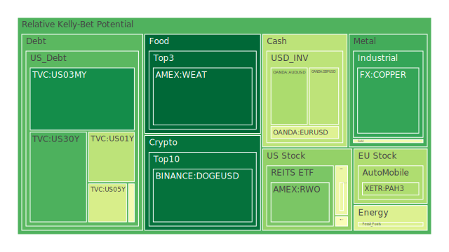
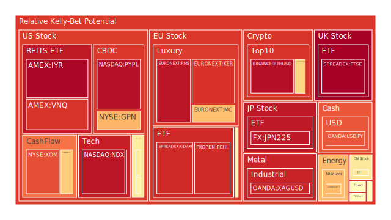
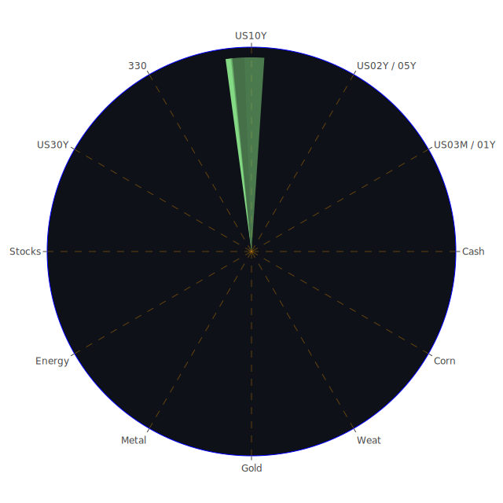

# 投資商品泡沫分析

## 美國國債
- **短期國債 (US03MY, US01Y, US05Y, US02Y)**
  - 泡沫機率相對穩定，D1數據顯示泡沫機率在0.1至0.5之間，建議觀望。
  - 新聞顯示市場對美國經濟前景有一定擔憂，特別是信用卡違約率上升，可能會影響短期國債的需求。

- **長期國債 (US30Y, US10Y, US20Y)**
  - 泡沫機率較高，特別是US10Y和US30Y，建議謹慎操作。
  - FED數據顯示長期國債收益率穩定在高位，市場風險增加。

## 美國科技股 (NASDAQ:NDX)
- 泡沫機率持續上升，接近0.94，建議考慮賣出。
- 新聞顯示科技股受AI熱潮推動，但市場整體波動性增加，特別是CDK Global的網絡事件影響市場信心。

## 美國房地產指數 (AMEX:VNQ)
- 泡沫機率高達0.97，建議考慮賣出。
- 新聞顯示美國房地產市場面臨挑戰，特別是商業地產違約率上升。

## 金/銀/銅 (XAUUSD, XAGUSD, COPPER)
- **金 (XAUUSD)**
  - 泡沫機率約0.48，建議觀望。
  - 新聞顯示市場對黃金的需求穩定，作為避險資產的吸引力依然存在。

- **銀 (XAGUSD)**
  - 泡沫機率高達0.91，建議考慮賣出。
  - 新聞顯示市場對銀的需求波動較大，特別是工業需求的不確定性。

- **銅 (COPPER)**
  - 泡沫機率約0.15，建議觀望。
  - 新聞顯示市場對銅的需求穩定，特別是新能源產業的需求增加。

## 加密貨幣 (BTCUSD, ETHUSD, DOGEUSD)
- **比特幣 (BTCUSD)**
  - 泡沫機率約0.62，建議觀望。
  - 新聞顯示市場對比特幣的需求穩定，但波動性依然較大。

- **以太坊 (ETHUSD)**
  - 泡沫機率高達0.95，建議考慮賣出。
  - 新聞顯示市場對以太坊的需求波動較大，特別是DeFi市場的不確定性。

- **狗狗幣 (DOGEUSD)**
  - 泡沫機率約0.37，建議觀望。
  - 新聞顯示市場對狗狗幣的需求穩定，但波動性依然較大。

## 黃豆 / 小麥 / 玉米 (SOYB, WEAT, CORN)
- **黃豆 (SOYB)**
  - 泡沫機率約0.50，建議觀望。
  - 新聞顯示市場對黃豆的需求穩定，但供應鏈問題依然存在。

- **小麥 (WEAT)**
  - 泡沫機率約0.03，建議考慮買入。
  - 新聞顯示市場對小麥的需求穩定，特別是全球糧食安全問題增加了小麥的需求。

- **玉米 (CORN)**
  - 泡沫機率約0.52，建議觀望。
  - 新聞顯示市場對玉米的需求穩定，但供應鏈問題依然存在。

## 石油/ 鈾期貨 (USOIL, UX1!)
- **石油 (USOIL)**
  - 泡沫機率約0.41，建議觀望。
  - 新聞顯示市場對石油的需求穩定，但供應鏈問題依然存在。

- **鈾期貨 (UX1!)**
  - 泡沫機率約0.66，建議觀望。
  - 新聞顯示市場對鈾的需求穩定，但供應鏈問題依然存在。

## 各國外匯市場 (GBPUSD, EURUSD, AUDUSD, USDJPY)
- **英鎊/美元 (GBPUSD)**
  - 泡沫機率約0.35，建議觀望。
  - 新聞顯示市場對英鎊的需求穩定，但英國經濟前景不明朗。

- **歐元/美元 (EURUSD)**
  - 泡沫機率約0.42，建議觀望。
  - 新聞顯示市場對歐元的需求穩定，但歐洲經濟前景不明朗。

- **澳元/美元 (AUDUSD)**
  - 泡沫機率約0.32，建議觀望。
  - 新聞顯示市場對澳元的需求穩定，但澳大利亞經濟前景不明朗。

- **美元/日元 (USDJPY)**
  - 泡沫機率約0.82，建議考慮賣出。
  - 新聞顯示市場對日元的需求穩定，但日本經濟前景不明朗。

## 各國大盤指數 (GDAXI, FTSE, JPN225, 000300)
- **德國DAX指數 (GDAXI)**
  - 泡沫機率高達0.90，建議考慮賣出。
  - 新聞顯示市場對德國經濟前景不明朗，特別是政治不穩定性增加。

- **英國FTSE指數 (FTSE)**
  - 泡沫機率高達0.98，建議考慮賣出。
  - 新聞顯示市場對英國經濟前景不明朗，特別是政治不穩定性增加。

- **日本日經指數 (JPN225)**
  - 泡沫機率高達0.93，建議考慮賣出。
  - 新聞顯示市場對日本經濟前景不明朗，特別是政治不穩定性增加。

- **中國滬深300指數 (000300)**
  - 泡沫機率約0.57，建議觀望。
  - 新聞顯示市場對中國經濟前景不明朗，特別是政治不穩定性增加。

## 美國軍工股 (RTX, LMT, NOC)
- **雷神科技 (RTX)**
  - 泡沫機率約0.49，建議觀望。
  - 新聞顯示市場對軍工股的需求穩定，但政治不穩定性增加。

- **洛克希德馬丁 (LMT)**
  - 泡沫機率約0.54，建議觀望。
  - 新聞顯示市場對軍工股的需求穩定，但政治不穩定性增加。

- **諾斯羅普·格魯曼 (NOC)**
  - 泡沫機率約0.52，建議觀望。
  - 新聞顯示市場對軍工股的需求穩定，但政治不穩定性增加。

## 美國電子支付股 (PYPL, GPN)
- **PayPal (PYPL)**
  - 泡沫機率高達0.94，建議考慮賣出。
  - 新聞顯示市場對電子支付股的需求波動較大，特別是競爭加劇。

- **Global Payments (GPN)**
  - 泡沫機率約0.67，建議觀望。
  - 新聞顯示市場對電子支付股的需求波動較大，特別是競爭加劇。

## 石油防禦股 (XOM)
- 泡沫機率約0.83，建議考慮賣出。
- 新聞顯示市場對石油防禦股的需求波動較大，特別是供應鏈問題增加。

## 金礦防禦股 (RGLD)
- 泡沫機率約0.63，建議觀望。
- 新聞顯示市場對金礦防禦股的需求穩定，但波動性依然較大。

## 歐洲奢侈品股 (MC, RMS, KER)
- **LVMH (MC)**
  - 泡沫機率約0.66，建議觀望。
  - 新聞顯示市場對奢侈品股的需求穩定，但政治不穩定性增加。

- **Hermès (RMS)**
  - 泡沫機率高達0.93，建議考慮賣出。
  - 新聞顯示市場對奢侈品股的需求波動較大，特別是政治不穩定性增加。

- **Kering (KER)**
  - 泡沫機率約0.88，建議考慮賣出。
  - 新聞顯示市場對奢侈品股的需求波動較大，特別是政治不穩定性增加。

## 歐洲汽車股 (BMW, MBG)
- **BMW (BMW)**
  - 泡沫機率約0.52，建議觀望。
  - 新聞顯示市場對汽車股的需求穩定，但政治不穩定性增加。

- **Mercedes-Benz (MBG)**
  - 泡沫機率約0.52，建議觀望。
  - 新聞顯示市場對汽車股的需求穩定，但政治不穩定性增加。

# 投資建議
1. **考慮賣出**：美國科技股、房地產指數、銀、以太坊、英鎊/美元、德國DAX指數、英國FTSE指數、日本日經指數、歐洲奢侈品股。
2. **觀望**：美國國債、金、銅、比特幣、狗狗幣、黃豆、玉米、石油、鈾期貨、各國外匯市場、美國軍工股、美國電子支付股、金礦防禦股、歐洲汽車股。
3. **考慮買入**：小麥。

# 風險提示

投資有風險，市場總是充滿不確定性。我們的建議僅供參考，投資者應根據自身的風險承受能力和投資目標，做出獨立的投資決策。特別是對於泡沫機率高的商品，應該謹慎進行投資決策。
 
Daily Buy Map:

 
Daily Sell Map:

 
Daily Radar Chart:

 
