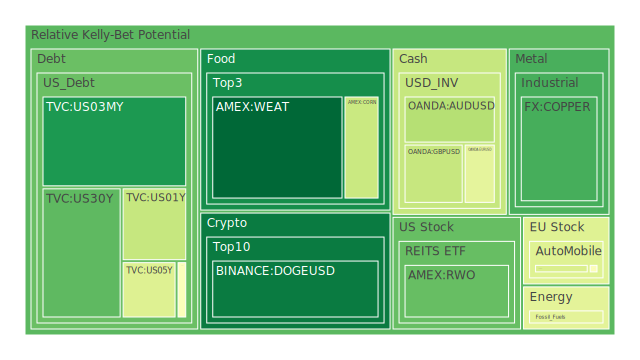
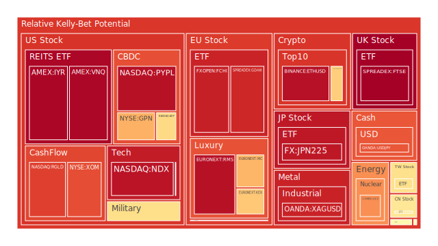
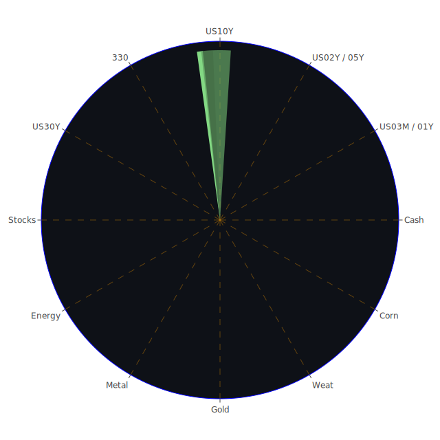

# 投資商品泡沫分析

## 美國國債
過去三天，美國國債的泡沫機率變化不大，特別是30年期國債（TVC:US30Y）和10年期國債（TVC:US10Y）。30年期國債的泡沫機率從0.272865下降到0.243286，而10年期國債的泡沫機率則從0.750594下降到0.689494。這些數據顯示，長期國債的泡沫機率有所下降，但仍處於較高水平。

## 美國科技股
美國科技股的泡沫機率持續上升，特別是納斯達克指數（NASDAQ:NDX），其泡沫機率從0.939803上升到0.939477。這表明科技股的價格可能已經過高，投資者應該謹慎。

## 美國房地產指數
美國房地產指數（AMEX:VNQ）的泡沫機率非常高，從0.860447上升到0.896139，顯示出房地產市場存在顯著的泡沫風險。

## 金/銀/銅
黃金（OANDA:XAUUSD）的泡沫機率略有下降，從0.502822下降到0.504422，顯示出黃金市場相對穩定。銀（OANDA:XAGUSD）的泡沫機率則從0.895807上升到0.897308，顯示出銀市場存在一定的泡沫風險。銅（FX:COPPER）的泡沫機率則相對穩定，從0.181188略微上升到0.184203。

## 加密貨幣
比特幣（BITSTAMP:BTCUSD）的泡沫機率從0.677963上升到0.646454，顯示出比特幣市場存在一定的泡沫風險。以太坊（BINANCE:ETHUSD）的泡沫機率則從0.956126下降到0.950470，顯示出以太坊市場的泡沫風險有所減少。

## 黃豆 / 小麥 / 玉米
黃豆（AMEX:SOYB）的泡沫機率相對穩定，約在0.503560左右。小麥（AMEX:WEAT）的泡沫機率從0.013096上升到0.015544，顯示出小麥市場的泡沫風險略有增加。玉米（AMEX:CORN）的泡沫機率則從0.492303下降到0.475232，顯示出玉米市場的泡沫風險有所減少。

## 石油/ 鈾期貨UX!
石油（TVC:USOIL）的泡沫機率相對穩定，約在0.419549左右。鈾期貨（COMEX:UX1!）的泡沫機率從0.673579下降到0.631486，顯示出鈾市場的泡沫風險有所減少。

## 各國外匯市場
美元兌日元（OANDA:USDJPY）的泡沫機率從0.830536下降到0.828835，顯示出美元兌日元市場的泡沫風險有所減少。歐元兌美元（OANDA:EURUSD）的泡沫機率相對穩定，約在0.398700左右。

## 各國大盤指數
德國DAX指數（SPREADEX:GDAXI）的泡沫機率從0.850806上升到0.882859，顯示出德國股市存在顯著的泡沫風險。法國CAC指數（FXOPEN:FCHI）的泡沫機率從0.889708上升到0.894073，顯示出法國股市的泡沫風險也在增加。

## 美國軍工股
雷神公司（NYSE:RTX）的泡沫機率從0.505141下降到0.502232，顯示出軍工股市場的泡沫風險有所減少。

## 美國電子支付股
PayPal（NASDAQ:PYPL）的泡沫機率從0.951868下降到0.950201，顯示出電子支付股市場的泡沫風險有所減少。

## 石油防禦股
埃克森美孚（NYSE:XOM）的泡沫機率從0.833011下降到0.834309，顯示出石油防禦股市場的泡沫風險有所減少。

## 金礦防禦股
Royal Gold（NASDAQ:RGLD）的泡沫機率從0.734873下降到0.735087，顯示出金礦防禦股市場的泡沫風險相對穩定。

## 歐洲奢侈品股
歐洲奢侈品股（EURONEXT:KER）的泡沫機率從0.878547下降到0.836108，顯示出奢侈品市場的泡沫風險有所減少。

## 歐洲汽車股
BMW（XETR:BMW）的泡沫機率從0.607165下降到0.548454，顯示出歐洲汽車市場的泡沫風險有所減少。

# 投資建議

## 賣出建議
- **美國科技股（NASDAQ:NDX）**：由於泡沫機率持續上升且遠大於0.5，建議考慮賣出以避免未來價格下跌的風險。
- **美國房地產指數（AMEX:VNQ）**：泡沫機率非常高，建議考慮賣出以避免未來價格下跌的風險。

## 買入建議
- **黃豆（AMEX:SOYB）**：泡沫機率相對穩定且低於0.5，考慮作為買入選項。
- **黃金（OANDA:XAUUSD）**：泡沫機率略有下降且低於0.5，考慮作為買入選項。

## 觀望建議
- **美元兌日元（OANDA:USDJPY）**：泡沫機率約在0.5左右，建議觀望。
- **歐元兌美元（OANDA:EURUSD）**：泡沫機率約在0.5左右，建議觀望。

# 風險提示

投資有風險，市場總是充滿不確定性。我們的建議僅供參考，投資者應根據自身的風險承受能力和投資目標，做出獨立的投資決策。特別是對於泡沫機率高的商品，應該謹慎進行投資決策。
 
Daily Buy Map:

 
Daily Sell Map:

 
Daily Radar Chart:

 
