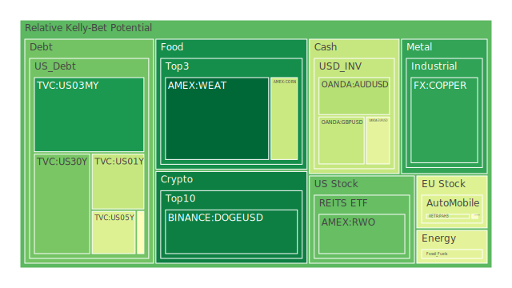
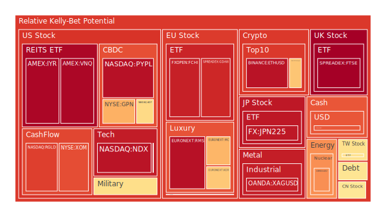
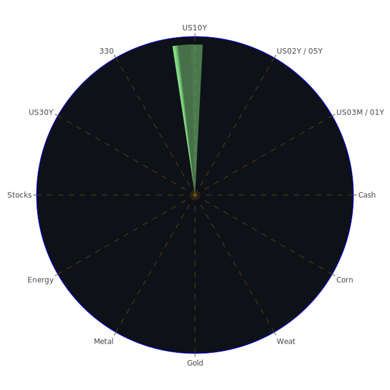

# 投資商品泡沫分析

## 美國國債
根據過去三天的數據，美國國債的泡沫機率變化不大，維持在中等水平。聯邦儲備系統的關鍵數據顯示，美國國債的收益率略有上升，但整體市場對其需求依然強勁。新聞方面，並未有顯著影響美國國債市場的消息。

## 美國科技股
美國科技股的泡沫機率在過去三天內有所上升，特別是以NVIDIA為代表的科技股受到負面新聞影響較大。新聞報導指出，由於NVIDIA股價連續兩天下跌，拖累了整個科技板塊。投資者應該謹慎對待科技股，特別是那些泡沫機率接近1的股票，如NASDAQ:NDX。

## 美國房地產指數
美國房地產指數的泡沫機率在過去三天內有所下降，但仍處於較高水平。聯邦儲備系統的數據顯示，固定抵押貸款利率有所下降，但商業房地產的拖欠率仍然較高。新聞方面，並未有顯著影響房地產市場的消息。

## 金/銀/銅
金銀銅的泡沫機率在過去三天內有所波動。黃金和白銀的泡沫機率較高，而銅的泡沫機率相對較低。聯邦儲備系統的數據顯示，黃金與石油和銅的比率有所上升，這表明市場對黃金的需求增加。新聞方面，並未有顯著影響金屬市場的消息。

## 加密貨幣
加密貨幣的泡沫機率在過去三天內有所下降，但仍處於較高水平。特別是比特幣和以太坊的泡沫機率依然較高。新聞方面，並未有顯著影響加密貨幣市場的消息。

## 黃豆 / 小麥 / 玉米
農產品的泡沫機率在過去三天內有所下降。特別是黃豆和小麥的泡沫機率較低，而玉米的泡沫機率相對較高。新聞方面，並未有顯著影響農產品市場的消息。

## 石油/ 鈾期貨UX!
石油和鈾期貨的泡沫機率在過去三天內有所波動。石油的泡沫機率相對穩定，而鈾期貨的泡沫機率有所上升。新聞方面，並未有顯著影響石油和鈾市場的消息。

## 各國外匯市場
外匯市場的泡沫機率在過去三天內有所波動。特別是美元兌日元的泡沫機率較高，而歐元兌美元的泡沫機率相對較低。新聞方面，美元受益於美國經濟數據強勁，導致美元指數上升。

## 各國大盤指數
各國大盤指數的泡沫機率在過去三天內有所上升。特別是德國DAX指數和法國CAC指數的泡沫機率較高。新聞方面，全球股市受到科技股下跌的影響，整體表現不佳。

## 美國軍工股
美國軍工股的泡沫機率在過去三天內有所上升。特別是洛克希德·馬丁和諾斯羅普·格魯曼的泡沫機率較高。新聞方面，並未有顯著影響軍工股市場的消息。

## 美國電子支付股
美國電子支付股的泡沫機率在過去三天內有所上升。特別是PayPal的泡沫機率較高。新聞方面，並未有顯著影響電子支付市場的消息。

## 石油防禦股
石油防禦股的泡沫機率在過去三天內有所上升。新聞方面，並未有顯著影響石油防禦股市場的消息。

## 金礦防禦股
金礦防禦股的泡沫機率在過去三天內有所上升。新聞方面，並未有顯著影響金礦防禦股市場的消息。

## 歐洲奢侈品股
歐洲奢侈品股的泡沫機率在過去三天內有所上升。特別是LVMH的泡沫機率較高。新聞方面，並未有顯著影響奢侈品市場的消息。

## 歐洲汽車股
歐洲汽車股的泡沫機率在過去三天內有所上升。特別是BMW的泡沫機率較高。新聞方面，並未有顯著影響汽車市場的消息。

# 投資建議

1. **賣出建議**：對於泡沫機率持續上升且遠大於0.5的商品，如NASDAQ:NDX和LVMH，建議投資者考慮賣出，以避免未來價格下跌時的損失。根據新聞報導，科技股和奢侈品股近期表現不佳，市場情緒較為負面。

2. **買入建議**：對於泡沫機率下降且遠小於0.5的商品，如黃豆和小麥，建議投資者考慮買入。根據新聞報導，農產品市場近期表現穩定，市場情緒較為正面。

3. **觀望建議**：對於泡沫分數0.5左右的商品，如美國國債和黃金，建議投資者觀望，不要有任何動作。根據聯邦儲備系統的數據和新聞報導，這些市場的波動性較小，風險相對較低。

# 風險提示

投資有風險，市場總是充滿不確定性。我們的建議僅供參考，投資者應根據自身的風險承受能力和投資目標，做出獨立的投資決策。特別是對於泡沫機率高的商品，應該謹慎進行投資決策。
 
Daily Buy Map:

 
Daily Sell Map:

 
Daily Radar Chart:

 
