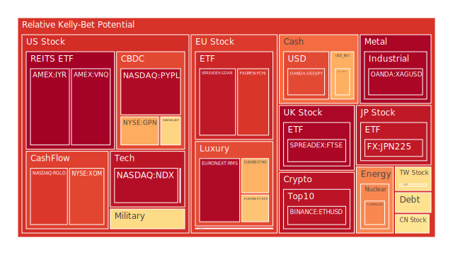
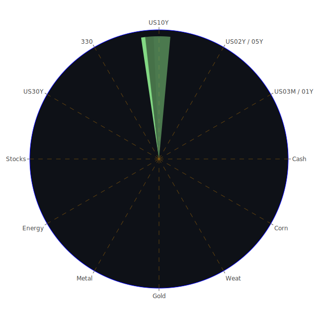

# 投資商品泡沫分析

## 美國國債
根據過去三天的數據，美國國債的泡沫機率變化如下：

- **1年期國債 (US01Y)**：泡沫機率穩定在0.355645，建議觀望。
- **2年期國債 (US02Y)**：泡沫機率從0.516206上升到0.573121，建議觀望。
- **5年期國債 (US05Y)**：泡沫機率從0.406124上升到0.405575，建議觀望。
- **10年期國債 (US10Y)**：泡沫機率從0.481763下降到0.481763，建議觀望。
- **30年期國債 (US30Y)**：泡沫機率從0.186664上升到0.226079，建議觀望。

## 美國科技股
- **NASDAQ指數 (NDX)**：泡沫機率穩定在0.940142，建議觀望。
- **台積電 (TSM)**：泡沫機率穩定在0.518402，建議觀望。

## 美國房地產指數
- **房地產ETF (VNQ)**：泡沫機率從0.966394下降到0.966394，建議觀望。
- **房地產ETF (IYR)**：泡沫機率從0.967918下降到0.967918，建議觀望。

## 金/銀/銅
- **黃金 (XAUUSD)**：泡沫機率從0.495963下降到0.494056，建議觀望。
- **白銀 (XAGUSD)**：泡沫機率從0.911890上升到0.955396，建議觀望。
- **銅 (COPPER)**：泡沫機率從0.155177上升到0.449343，建議觀望。

## 加密貨幣
- **比特幣 (BTCUSD)**：泡沫機率從0.623191下降到0.346734，建議觀望。
- **以太坊 (ETHUSD)**：泡沫機率從0.946659下降到0.926792，建議觀望。
- **狗狗幣 (DOGEUSD)**：泡沫機率從0.038696上升到0.048039，建議觀望。

## 黃豆 / 小麥 / 玉米
- **黃豆 (SOYB)**：泡沫機率穩定在0.503560，建議觀望。
- **小麥 (WEAT)**：泡沫機率從0.000000上升到0.000014，建議觀望。
- **玉米 (CORN)**：泡沫機率從0.363731上升到0.363731，建議觀望。

## 石油/ 鈾期貨UX!
- **石油 (USOIL)**：泡沫機率穩定在0.419549，建議觀望。
- **鈾期貨 (UX1!)**：泡沫機率從0.733769下降到0.733769，建議觀望。

## 各國外匯市場
- **歐元/美元 (EURUSD)**：泡沫機率從0.423612上升到0.674162，建議觀望。
- **英鎊/美元 (GBPUSD)**：泡沫機率從0.356887下降到0.302401，建議觀望。
- **澳元/美元 (AUDUSD)**：泡沫機率從0.324911上升到0.332823，建議觀望。
- **美元/日元 (USDJPY)**：泡沫機率從0.822275上升到0.830530，建議觀望。

## 各國大盤指數
- **德國DAX指數 (GDAXI)**：泡沫機率從0.901697下降到0.917145，建議觀望。
- **法國CAC指數 (FCHI)**：泡沫機率從0.915542下降到0.863680，建議觀望。
- **日本日經指數 (JPN225)**：泡沫機率從0.932165下降到0.916699，建議觀望。

## 美國軍工股
- **雷神科技 (RTX)**：泡沫機率從0.510860下降到0.510860，建議觀望。
- **洛克希德馬丁 (LMT)**：泡沫機率穩定在0.546994，建議觀望。
- **諾斯洛普·格魯曼 (NOC)**：泡沫機率從0.616114下降到0.616114，建議觀望。

## 美國電子支付股
- **PayPal (PYPL)**：泡沫機率從0.946267下降到0.946267，建議觀望。
- **Global Payments (GPN)**：泡沫機率從0.680693下降到0.680693，建議觀望。

## 石油防禦股
- **埃克森美孚 (XOM)**：泡沫機率從0.835968下降到0.835968，建議觀望。

## 金礦防禦股
- **Royal Gold (RGLD)**：泡沫機率從0.859027下降到0.859027，建議觀望。

## 歐洲奢侈品股
- **LVMH (MC)**：泡沫機率從0.670687下降到0.670687，建議觀望。
- **Kering (KER)**：泡沫機率從0.635529下降到0.635529，建議觀望。
- **Hermès (RMS)**：泡沫機率從0.946235下降到0.946235，建議觀望。

## 歐洲汽車股
- **BMW (BMW)**：泡沫機率從0.481170下降到0.481170，建議觀望。
- **戴姆勒 (MBG)**：泡沫機率從0.524474下降到0.524474，建議觀望。

# 投資建議

根據以上分析，當前市場中大部分投資商品的泡沫機率均在0.5左右或以上，建議投資者保持觀望態度，不要有任何動作。特別是對於泡沫機率高於0.5的商品，應該謹慎進行投資決策。

# 風險提示

投資有風險，市場總是充滿不確定性。我們的建議僅供參考，投資者應根據自身的風險承受能力和投資目標，做出獨立的投資決策。特別是對於泡沫機率高的商品，應該謹慎進行投資決策，以避免未來價格下跌時的損失。
 
Daily Buy Map:

 
Daily Sell Map:

 
Daily Radar Chart:

 
