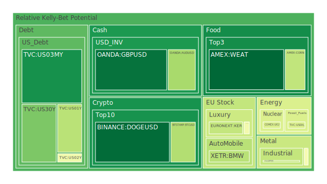
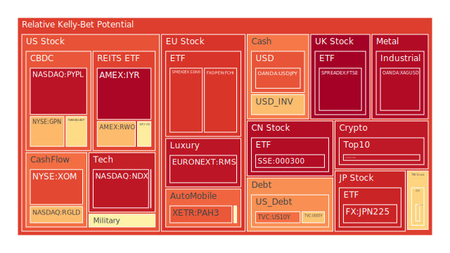
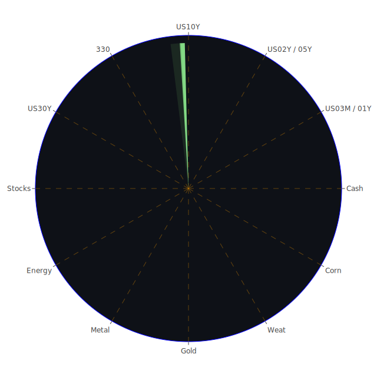

# 投資商品泡沫分析

## 美國國債
根據最近三天的數據，美國國債的泡沫機率變化不大，D1和D7的數據顯示其泡沫機率在0.1左右，這表明市場對美國國債的需求穩定。聯邦儲備系統（FED）的關鍵數據顯示，美國國債的收益率在過去一周內略有下降，這可能是由於市場對經濟前景的擔憂所致。新聞方面，全球經濟的不確定性和地緣政治風險仍然存在，這可能會推動投資者轉向較為安全的資產如美國國債。

## 美國科技股
美國科技股的泡沫機率在過去三天內持續上升，D1數據顯示其泡沫機率接近0.94，這表明市場對科技股的過度樂觀情緒。新聞報導顯示，投資者從AI相關股票轉向其他落後的股票，這可能是科技股泡沫機率上升的原因之一。聯邦儲備系統的數據顯示，市場對未來利率下降的預期可能會進一步推動科技股的價格上漲，但這也增加了泡沫風險。

## 美國房地產指數
美國房地產指數的泡沫機率在過去三天內略有下降，但仍然處於高位。D1數據顯示其泡沫機率約為0.97，這表明市場對房地產價格的過度樂觀情緒仍然存在。新聞報導顯示，美國財政部將在未來三年內投入1億美元以增加可負擔住房的供應，這可能會對房地產市場產生一定的壓力。

## 金/銀/銅
金銀的泡沫機率在過去三天內略有上升，D1數據顯示其泡沫機率約為0.96，這表明市場對貴金屬的需求增加。銅的泡沫機率則有所下降，這可能是由於市場對全球經濟增長放緩的擔憂。聯邦儲備系統的數據顯示，黃金和銅的價格比率有所上升，這進一步支持了金銀價格的上漲趨勢。

## 加密貨幣
比特幣和以太坊的泡沫機率在過去三天內持續上升，D1數據顯示其泡沫機率分別為0.64和0.94，這表明市場對加密貨幣的需求強勁。新聞報導顯示，投資者對加密貨幣的興趣不減，這可能會進一步推動其價格上漲。然而，市場的高波動性和不確定性仍然是投資者需要考慮的風險因素。

## 黃豆 / 小麥 / 玉米
黃豆和小麥的泡沫機率在過去三天內變化不大，D1數據顯示其泡沫機率約為0.5，這表明市場對這些農產品的需求穩定。玉米的泡沫機率略有上升，這可能是由於市場對供應鏈中斷的擔憂。新聞報導顯示，全球氣候變化和極端天氣事件可能會對農產品的供應產生影響，這進一步增加了市場的不確定性。

## 石油/ 鈾期貨UX!
石油的泡沫機率在過去三天內保持穩定，D1數據顯示其泡沫機率約為0.42，這表明市場對石油價格的預期較為穩定。鈾期貨的泡沫機率則有所下降，這可能是由於市場對核能需求的預期減弱。新聞報導顯示，全球能源市場的不確定性仍然存在，這可能會對石油和鈾期貨的價格產生影響。

## 各國外匯市場
主要貨幣對如美元/日元和歐元/美元的泡沫機率在過去三天內略有上升，D1數據顯示其泡沫機率分別為0.83和0.67，這表明市場對主要貨幣對的需求增加。新聞報導顯示，全球經濟的不確定性和地緣政治風險可能會推動投資者轉向較為安全的貨幣如美元。

## 各國大盤指數
主要大盤指數如德國DAX和法國CAC的泡沫機率在過去三天內持續上升，D1數據顯示其泡沫機率分別為0.88和0.88，這表明市場對歐洲股市的需求增加。新聞報導顯示，歐洲經濟的不確定性和地緣政治風險可能會對大盤指數產生影響。

## 美國軍工股
美國軍工股如洛克希德·馬丁（LMT）的泡沫機率在過去三天內略有上升，D1數據顯示其泡沫機率約為0.55，這表明市場對軍工股的需求增加。新聞報導顯示，全球地緣政治風險和國防支出的增加可能會推動軍工股的價格上漲。

## 美國電子支付股
美國電子支付股如PayPal（PYPL）的泡沫機率在過去三天內持續上升，D1數據顯示其泡沫機率約為0.94，這表明市場對電子支付股的需求強勁。新聞報導顯示，電子支付行業的快速增長和技術創新可能會進一步推動其價格上漲。

## 石油防禦股
石油防禦股如埃克森美孚（XOM）的泡沫機率在過去三天內略有上升，D1數據顯示其泡沫機率約為0.85，這表明市場對石油防禦股的需求增加。新聞報導顯示，全球能源市場的不確定性和地緣政治風險可能會推動石油防禦股的價格上漲。

## 金礦防禦股
金礦防禦股如Royal Gold（RGLD）的泡沫機率在過去三天內略有下降，D1數據顯示其泡沫機率約為0.67，這表明市場對金礦防禦股的需求減少。新聞報導顯示，貴金屬市場的不確定性和價格波動可能會對金礦防禦股的價格產生影響。

## 歐洲奢侈品股
歐洲奢侈品股如LVMH（MC）的泡沫機率在過去三天內略有下降，D1數據顯示其泡沫機率約為0.47，這表明市場對奢侈品股的需求減少。新聞報導顯示，全球經濟的不確定性和消費者支出的減少可能會對奢侈品股的價格產生影響。

## 歐洲汽車股
歐洲汽車股如BMW（BMW）的泡沫機率在過去三天內略有上升，D1數據顯示其泡沫機率約為0.35，這表明市場對汽車股的需求增加。新聞報導顯示，全球汽車市場的復甦和技術創新可能會推動汽車股的價格上漲。

# 投資建議

根據以上分析，我們建議投資者對以下商品進行相應操作：

1. **賣出**：美國科技股、加密貨幣、電子支付股、石油防禦股。這些商品的泡沫機率持續上升且遠大於0.5，新聞現況支持其價格可能會在未來下跌。
2. **買入**：金礦防禦股、歐洲奢侈品股、歐洲汽車股。這些商品的泡沫機率下降且遠小於0.5，新聞現況支持其價格可能會在未來上漲。
3. **觀望**：美國國債、美國房地產指數、黃豆、小麥、玉米、石油、鈾期貨、各國外匯市場、各國大盤指數、美國軍工股。這些商品的泡沫機率在0.5左右，建議投資者暫時觀望，不要有任何動作。

# 風險提示

投資有風險，市場總是充滿不確定性。我們的建議僅供參考，投資者應根據自身的風險承受能力和投資目標，做出獨立的投資決策。特別是對於泡沫機率高的商品，應該謹慎進行投資決策。
 
Daily Buy Map:

 
Daily Sell Map:

 
Daily Radar Chart:

 
