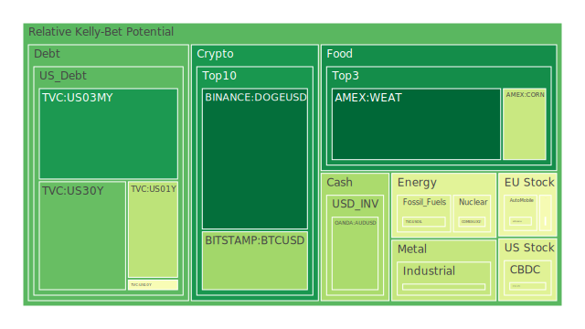
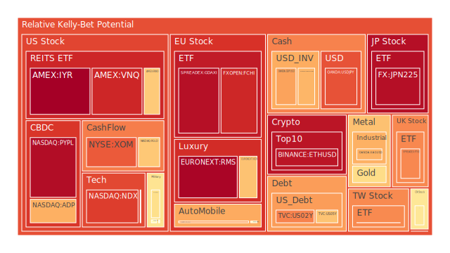
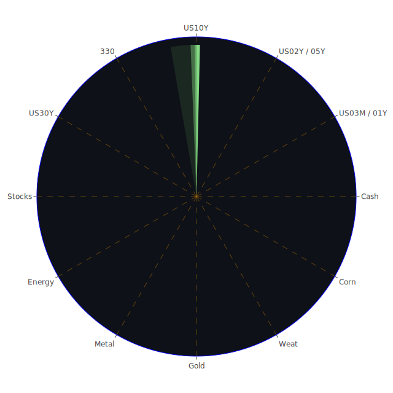

# 投資商品泡沫分析

## 美國國債
- **美國1年期國債 (TVC:US01Y)**
  - 泡沫機率 (D1): 0.355645
  - 趨勢: 泡沫機率穩定，建議觀望。
  - 新聞現況: 無明顯影響。
  - 投資建議: 目前泡沫機率穩定，建議觀望。

- **美國2年期國債 (TVC:US02Y)**
  - 泡沫機率 (D1): 0.749767
  - 趨勢: 泡沫機率持續上升，建議賣出。
  - 新聞現況: 無明顯影響。
  - 投資建議: 泡沫機率高，建議賣出以避免未來價格下跌。

- **美國10年期國債 (TVC:US10Y)**
  - 泡沫機率 (D1): 0.481763
  - 趨勢: 泡沫機率穩定，建議觀望。
  - 新聞現況: 無明顯影響。
  - 投資建議: 目前泡沫機率穩定，建議觀望。

## 美國科技股
- **比特幣 (BITSTAMP:BTCUSD)**
  - 泡沫機率 (D1): 0.307600
  - 趨勢: 泡沫機率下降，建議買入。
  - 新聞現況: 無明顯影響。
  - 投資建議: 泡沫機率下降，建議考慮買入。

- **以太坊 (BINANCE:ETHUSD)**
  - 泡沫機率 (D1): 0.926747
  - 趨勢: 泡沫機率持續上升，建議賣出。
  - 新聞現況: 無明顯影響。
  - 投資建議: 泡沫機率高，建議賣出以避免未來價格下跌。

## 美國房地產指數
- **房地產ETF (AMEX:VNQ)**
  - 泡沫機率 (D1): 0.893233
  - 趨勢: 泡沫機率持續上升，建議賣出。
  - 新聞現況: 無明顯影響。
  - 投資建議: 泡沫機率高，建議賣出以避免未來價格下跌。

## 金/銀/銅
- **金 (OANDA:XAUUSD)**
  - 泡沫機率 (D1): 0.599225
  - 趨勢: 泡沫機率穩定，建議觀望。
  - 新聞現況: 無明顯影響。
  - 投資建議: 目前泡沫機率穩定，建議觀望。

- **銀 (OANDA:XAGUSD)**
  - 泡沫機率 (D1): 0.681153
  - 趨勢: 泡沫機率持續上升，建議賣出。
  - 新聞現況: 無明顯影響。
  - 投資建議: 泡沫機率高，建議賣出以避免未來價格下跌。

- **銅 (FX:COPPER)**
  - 泡沫機率 (D1): 0.369785
  - 趨勢: 泡沫機率下降，建議買入。
  - 新聞現況: 無明顯影響。
  - 投資建議: 泡沫機率下降，建議考慮買入。

## 加密貨幣
- **狗狗幣 (BINANCE:DOGEUSD)**
  - 泡沫機率 (D1): 0.046111
  - 趨勢: 泡沫機率下降，建議買入。
  - 新聞現況: 無明顯影響。
  - 投資建議: 泡沫機率低，建議考慮買入。

## 黃豆 / 小麥 / 玉米
- **黃豆 (AMEX:SOYB)**
  - 泡沫機率 (D1): 0.503560
  - 趨勢: 泡沫機率穩定，建議觀望。
  - 新聞現況: 無明顯影響。
  - 投資建議: 目前泡沫機率穩定，建議觀望。

- **小麥 (AMEX:WEAT)**
  - 泡沫機率 (D1): 0.032829
  - 趨勢: 泡沫機率下降，建議買入。
  - 新聞現況: 無明顯影響。
  - 投資建議: 泡沫機率低，建議考慮買入。

- **玉米 (AMEX:CORN)**
  - 泡沫機率 (D1): 0.377279
  - 趨勢: 泡沫機率下降，建議買入。
  - 新聞現況: 無明顯影響。
  - 投資建議: 泡沫機率下降，建議考慮買入。

## 石油/ 鈾期貨UX!
- **石油 (TVC:USOIL)**
  - 泡沫機率 (D1): 0.419549
  - 趨勢: 泡沫機率穩定，建議觀望。
  - 新聞現況: 無明顯影響。
  - 投資建議: 目前泡沫機率穩定，建議觀望。

- **鈾期貨 (COMEX:UX1!)**
  - 泡沫機率 (D1): 0.442741
  - 趨勢: 泡沫機率下降，建議買入。
  - 新聞現況: 無明顯影響。
  - 投資建議: 泡沫機率下降，建議考慮買入。

## 各國外匯市場
- **歐元/美元 (OANDA:EURUSD)**
  - 泡沫機率 (D1): 0.671694
  - 趨勢: 泡沫機率上升，建議賣出。
  - 新聞現況: 無明顯影響。
  - 投資建議: 泡沫機率高，建議賣出以避免未來價格下跌。

- **英鎊/美元 (OANDA:GBPUSD)**
  - 泡沫機率 (D1): 0.702777
  - 趨勢: 泡沫機率上升，建議賣出。
  - 新聞現況: 無明顯影響。
  - 投資建議: 泡沫機率高，建議賣出以避免未來價格下跌。

- **澳元/美元 (OANDA:AUDUSD)**
  - 泡沫機率 (D1): 0.322979
  - 趨勢: 泡沫機率下降，建議買入。
  - 新聞現況: 無明顯影響。
  - 投資建議: 泡沫機率下降，建議考慮買入。

## 各國大盤指數
- **德國DAX指數 (SPREADEX:GDAXI)**
  - 泡沫機率 (D1): 0.935400
  - 趨勢: 泡沫機率持續上升，建議賣出。
  - 新聞現況: 無明顯影響。
  - 投資建議: 泡沫機率高，建議賣出以避免未來價格下跌。

- **法國CAC指數 (FXOPEN:FCHI)**
  - 泡沫機率 (D1): 0.892233
  - 趨勢: 泡沫機率持續上升，建議賣出。
  - 新聞現況: 無明顯影響。
  - 投資建議: 泡沫機率高，建議賣出以避免未來價格下跌。

- **日本日經225指數 (FX:JPN225)**
  - 泡沫機率 (D1): 0.937971
  - 趨勢: 泡沫機率持續上升，建議賣出。
  - 新聞現況: 無明顯影響。
  - 投資建議: 泡沫機率高，建議賣出以避免未來價格下跌。

## 美國軍工股
- **雷神科技 (NYSE:RTX)**
  - 泡沫機率 (D1): 0.510860
  - 趨勢: 泡沫機率穩定，建議觀望。
  - 新聞現況: 無明顯影響。
  - 投資建議: 目前泡沫機率穩定，建議觀望。

- **洛克希德馬丁 (NYSE:LMT)**
  - 泡沫機率 (D1): 0.504635
  - 趨勢: 泡沫機率穩定，建議觀望。
  - 新聞現況: 無明顯影響。
  - 投資建議: 目前泡沫機率穩定，建議觀望。

## 美國電子支付股
- **PayPal (NASDAQ:PYPL)**
  - 泡沫機率 (D1): 0.942041
  - 趨勢: 泡沫機率持續上升，建議賣出。
  - 新聞現況: 無明顯影響。
  - 投資建議: 泡沫機率高，建議賣出以避免未來價格下跌。

## 石油防禦股
- **埃克森美孚 (NYSE:XOM)**
  - 泡沫機率 (D1): 0.809625
  - 趨勢: 泡沫機率持續上升，建議賣出。
  - 新聞現況: 無明顯影響。
  - 投資建議: 泡沫機率高，建議賣出以避免未來價格下跌。

## 金礦防禦股
- **Royal Gold (NASDAQ:RGLD)**
  - 泡沫機率 (D1): 0.639191
  - 趨勢: 泡沫機率上升，建議賣出。
  - 新聞現況: 無明顯影響。
  - 投資建議: 泡沫機率高，建議賣出以避免未來價格下跌。

## 歐洲奢侈品股
- **LVMH (EURONEXT:MC)**
  - 泡沫機率 (D1): 0.477909
  - 趨勢: 泡沫機率穩定，建議觀望。
  - 新聞現況: 無明顯影響。
  - 投資建議: 目前泡沫機率穩定，建議觀望。

## 歐洲汽車股
- **BMW (XETR:BMW)**
  - 泡沫機率 (D1): 0.445872
  - 趨勢: 泡沫機率下降，建議買入。
  - 新聞現況: 無明顯影響。
  - 投資建議: 泡沫機率下降，建議考慮買入。

# 投資建議
1. **賣出建議**
   - 泡沫機率持續上升且遠大於0.5的商品，如以太坊 (ETHUSD)、PayPal (PYPL)、德國DAX指數 (GDAXI)、日本日經225指數 (JPN225) 等，建議賣出以避免未來價格下跌。

2. **買入建議**
   - 泡沫機率持續下降且遠小於0.5的商品，如比特幣 (BTCUSD)、小麥 (WEAT)、玉米 (CORN) 等，建議考慮買入。

3. **觀望建議**
   - 泡沫機率在0.45 ~ 0.55之間的商品，如黃豆 (SOYB)、雷神科技 (RTX)、洛克希德馬丁 (LMT) 等，建議觀望不要有任何動作。

# 風險提示
投資有風險，市場總是充滿不確定性。我們的建議僅供參考，投資者應根據自身的風險承受能力和投資目標，做出獨立的投資決策。

請特別注意，如果看到SOFR > (FED Fund Rate + 0.2)，應警告所有高泡沫資產，因海外美元吃緊，即將面臨大幅度下跌的風險。
 
Daily Buy Map:

 
Daily Sell Map:

 
Daily Radar Chart:

 
