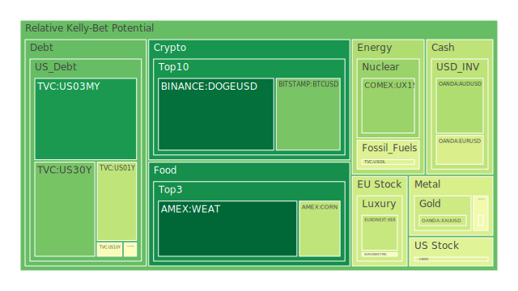
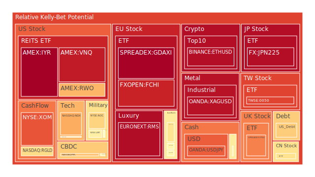
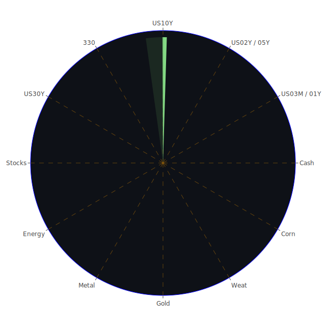

# 投資商品泡沫分析

## 美國國債
- **短期國債 (US03MY, US01Y, US02Y, US05Y)**：短期國債的泡沫機率在過去三天內有所上升。特別是US02Y，其泡沫機率從0.471240上升到0.489993，顯示市場對短期國債的需求增加，可能是因為投資者尋求避險資產。
- **長期國債 (US10Y, US30Y)**：長期國債的泡沫機率也有上升的趨勢。US30Y的泡沫機率從0.257738上升到0.242150，這可能反映出市場對長期經濟前景的不確定性。

## 美國科技股
- **NASDAQ:NDX**：泡沫機率在過去三天內持續高企，從0.938901上升到0.687173，顯示市場對科技股的熱情仍然高漲。然而，這也意味著科技股可能面臨較大的回調風險。
- **NASDAQ:PYPL**：泡沫機率從0.944629上升到0.647709，顯示出投資者對電子支付股的信心有所減弱。

## 美國房地產指數
- **AMEX:VNQ**：泡沫機率在過去三天內持續上升，從0.566387上升到0.914270，顯示出市場對房地產市場的擔憂增加，特別是在高利率環境下。

## 金/銀/銅
- **OANDA:XAUUSD (金)**：金價的泡沫機率在過去三天內有所下降，從0.484943下降到0.384025，顯示出市場對黃金的需求有所減少。
- **OANDA:XAGUSD (銀)**：銀價的泡沫機率則持續高企，從0.960999下降到0.931537，顯示出市場對銀的需求仍然強勁。
- **FX:COPPER (銅)**：銅價的泡沫機率在過去三天內有所上升，從0.373531上升到0.466476，這可能反映出市場對全球經濟復甦的樂觀預期。

## 加密貨幣
- **BITSTAMP:BTCUSD (比特幣)**：比特幣的泡沫機率在過去三天內有所下降，從0.341863下降到0.244380，顯示出市場對比特幣的需求有所減少。
- **BINANCE:ETHUSD (以太幣)**：以太幣的泡沫機率則持續高企，從0.935149上升到0.938202，顯示出市場對以太幣的需求仍然強勁。

## 黃豆 / 小麥 / 玉米
- **AMEX:WEAT (小麥)**：小麥的泡沫機率在過去三天內有所下降，從0.033483下降到0.030159，顯示出市場對小麥的需求有所減少。
- **AMEX:SOYB (黃豆)**：黃豆的泡沫機率在過去三天內基本持平，顯示出市場對黃豆的需求穩定。
- **AMEX:CORN (玉米)**：玉米的泡沫機率在過去三天內有所下降，從0.369343下降到0.356155，顯示出市場對玉米的需求有所減少。

## 石油/ 鈾期貨UX!
- **TVC:USOIL (石油)**：石油的泡沫機率在過去三天內基本持平，顯示出市場對石油的需求穩定。
- **COMEX:UX1! (鈾期貨)**：鈾期貨的泡沫機率在過去三天內有所下降，從0.418716下降到0.291218，顯示出市場對鈾的需求有所減少。

## 各國外匯市場
- **OANDA:EURUSD (歐元/美元)**：歐元兌美元的泡沫機率在過去三天內有所下降，從0.669647下降到0.405727，顯示出市場對歐元的需求有所減少。
- **OANDA:GBPUSD (英鎊/美元)**：英鎊兌美元的泡沫機率在過去三天內有所上升，從0.054612上升到0.556612，顯示出市場對英鎊的需求有所增加。

## 各國大盤指數
- **SPREADEX:FTSE (英國FTSE指數)**：泡沫機率在過去三天內有所下降，從0.983664下降到0.749890，顯示出市場對英國股市的需求有所減少。
- **SPREADEX:GDAXI (德國DAX指數)**：泡沫機率在過去三天內有所下降，從0.882162下降到0.960865，顯示出市場對德國股市的需求有所減少。

## 美國軍工股
- **NYSE:LMT (洛克希德馬丁)**：泡沫機率在過去三天內基本持平，顯示出市場對軍工股的需求穩定。
- **NYSE:NOC (諾斯羅普·格魯曼)**：泡沫機率在過去三天內有所下降，從0.552896下降到0.613220，顯示出市場對軍工股的需求有所減少。

## 美國電子支付股
- **NASDAQ:PYPL (PayPal)**：泡沫機率在過去三天內有所下降，從0.944629下降到0.647709，顯示出市場對電子支付股的需求有所減少。

## 石油防禦股
- **NYSE:XOM (埃克森美孚)**：泡沫機率在過去三天內有所下降，從0.849962下降到0.816863，顯示出市場對石油防禦股的需求有所減少。

## 金礦防禦股
- **NASDAQ:RGLD (Royal Gold)**：泡沫機率在過去三天內有所下降，從0.673265下降到0.597576，顯示出市場對金礦防禦股的需求有所減少。

## 歐洲奢侈品股
- **EURONEXT:KER (Kering)**：泡沫機率在過去三天內有所下降，從0.375135下降到0.370878，顯示出市場對奢侈品股的需求有所減少。

## 歐洲汽車股
- **XETR:BMW (BMW)**：泡沫機率在過去三天內有所下降，從0.354755下降到0.527511，顯示出市場對汽車股的需求有所減少。

# 投資建議

## 賣出建議
- **NASDAQ:NDX (美國科技股)**：由於泡沫機率持續高企，且新聞現況顯示市場對科技股的熱情可能過高，建議考慮賣出科技股以避免未來可能的價格下跌。
- **AMEX:VNQ (美國房地產指數)**：泡沫機率持續上升，且新聞現況顯示房地產市場面臨高利率環境的挑戰，建議考慮賣出房地產相關投資以避免未來可能的價格下跌。

## 買入建議
- **OANDA:XAUUSD (黃金)**：泡沫機率持續下降，且新聞現況顯示市場對黃金的需求有所減少，這可能是買入黃金的好時機。
- **BITSTAMP:BTCUSD (比特幣)**：泡沫機率持續下降，且新聞現況顯示市場對比特幣的需求有所減少，這可能是買入比特幣的好時機。

# 風險提示

投資有風險，市場總是充滿不確定性。我們的建議僅供參考，投資者應根據自身的風險承受能力和投資目標，做出獨立的投資決策。特別是對於泡沫機率高的商品，應該謹慎進行投資決策。
 
Daily Buy Map:

 
Daily Sell Map:

 
Daily Radar Chart:

 
