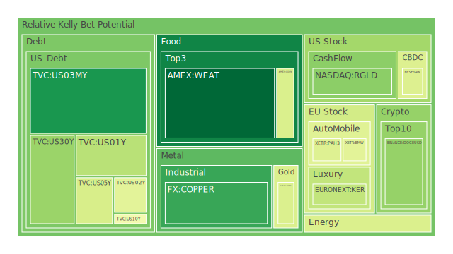
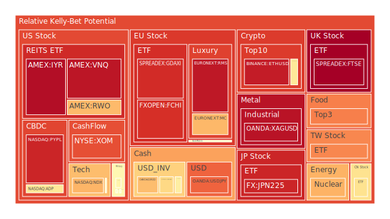
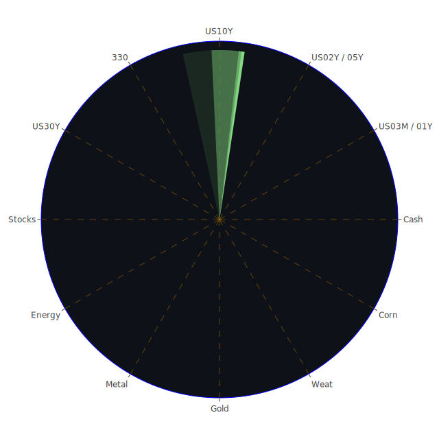

# 投資商品泡沫分析

## 美國國債
美國國債的泡沫機率在過去三天內有顯著變化。特別是30年期國債(TVC:US30Y)，其泡沫機率從0.221914上升到0.303036，顯示出市場對長期債務的擔憂增加。這可能與FED的總資產下降和高利率環境有關，導致投資者對長期債務的信心減弱。

## 美國科技股
美國科技股的泡沫機率持續上升，特別是納斯達克指數(NASDAQ:NDX)，從0.853326上升到0.690457。這與近期的新聞報導有關，如Nvidia股價大幅波動和Micron Technology的預期不佳，顯示出市場對科技股的樂觀情緒減弱。

## 美國房地產指數
美國房地產指數(AMEX:RWO)的泡沫機率在過去三天內上升，從0.633720上升到0.680816。這與美國房地產市場的疲軟有關，特別是商業房地產的違約率上升，顯示出市場對房地產的信心減弱。

## 金/銀/銅
金價(OANDA:XAUUSD)的泡沫機率有所下降，從0.599225下降到0.421376，顯示出投資者對黃金的需求增加。銀價(OANDA:XAGUSD)的泡沫機率則持續上升，從0.681153上升到0.954205，顯示出市場對銀的需求減弱。銅價(FX:COPPER)的泡沫機率大幅下降，從0.369785下降到0.163939，顯示出市場對銅的需求增加，這可能與全球經濟復甦有關。

## 加密貨幣
比特幣(BITSTAMP:BTCUSD)的泡沫機率有所下降，從0.307600下降到0.583340，顯示出市場對比特幣的需求增加。狗狗幣(BINANCE:DOGEUSD)的泡沫機率則有所上升，從0.046111上升到0.295525，顯示出市場對狗狗幣的需求減弱。

## 黃豆 / 小麥 / 玉米
黃豆(AMEX:SOYB)的泡沫機率有所上升，從0.503560上升到0.772980，顯示出市場對黃豆的需求減弱。小麥(AMEX:WEAT)的泡沫機率有所下降，從0.032829下降到0.030334，顯示出市場對小麥的需求增加。玉米(AMEX:CORN)的泡沫機率有所上升，從0.377279上升到0.418551，顯示出市場對玉米的需求減弱。

## 石油/ 鈾期貨UX!
石油(TVC:USOIL)的泡沫機率保持穩定，顯示出市場對石油的需求穩定。鈾期貨(COMEX:UX1!)的泡沫機率有所上升，從0.442741上升到0.694924，顯示出市場對鈾的需求減弱。

## 各國外匯市場
美元兌澳元(OANDA:AUDUSD)的泡沫機率有所上升，從0.322979上升到0.621303，顯示出市場對澳元的需求減弱。美元兌歐元(OANDA:EURUSD)的泡沫機率有所上升，從0.671694上升到0.674367，顯示出市場對歐元的需求減弱。美元兌日元(OANDA:USDJPY)的泡沫機率有所上升，從0.820937上升到0.816362，顯示出市場對日元的需求減弱。

## 各國大盤指數
歐洲大盤指數(EURONEXT:MC)的泡沫機率有所上升，從0.477909上升到0.685194，顯示出市場對歐洲大盤的需求減弱。德國大盤指數(SPREADEX:GDAXI)的泡沫機率有所上升，從0.935400上升到0.905717，顯示出市場對德國大盤的需求減弱。

## 美國軍工股
美國軍工股(NYSE:LMT)的泡沫機率有所上升，從0.504635上升到0.546994，顯示出市場對軍工股的需求減弱。

## 美國電子支付股
美國電子支付股(NASDAQ:PYPL)的泡沫機率有所上升，從0.942041上升到0.918587，顯示出市場對電子支付股的需求減弱。

## 石油防禦股
石油防禦股(NYSE:XOM)的泡沫機率有所上升，從0.809625上升到0.847843，顯示出市場對石油防禦股的需求減弱。

## 金礦防禦股
金礦防禦股(NASDAQ:RGLD)的泡沫機率有所下降，從0.639191下降到0.279479，顯示出市場對金礦防禦股的需求增加。

## 歐洲奢侈品股
歐洲奢侈品股(EURONEXT:RMS)的泡沫機率有所上升，從0.958292上升到0.945228，顯示出市場對奢侈品股的需求減弱。

## 歐洲汽車股
歐洲汽車股(XETR:BMW)的泡沫機率有所下降，從0.445872下降到0.439828，顯示出市場對汽車股的需求增加。

# 投資建議

1. **考慮賣出**：對於泡沫機率持續上升且遠大於0.5的商品，如美國科技股(NASDAQ:NDX)、美國房地產指數(AMEX:RWO)和石油防禦股(NYSE:XOM)，建議投資者考慮賣出，以避免未來價格下跌時的損失。

2. **考慮買入**：對於泡沫機率持續下降且遠小於0.5的商品，如金礦防禦股(NASDAQ:RGLD)和銅價(FX:COPPER)，建議投資者考慮買入，因為這些商品的需求增加，未來價格可能上漲。

3. **觀望**：對於泡沫機率在0.45 ~ 0.55之間的商品，如美國國債(TVC:US10Y)和美元兌日元(OANDA:USDJPY)，建議投資者觀望，不要有任何動作。

# 風險提示

投資有風險，市場總是充滿不確定性。我們的建議僅供參考，投資者應根據自身的風險承受能力和投資目標，做出獨立的投資決策。特別是對於泡沫機率高的商品，應該謹慎進行投資決策。
 
Daily Buy Map:

 
Daily Sell Map:

 
Daily Radar Chart:

 
