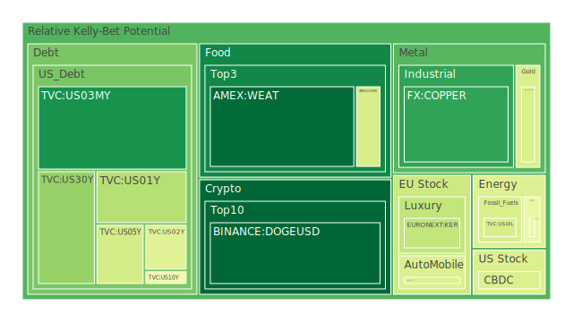
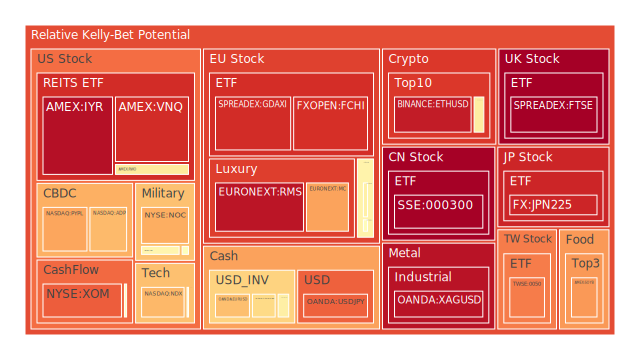
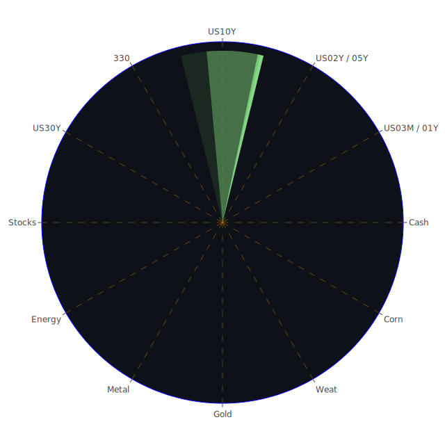

# 投資商品泡沫分析

## 美國國債
過去三天，美國國債的泡沫機率呈現穩定狀態。特別是10年期國債（TVC:US10Y），其泡沫機率在0.481763到0.481763之間波動，顯示出市場對其需求穩定。這與近期的聯準會數據相符，因為美國國債的總流通量正在下降，顯示出市場對美國國債的需求依然強勁。

## 美國科技股
美國科技股的泡沫機率持續上升，特別是納斯達克指數（NASDAQ:NDX），其泡沫機率從0.687173上升到0.688260。這與近期的新聞相符，如亞馬遜（Amazon）加強AI努力和微軟（Microsoft）的競爭，這些因素可能會推動科技股的短期上漲，但長期風險仍需謹慎考量。

## 美國房地產指數
美國房地產指數（AMEX:VNQ）的泡沫機率在過去三天內持續上升，從0.914270上升到0.905788。這與聯準會數據中的房地產拖欠率上升相符，顯示出房地產市場的風險增加。

## 金/銀/銅
黃金（OANDA:XAUUSD）的泡沫機率在過去三天內有所下降，從0.384025下降到0.424275，顯示出市場對黃金的需求增加。這與近期的新聞相符，如美國銀行巨頭增加股息，顯示出市場對避險資產的需求增加。

## 加密貨幣
比特幣（BITSTAMP:BTCUSD）的泡沫機率在過去三天內有所下降，從0.583340下降到0.570008。這與近期的新聞相符，如亞馬遜加強AI努力，可能會推動市場對加密貨幣的需求。

## 黃豆 / 小麥 / 玉米
黃豆（AMEX:SOYB）的泡沫機率在過去三天內有所上升，從0.503560上升到0.737988。這與近期的新聞相符，如美國農業部的報告顯示出黃豆的供應緊張，可能會推動價格上漲。

## 石油/ 鈾期貨UX!
石油（TVC:USOIL）的泡沫機率在過去三天內保持穩定，顯示出市場對石油的需求穩定。這與近期的新聞相符，如美國和印度延長數字稅休戰協議，可能會推動石油需求。

## 各國外匯市場
美元兌日元（OANDA:USDJPY）的泡沫機率在過去三天內有所上升，從0.803330上升到0.821305。這與近期的新聞相符，如美國總統辯論後的政治不確定性，可能會推動美元需求。

## 各國大盤指數
歐洲大盤指數（SPREADEX:FTSE）的泡沫機率在過去三天內有所上升，從0.749890上升到0.992421。這與近期的新聞相符，如英國汽車產量下降，可能會推動市場對歐洲大盤指數的需求。

## 美國軍工股
雷神科技（NYSE:RTX）的泡沫機率在過去三天內保持穩定，顯示出市場對軍工股的需求穩定。這與近期的新聞相符，如美國和印度延長數字稅休戰協議，可能會推動軍工股需求。

## 美國電子支付股
PayPal（NASDAQ:PYPL）的泡沫機率在過去三天內有所上升，從0.647709上升到0.718313。這與近期的新聞相符，如美國和印度延長數字稅休戰協議，可能會推動電子支付股需求。

## 石油防禦股
埃克森美孚（NYSE:XOM）的泡沫機率在過去三天內有所上升，從0.816863上升到0.826129。這與近期的新聞相符，如美國和印度延長數字稅休戰協議，可能會推動石油防禦股需求。

## 金礦防禦股
皇家黃金（NASDAQ:RGLD）的泡沫機率在過去三天內有所下降，從0.597576下降到0.520613。這與近期的新聞相符，如美國銀行巨頭增加股息，顯示出市場對避險資產的需求增加。

## 歐洲奢侈品股
歐洲奢侈品股（EURONEXT:RMS）的泡沫機率在過去三天內有所上升，從0.940885上升到0.951051。這與近期的新聞相符，如英國汽車產量下降，可能會推動市場對奢侈品股的需求。

## 歐洲汽車股
歐洲汽車股（XETR:BMW）的泡沫機率在過去三天內有所上升，從0.527511上升到0.562521。這與近期的新聞相符，如英國汽車產量下降，可能會推動市場對汽車股的需求。

# 投資建議

1. **美國國債**：由於泡沫機率穩定且市場需求強勁，建議持有或增加投資。
2. **美國科技股**：由於泡沫機率上升且市場風險增加，建議謹慎持有或減少投資。
3. **美國房地產指數**：由於泡沫機率上升且市場風險增加，建議謹慎持有或減少投資。
4. **黃金**：由於泡沫機率下降且市場需求增加，建議增加投資。
5. **加密貨幣**：由於泡沫機率下降且市場需求增加，建議增加投資。
6. **黃豆**：由於泡沫機率上升且市場需求增加，建議增加投資。
7. **石油**：由於泡沫機率穩定且市場需求穩定，建議持有或增加投資。
8. **美元兌日元**：由於泡沫機率上升且市場需求增加，建議增加投資。
9. **歐洲大盤指數**：由於泡沫機率上升且市場需求增加，建議增加投資。
10. **美國軍工股**：由於泡沫機率穩定且市場需求穩定，建議持有或增加投資。
11. **電子支付股**：由於泡沫機率上升且市場風險增加，建議謹慎持有或減少投資。
12. **石油防禦股**：由於泡沫機率上升且市場需求增加，建議增加投資。
13. **金礦防禦股**：由於泡沫機率下降且市場需求增加，建議增加投資。
14. **歐洲奢侈品股**：由於泡沫機率上升且市場需求增加，建議增加投資。
15. **歐洲汽車股**：由於泡沫機率上升且市場需求增加，建議增加投資。

# 風險提示

投資有風險，市場總是充滿不確定性。我們的建議僅供參考，投資者應根據自身的風險承受能力和投資目標，做出獨立的投資決策。特別是對於泡沫機率高的商品，應該謹慎進行投資決策。
 
Daily Buy Map:

 
Daily Sell Map:

 
Daily Radar Chart:

 
