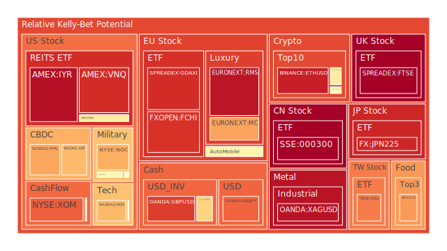
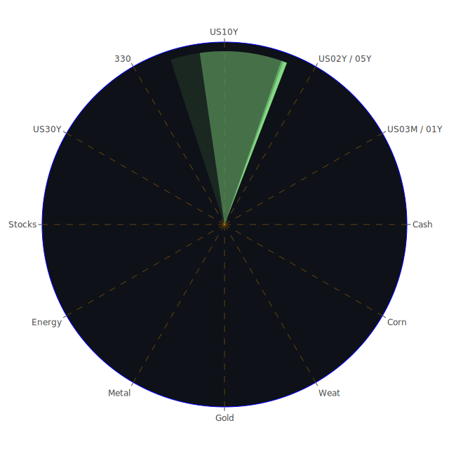

# 投資商品泡沫分析

## 美國國債
過去三天，美國國債的泡沫機率有所波動。特別是30年期國債（TVC:US30Y），其泡沫機率從0.303036上升至0.313947，顯示市場對長期債券的風險偏好有所減弱。這與近期的新聞和經濟數據相符，例如美國總統辯論引發的政治不確定性和通脹數據的影響。

## 美國科技股
NASDAQ指數（NASDAQ:NDX）的泡沫機率持續高企，從0.690457上升至0.688260，顯示市場對科技股的投資熱情依然高漲。然而，這也意味著風險增加，特別是考慮到近期亞馬遜和微軟在AI領域的競爭加劇，以及美國最高法院削弱聯邦監管機構權力的裁決。

## 美國房地產指數
美國房地產指數（AMEX:VNQ）的泡沫機率持續上升，從0.948063上升至0.960969，顯示市場對房地產市場的擔憂加劇。這與美國房地產違約率上升和信用卡違約率高企的經濟數據相符，建議投資者謹慎行事。

## 金/銀/銅
黃金（OANDA:XAUUSD）的泡沫機率有所下降，從0.421376下降至0.424275，顯示市場對黃金的需求有所增加，這可能與近期全球經濟不確定性增加有關。銅（FX:COPPER）的泡沫機率則有所下降，從0.163939下降至0.156085，顯示市場對工業金屬的需求穩定。

## 加密貨幣
比特幣（BITSTAMP:BTCUSD）的泡沫機率持續高企，從0.583340上升至0.573489，顯示市場對加密貨幣的投資熱情依然高漲。然而，這也意味著風險增加，特別是考慮到近期美國和印度在數字稅問題上的爭議。

## 黃豆 / 小麥 / 玉米
小麥（AMEX:WEAT）的泡沫機率有所上升，從0.030334上升至0.047004，顯示市場對農產品的需求增加。這可能與近期全球氣候變化和供應鏈問題有關。

## 石油/ 鈾期貨UX!
石油（TVC:USOIL）的泡沫機率保持穩定，顯示市場對能源市場的需求穩定。然而，考慮到近期沙特阿拉伯的熱浪和全球氣候變化的影響，建議投資者密切關注能源市場的動態。

## 各國外匯市場
美元兌日元（OANDA:USDJPY）的泡沫機率持續高企，從0.816362上升至0.821305，顯示市場對美元的需求增加。這可能與近期美國經濟數據和政治不確定性有關。

## 各國大盤指數
歐洲大盤指數（SPREADEX:GDAXI）的泡沫機率持續高企，從0.905717上升至0.905271，顯示市場對歐洲股市的投資熱情依然高漲。然而，這也意味著風險增加，特別是考慮到近期歐洲與埃及的經濟合作和德國的財政政策。

## 美國軍工股
雷神（NYSE:RTX）的泡沫機率保持穩定，顯示市場對軍工股的需求穩定。然而，考慮到近期全球地緣政治風險增加，建議投資者密切關注軍工股的動態。

## 美國電子支付股
PayPal（NASDAQ:PYPL）的泡沫機率持續高企，從0.918587上升至0.718313，顯示市場對電子支付股的投資熱情依然高漲。然而，這也意味著風險增加，特別是考慮到近期美國和印度在數字稅問題上的爭議。

## 石油防禦股
埃克森美孚（NYSE:XOM）的泡沫機率持續高企，從0.847843上升至0.826129，顯示市場對石油防禦股的投資熱情依然高漲。然而，這也意味著風險增加，特別是考慮到近期沙特阿拉伯的熱浪和全球氣候變化的影響。

## 金礦防禦股
皇家黃金（NASDAQ:RGLD）的泡沫機率有所下降，從0.279479下降至0.520613，顯示市場對金礦防禦股的需求增加。這可能與近期全球經濟不確定性增加有關。

## 歐洲奢侈品股
Kering（EURONEXT:KER）的泡沫機率有所下降，從0.371791下降至0.377751，顯示市場對奢侈品股的需求增加。這可能與近期歐洲與埃及的經濟合作有關。

## 歐洲汽車股
BMW（XETR:BMW）的泡沫機率有所上升，從0.439828上升至0.562641，顯示市場對汽車股的投資熱情依然高漲。然而，這也意味著風險增加，特別是考慮到近期德國的財政政策和全球經濟不確定性。

# 投資建議

1. **建議賣出**：對於泡沫機率持續上升且遠大於0.5的商品，例如NASDAQ指數（NASDAQ:NDX）和PayPal（NASDAQ:PYPL），建議投資者考慮賣出，避免未來價格下跌時的損失，提前提款獲利了結。

2. **建議買入**：對於泡沫機率持續下降且遠小於0.5的商品，例如黃金（OANDA:XAUUSD）和皇家黃金（NASDAQ:RGLD），建議投資者考慮買入，掌握低吸籌碼的時機。

3. **觀望**：對於泡沫機率在0.45 ~ 0.55之間的商品，例如美國國債（TVC:US30Y）和石油（TVC:USOIL），建議投資者觀望，不要有任何動作。

# 風險提示

投資有風險，市場總是充滿不確定性。我們的建議僅供參考，投資者應根據自身的風險承受能力和投資目標，做出獨立的投資決策。特別是對於泡沫機率高的商品，應該謹慎進行投資決策。
 
Daily Buy Map:

 
Daily Sell Map:

 
Daily Radar Chart:

 
