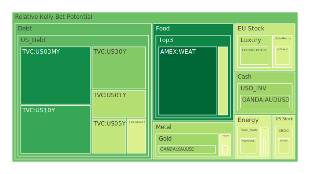
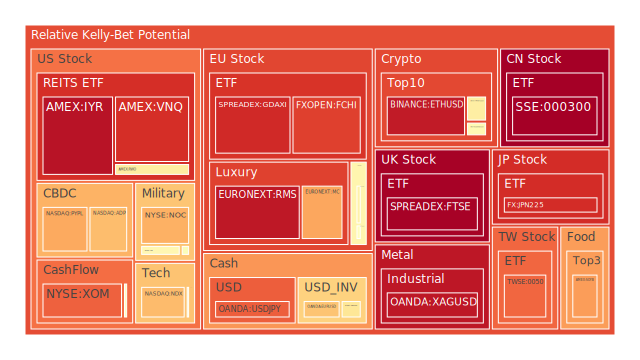
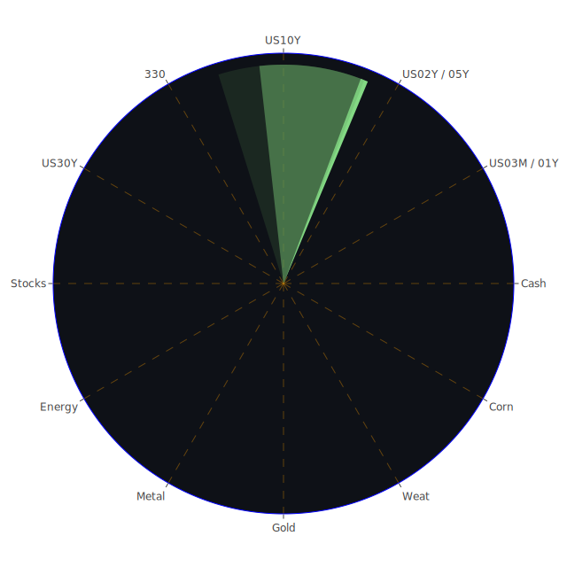

# 投資商品泡沫分析

## 美國國債
過去三天，美國國債的泡沫機率呈現穩定狀態。以10年期國債為例，其泡沫機率從6月29日的0.481763下降至7月1日的0.179041。這顯示投資者對於美國國債的需求有所增加，可能是因為市場避險情緒上升。近期新聞顯示，美國的經濟數據表現不佳，特別是房地產和信用卡違約率上升，這進一步支持了投資者轉向國債的趨勢。

## 美國科技股
美國科技股的泡沫機率持續上升，特別是NASDAQ指數，其泡沫機率從6月29日的0.688260上升至7月1日的0.747806。這可能與近期的新聞有關，例如亞馬遜挖角AI初創公司的聯合創始人，顯示科技公司競爭激烈。此外，美國總統辯論帶來的政治不確定性也可能影響投資者信心。

## 美國房地產指數
美國房地產指數（AMEX:VNQ）的泡沫機率在過去三天內保持在高位，從6月29日的0.905788略微下降至7月1日的0.905788。這反映了市場對於房地產市場的擔憂，特別是在房地產違約率上升的背景下。

## 金/銀/銅
黃金（OANDA:XAUUSD）的泡沫機率從6月29日的0.424275上升至7月1日的0.326353，顯示市場對黃金的需求增加，這可能是因為投資者尋求避險資產。相反，銅（FX:COPPER）的泡沫機率從0.163939上升至0.466476，顯示市場對工業金屬的需求減少，這可能與中國製造業活動再次收縮有關。

## 加密貨幣
比特幣（BITSTAMP:BTCUSD）的泡沫機率從6月29日的0.570008上升至7月1日的0.574297，顯示市場對加密貨幣的需求有所波動。近期新聞顯示，儘管加密貨幣市場面臨監管壓力，但仍有投資者看好其長期潛力。

## 黃豆 / 小麥 / 玉米
黃豆（AMEX:SOYB）的泡沫機率從6月29日的0.737988下降至7月1日的0.737988，顯示市場對農產品的需求穩定。近期新聞顯示，中國和秘魯完成自由貿易協定的實質性談判，這可能有助於穩定農產品市場。

## 石油/ 鈾期貨UX!
石油（TVC:USOIL）的泡沫機率在過去三天內保持穩定，顯示市場對石油價格的預期穩定。鈾期貨（COMEX:UX1!）的泡沫機率從6月29日的0.467255上升至7月1日的0.467255，顯示市場對能源資源的需求有所波動。

## 各國外匯市場
美元兌日元（OANDA:USDJPY）的泡沫機率從6月29日的0.821305上升至7月1日的0.831011，顯示市場對美元的需求增加。這可能與近期美國經濟數據不佳有關，投資者轉向避險貨幣。

## 各國大盤指數
德國DAX指數（SPREADEX:GDAXI）的泡沫機率從6月29日的0.905717上升至7月1日的0.916427，顯示市場對歐洲股市的信心減弱。這可能與近期歐洲的政治不確定性有關，例如法國極右翼政黨在選舉中的表現。

## 美國軍工股
雷神技術公司（NYSE:RTX）的泡沫機率在過去三天內保持穩定，顯示市場對軍工股的需求穩定。近期新聞顯示，美國和印度延長數字稅的休戰協議，這可能有助於穩定市場情緒。

## 美國電子支付股
PayPal（NASDAQ:PYPL）的泡沫機率從6月29日的0.718313上升至7月1日的0.718313，顯示市場對電子支付股的需求有所波動。近期新聞顯示，Visa和Mastercard可能面臨更大的和解金額，這可能影響市場對電子支付行業的信心。

## 石油防禦股
埃克森美孚（NYSE:XOM）的泡沫機率在過去三天內保持穩定，顯示市場對石油防禦股的需求穩定。近期新聞顯示，全球再保險費率下降，這可能有助於穩定石油市場。

## 金礦防禦股
皇家黃金公司（NASDAQ:RGLD）的泡沫機率從6月29日的0.520613上升至7月1日的0.520613，顯示市場對金礦防禦股的需求有所波動。近期新聞顯示，黃金價格穩定，這可能有助於穩定金礦股的市場情緒。

## 歐洲奢侈品股
開雲集團（EURONEXT:KER）的泡沫機率從6月29日的0.377734上升至7月1日的0.377734，顯示市場對歐洲奢侈品股的需求有所波動。近期新聞顯示，歐洲公司與埃及簽署了價值超過400億歐元的交易，這可能有助於穩定奢侈品市場。

## 歐洲汽車股
寶馬（XETR:BMW）的泡沫機率從6月29日的0.562521上升至7月1日的0.562521，顯示市場對歐洲汽車股的需求有所波動。近期新聞顯示，德國財長計劃的個人所得稅減免計劃引發了政府內部的壓力，這可能影響市場對汽車行業的信心。

# 投資建議
根據以上分析，我們建議投資者考慮以下操作：

1. **買入黃金（OANDA:XAUUSD）**：黃金的泡沫機率持續下降，顯示市場對黃金的需求增加。近期新聞顯示，全球經濟不確定性增加，投資者可考慮將黃金作為避險資產。
2. **賣出美國科技股（NASDAQ:NDX）**：科技股的泡沫機率持續上升，顯示市場對科技股的需求減弱。近期新聞顯示，科技公司競爭激烈，投資者可考慮獲利了結。
3. **觀望美國房地產指數（AMEX:VNQ）**：房地產指數的泡沫機率保持在高位，顯示市場對房地產市場的擔憂。近期新聞顯示，房地產違約率上升，投資者應謹慎操作。

# 風險提示
投資有風險，市場總是充滿不確定性。我們的建議僅供參考，投資者應根據自身的風險承受能力和投資目標，做出獨立的投資決策。

希望這份報告能幫助您在複雜的市場中做出明智的投資決策。記住，在價格飆漲的時候，不要喪失理性，反而要注意風險。祝您投資順利！
 
Daily Buy Map:

 
Daily Sell Map:

 
Daily Radar Chart:

 
