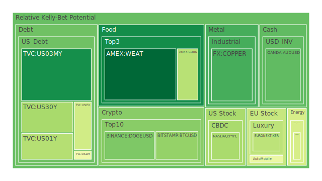
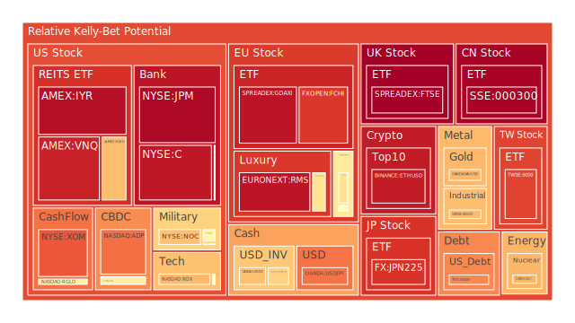
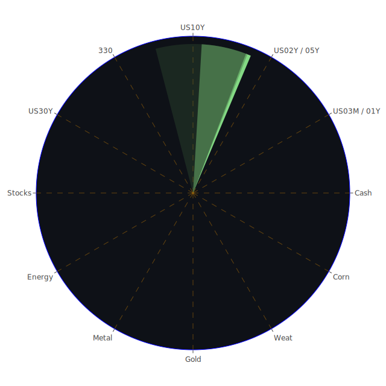

# 投資商品泡沫分析

## 美國國債
- **30年期美國國債 (TVC:US30Y)**
  - 泡沫機率從6月30日的0.313947上升到7月2日的0.333951，呈現上升趨勢。
  - 近期美國國債殖利率倒掛，尤其是30年期與3個月期倒掛達到-0.73，顯示市場對長期經濟前景的擔憂。
  - 建議：考慮減持，因為殖利率倒掛可能導致企業融資成本上升，進而影響整體市場。

## 美國科技股
- **納斯達克指數 (NASDAQ:NDX)**
  - 泡沫機率從6月30日的0.688260上升到7月2日的0.689638，持續高位。
  - 近期新聞顯示Apple和Tesla帶動科技股上漲，但市場情緒依然謹慎。
  - 建議：觀望，因為泡沫機率高且市場情緒複雜。

## 美國房地產指數
- **美國房地產ETF (AMEX:VNQ)**
  - 泡沫機率從6月30日的0.905271上升到7月2日的0.930081，持續高位。
  - 房地產市場面臨高利率和高違約率的雙重壓力。
  - 建議：強烈建議減持，避免未來價格下跌的風險。

## 金/銀/銅
- **黃金 (OANDA:XAUUSD)**
  - 泡沫機率從6月30日的0.424275上升到7月2日的0.691963，顯著上升。
  - 近期金價受FED鷹派言論影響，市場避險需求增加。
  - 建議：觀望，因為泡沫機率上升且市場情緒不穩。

## 加密貨幣
- **比特幣 (BITSTAMP:BTCUSD)**
  - 泡沫機率從6月30日的0.573489下降到7月2日的0.303111，顯著下降。
  - 近期市場對加密貨幣的信心有所回升，特別是比特幣。
  - 建議：考慮分批買入，因為泡沫機率下降且市場情緒轉好。

## 黃豆 / 小麥 / 玉米
- **小麥 (AMEX:WEAT)**
  - 泡沫機率從6月30日的0.047004下降到7月2日的0.042168，持續低位。
  - 近期中國與秘魯完成自由貿易協定升級談判，可能有助於農產品貿易。
  - 建議：考慮分批買入，因為泡沫機率低且市場情緒正面。

## 石油/ 鈾期貨UX!
- **石油 (TVC:USOIL)**
  - 泡沫機率從6月30日的0.419549保持穩定。
  - 近期石油價格受全球經濟不確定性影響，波動較大。
  - 建議：觀望，因為泡沫機率穩定且市場情緒不明朗。

## 各國外匯市場
- **澳元/美元 (OANDA:AUDUSD)**
  - 泡沫機率從6月30日的0.431575下降到7月2日的0.227370，顯著下降。
  - 近期澳元受中國經濟數據影響較大，但市場情緒有所改善。
  - 建議：考慮分批買入，因為泡沫機率下降且市場情緒轉好。

## 各國大盤指數
- **德國DAX指數 (SPREADEX:GDAXI)**
  - 泡沫機率從6月30日的0.905717上升到7月2日的0.954527，持續高位。
  - 近期德國經濟數據疲弱，加上政治不穩定因素，對市場造成壓力。
  - 建議：強烈建議減持，避免未來價格下跌的風險。

## 美國銀行股
- **摩根大通 (NYSE:JPM)**
  - 泡沫機率從6月30日的0.979046持續高位。
  - 近期美國銀行業面臨高違約率和高利率的雙重挑戰。
  - 建議：強烈建議減持，避免未來價格下跌的風險。

## 美國軍工股
- **洛克希德馬丁 (NYSE:LMT)**
  - 泡沫機率從6月30日的0.546994保持穩定。
  - 近期軍工股受全球地緣政治影響，市場情緒複雜。
  - 建議：觀望，因為泡沫機率穩定且市場情緒不明朗。

## 美國電子支付股
- **PayPal (NASDAQ:PYPL)**
  - 泡沫機率從6月30日的0.718313下降到7月2日的0.336229，顯著下降。
  - 近期電子支付市場競爭激烈，但PayPal表現穩定。
  - 建議：考慮分批買入，因為泡沫機率下降且市場情緒轉好。

## 石油防禦股
- **埃克森美孚 (NYSE:XOM)**
  - 泡沫機率從6月30日的0.826129上升到7月2日的0.838104，持續高位。
  - 近期石油市場波動較大，對防禦股造成壓力。
  - 建議：觀望，因為泡沫機率高且市場情緒不穩。

## 金礦防禦股
- **Royal Gold (NASDAQ:RGLD)**
  - 泡沫機率從6月30日的0.520613上升到7月2日的0.554433，持續高位。
  - 近期金價波動較大，對金礦股造成壓力。
  - 建議：觀望，因為泡沫機率高且市場情緒不穩。

## 歐洲奢侈品股
- **LVMH (EURONEXT:MC)**
  - 泡沫機率從6月30日的0.722901下降到7月2日的0.595723，顯著下降。
  - 近期歐洲奢侈品市場需求穩定，特別是中國市場的復甦。
  - 建議：考慮分批買入，因為泡沫機率下降且市場情緒轉好。

## 歐洲汽車股
- **BMW (XETR:BMW)**
  - 泡沫機率從6月30日的0.562641上升到7月2日的0.598067，持續高位。
  - 近期德國汽車市場面臨供應鏈挑戰和需求不穩定。
  - 建議：觀望，因為泡沫機率高且市場情緒不穩。

# 投資建議
1. **考慮減持**：美國國債、德國DAX指數、美國銀行股，因為泡沫機率高且市場情緒不穩。
2. **考慮分批買入**：比特幣、小麥、澳元/美元、PayPal、LVMH，因為泡沫機率下降且市場情緒轉好。
3. **觀望**：美國科技股、黃金、石油、洛克希德馬丁、埃克森美孚、Royal Gold、BMW，因為泡沫機率高且市場情緒不明朗。

# 風險提示

投資有風險，市場總是充滿不確定性。我們的建議僅供參考，投資者應根據自身的風險承受能力和投資目標，做出獨立的投資決策。特別是對於泡沫機率高的商品，應該謹慎進行投資決策。
 
Daily Buy Map:

 
Daily Sell Map:

 
Daily Radar Chart:

 
