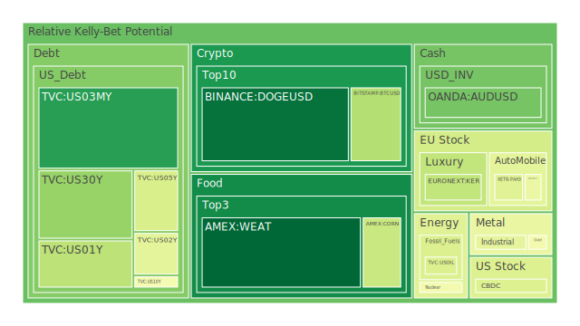
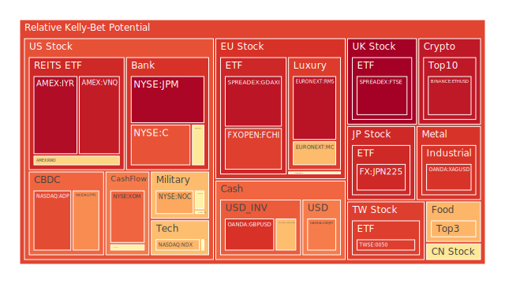
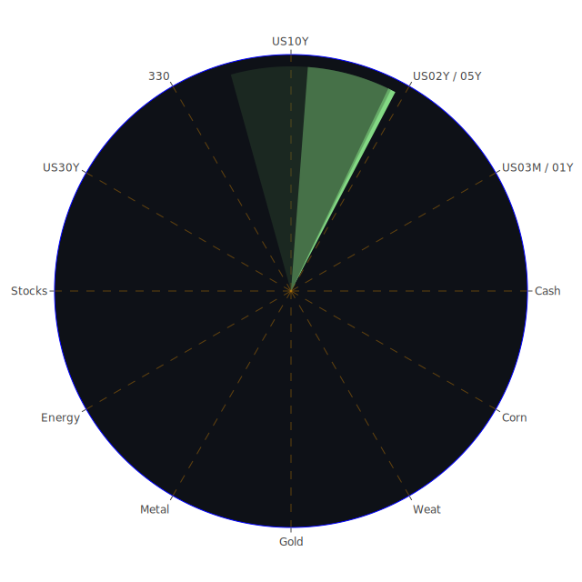

# 投資商品泡沫分析

## 美國國債
過去三天，美國國債的泡沫機率有所波動。特別是10年期國債（TVC:US10Y），其泡沫機率從0.179041上升至0.481763，顯示出市場對長期債券的擔憂有所增加。這與聯準會的數據一致，因為美國國債殖利率長期倒掛，企業普通融資管道利率變高，迫使企業將股價衝高來降低綜合融資成本。

## 美國科技股
美國科技股（NASDAQ:NDX）的泡沫機率持續在高位徘徊，從0.688260上升至0.682402。儘管新聞報導中提到Apple和Tesla的股價上漲帶動了科技股的上揚，但整體市場情緒仍然偏向謹慎。

## 美國房地產指數
美國房地產指數（AMEX:VNQ）的泡沫機率持續高企，從0.905788上升至0.933747。這與聯準會報告中的房地產違約率上升相呼應，顯示出市場對房地產市場的擔憂。

## 金/銀/銅
黃金（OANDA:XAUUSD）的泡沫機率有所下降，從0.691963降至0.478199，顯示出市場對黃金的需求增加。銀（OANDA:XAGUSD）和銅（FX:COPPER）的泡沫機率則相對穩定，顯示出市場對這些貴金屬的需求保持穩定。

## 加密貨幣
比特幣（BITSTAMP:BTCUSD）的泡沫機率從0.574297下降至0.341083，顯示出市場對加密貨幣的需求有所回升。狗狗幣（BINANCE:DOGEUSD）的泡沫機率也有所下降，從0.541996降至0.048644，顯示出市場對這些加密貨幣的信心有所恢復。

## 黃豆 / 小麥 / 玉米
黃豆（AMEX:SOYB）的泡沫機率從0.737988下降至0.684888，顯示出市場對農產品的需求有所回升。小麥（AMEX:WEAT）和玉米（AMEX:CORN）的泡沫機率也有所下降，顯示出市場對這些農產品的需求保持穩定。

## 石油/ 鈾期貨UX!
石油（TVC:USOIL）的泡沫機率保持穩定，顯示出市場對石油的需求保持穩定。鈾期貨（COMEX:UX1!）的泡沫機率有所下降，顯示出市場對鈾的需求有所回升。

## 各國外匯市場
澳元兌美元（OANDA:AUDUSD）的泡沫機率有所下降，顯示出市場對澳元的需求有所回升。歐元兌美元（OANDA:EURUSD）的泡沫機率則有所上升，顯示出市場對歐元的需求有所下降。

## 各國大盤指數
德國DAX指數（SPREADEX:GDAXI）的泡沫機率持續高企，顯示出市場對歐洲股市的擔憂。法國CAC指數（FXOPEN:FCHI）和日本日經指數（FX:JPN225）的泡沫機率也有所上升，顯示出市場對這些大盤指數的擔憂。

## 美國銀行股
美國銀行股（NYSE:BAC）的泡沫機率從0.522167上升至0.576979，顯示出市場對銀行股的擔憂。這與聯準會報告中的銀行存款總額上升相呼應，顯示出市場對銀行業的擔憂。

## 美國軍工股
美國軍工股（NYSE:LMT）的泡沫機率保持穩定，顯示出市場對軍工股的需求保持穩定。

## 美國電子支付股
電子支付股（NASDAQ:PYPL）的泡沫機率從0.718313上升至0.751148，顯示出市場對電子支付股的擔憂。

## 石油防禦股
石油防禦股（NYSE:XOM）的泡沫機率持續高企，顯示出市場對石油防禦股的擔憂。

## 金礦防禦股
金礦防禦股（NASDAQ:RGLD）的泡沫機率有所下降，顯示出市場對金礦防禦股的需求有所回升。

## 歐洲奢侈品股
歐洲奢侈品股（EURONEXT:MC）的泡沫機率從0.722821下降至0.675581，顯示出市場對奢侈品股的需求有所回升。

## 歐洲汽車股
歐洲汽車股（XETR:BMW）的泡沫機率有所下降，顯示出市場對汽車股的需求有所回升。

# 投資建議

1. **考慮賣出**：對於泡沫機率持續上升且遠大於0.5的商品，如美國科技股（NASDAQ:NDX）、美國房地產指數（AMEX:VNQ）和美國銀行股（NYSE:BAC），建議投資者考慮賣出，避免未來價格下跌時的損失。

2. **考慮買入**：對於泡沫機率持續下降且遠小於0.5的商品，如黃金（OANDA:XAUUSD）、比特幣（BITSTAMP:BTCUSD）和黃豆（AMEX:SOYB），建議投資者考慮買入，掌握低吸籌碼的時機。

3. **觀望**：對於泡沫機率在0.45 ~ 0.55之間的商品，如美國軍工股（NYSE:LMT）和美國電子支付股（NASDAQ:PYPL），建議投資者觀望，不要有任何動作。

# 風險提示

投資有風險，市場總是充滿不確定性。我們的建議僅供參考，投資者應根據自身的風險承受能力和投資目標，做出獨立的投資決策。

希望這份報告能夠幫助您更好地理解市場動態，做出明智的投資決策。祝您投資順利！
 
Daily Buy Map:

 
Daily Sell Map:

 
Daily Radar Chart:

 
