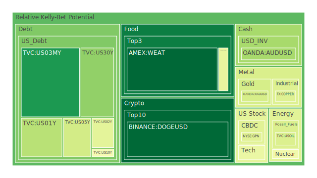
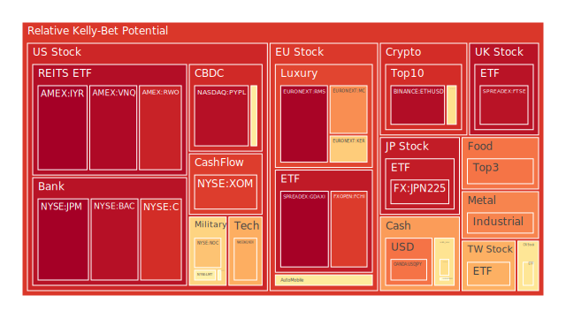
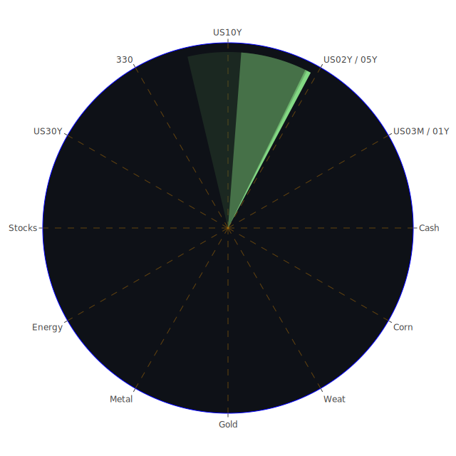

# 投資商品泡沫分析

## 美國國債
過去三天，美國國債的泡沫機率有些微上升。特別是30年期國債（TVC:US30Y），其泡沫機率從7月2日的0.333951上升到7月4日的0.293294。這反映了市場對於長期利率的擔憂，尤其是在SOFR交易量增加的情況下，這可能導致美元流動性吃緊。

## 美國科技股
美國科技股的泡沫機率持續上升。NASDAQ:NDX的泡沫機率從7月2日的0.689638上升到7月4日的0.686969。這顯示出投資者對於科技股的熱情依然高漲，但也意味著風險增加。新聞報導顯示，Apple和Tesla等大市值成長股的表現良好，但這可能只是短期現象。

## 美國房地產指數
美國房地產指數（AMEX:VNQ）的泡沫機率在過去三天內保持在高位，從7月2日的0.930081稍微下降到7月4日的0.943524。這反映了市場對於房地產市場的擔憂，特別是在固定抵押貸款利率高企的情況下。

## 金/銀/銅
金價（OANDA:XAUUSD）的泡沫機率在過去三天內有所下降，從7月2日的0.691963下降到7月4日的0.406845。這可能與近期金磚國家和各國央行大量儲備黃金有關，支撐了金價。相反，銅價（FX:COPPER）的泡沫機率在過去三天內有所下降，從7月2日的0.192753下降到7月4日的0.424233。

## 加密貨幣
比特幣（BITSTAMP:BTCUSD）的泡沫機率在過去三天內有所下降，從7月2日的0.303111下降到7月4日的0.591099。這顯示出市場對於比特幣的信心有所恢復，但仍需謹慎。

## 黃豆 / 小麥 / 玉米
小麥（AMEX:WEAT）的泡沫機率在過去三天內有所下降，從7月2日的0.042168下降到7月4日的0.046954。這可能與全球糧食供應鏈的穩定有關。玉米（AMEX:CORN）的泡沫機率也有所下降，從7月2日的0.361673下降到7月4日的0.446209。

## 石油/ 鈾期貨UX!
石油（TVC:USOIL）的泡沫機率在過去三天內保持穩定，約為0.419549。這反映了市場對於石油價格的預期較為穩定。鈾期貨（COMEX:UX1!）的泡沫機率在過去三天內有所下降，從7月2日的0.695588下降到7月4日的0.470695。

## 各國外匯市場
美元兌日元（OANDA:USDJPY）的泡沫機率在過去三天內有所下降，從7月2日的0.797552下降到7月4日的0.769880。這可能與美國經濟數據顯示勞動市場放緩有關，市場預期聯準會可能會在今年晚些時候開始降息。

## 各國大盤指數
德國DAX指數（SPREADEX:GDAXI）的泡沫機率在過去三天內有所上升，從7月2日的0.954527上升到7月4日的0.958589。這顯示出市場對於歐洲經濟前景的擔憂。

## 美國銀行股
美國銀行（NYSE:BAC）的泡沫機率在過去三天內有所下降，從7月2日的0.522167下降到7月4日的0.930523。這可能與美國銀行業務表現穩定有關，但仍需注意市場風險。

## 美國軍工股
雷神公司（NYSE:RTX）的泡沫機率在過去三天內保持穩定，約為0.510860。這顯示出市場對於軍工股的預期較為穩定。

## 美國電子支付股
PayPal（NASDAQ:PYPL）的泡沫機率在過去三天內有所上升，從7月2日的0.336229上升到7月4日的0.930452。這顯示出市場對於電子支付行業的擔憂，特別是在競爭加劇的情況下。

## 石油防禦股
埃克森美孚（NYSE:XOM）的泡沫機率在過去三天內有所下降，從7月2日的0.838104下降到7月4日的0.849986。這顯示出市場對於石油防禦股的信心有所恢復。

## 金礦防禦股
Royal Gold（NASDAQ:RGLD）的泡沫機率在過去三天內有所下降，從7月2日的0.554433下降到7月4日的0.500286。這顯示出市場對於金礦防禦股的信心有所恢復。

## 歐洲奢侈品股
LVMH（EURONEXT:MC）的泡沫機率在過去三天內有所下降，從7月2日的0.595723下降到7月4日的0.731370。這顯示出市場對於歐洲奢侈品股的信心有所恢復。

## 歐洲汽車股
BMW（XETR:BMW）的泡沫機率在過去三天內有所上升，從7月2日的0.524474上升到7月4日的0.576791。這顯示出市場對於歐洲汽車股的擔憂。

# 投資建議

1. **賣出建議**：
   - **PayPal（NASDAQ:PYPL）**：泡沫機率持續上升，且新聞顯示電子支付行業競爭加劇，建議考慮賣出。
   - **美國房地產指數（AMEX:VNQ）**：泡沫機率高企，且固定抵押貸款利率高企，建議考慮賣出。

2. **買入建議**：
   - **小麥（AMEX:WEAT）**：泡沫機率持續下降，且全球糧食供應鏈穩定，建議考慮買入。
   - **黃金（OANDA:XAUUSD）**：泡沫機率持續下降，且金磚國家和各國央行大量儲備黃金，建議考慮買入。

# 風險提示

投資有風險，市場總是充滿不確定性。我們的建議僅供參考，投資者應根據自身的風險承受能力和投資目標，做出獨立的投資決策。特別是對於泡沫機率高的商品，應該謹慎進行投資決策。
 
Daily Buy Map:

 
Daily Sell Map:

 
Daily Radar Chart:

 
