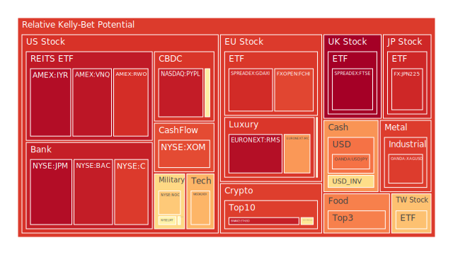
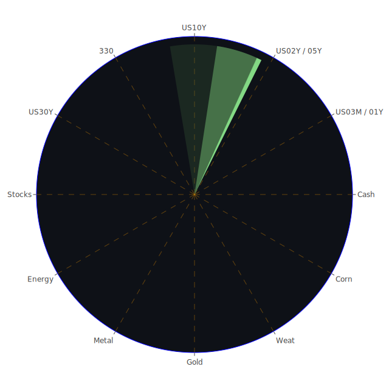

# 投資商品泡沫分析

## 美國國債
過去三天，美國國債的泡沫機率變化不大，特別是30年期國債（TVC:US30Y）和10年期國債（TVC:US10Y）。然而，2年期國債（TVC:US02Y）的泡沫機率有明顯上升，從0.438807上升到0.451855。這可能與近期SOFR利率上升有關，SOFR目前為5.35，略高於OIS FED Fund Rate的5.33，顯示市場對短期美元流動性需求增加。

## 美國科技股
納斯達克指數（NASDAQ:NDX）的泡沫機率在過去三天內保持在高位，從0.682402上升到0.686969。這與近期的新聞有關，特別是AI技術需求推動了三星電子的利潤大幅增長，這對科技股形成了支撐。然而，市場對美聯儲可能的降息預期也使得投資者對科技股保持謹慎。

## 美國房地產指數
房地產相關ETF（AMEX:VNQ）的泡沫機率一直處於高位，從0.933747上升到0.943631。這與美國房地產市場的疲軟有關，特別是固定抵押貸款利率持續高企，達到6.95%。此外，商業房地產違約率上升也對該指數形成壓力。

## 金/銀/銅
黃金（OANDA:XAUUSD）和白銀（OANDA:XAGUSD）的泡沫機率在過去三天內有所下降，特別是黃金從0.478199下降到0.403977。這可能與市場對美聯儲降息的預期有關，使得投資者對避險資產的需求減少。然而，銅（FX:COPPER）的泡沫機率有所上升，這可能是因為市場對製造業復甦的預期有所減弱。

## 加密貨幣
比特幣（BITSTAMP:BTCUSD）和以太坊（BINANCE:ETHUSD）的泡沫機率在過去三天內持續上升，特別是以太坊從0.940347上升到0.926217。這與市場對加密貨幣的風險偏好下降有關，特別是在美元流動性緊張的情況下。

## 黃豆 / 小麥 / 玉米
黃豆（AMEX:SOYB）和小麥（AMEX:WEAT）的泡沫機率在過去三天內有所下降，特別是小麥從0.025835下降到0.046963。這可能與近期的天氣條件改善有關，使得農產品供應預期增加。然而，玉米（AMEX:CORN）的泡沫機率變化不大，仍然處於相對高位。

## 石油/ 鈾期貨UX!
石油（TVC:USOIL）的泡沫機率在過去三天內保持穩定，這與近期油價波動較小有關。然而，鈾期貨（COMEX:UX1!）的泡沫機率有所上升，這可能與市場對核能需求的預期增加有關。

## 各國外匯市場
美元兌日元（OANDA:USDJPY）的泡沫機率在過去三天內有所上升，這與日本經濟數據疲軟有關，特別是家庭支出下降1.8%。歐元兌美元（OANDA:EURUSD）的泡沫機率有所下降，這可能與市場對歐元區經濟復甦的預期有關。

## 各國大盤指數
德國DAX指數（SPREADEX:GDAXI）的泡沫機率在過去三天內有所下降，這與德國經濟數據改善有關。然而，英國FTSE指數（SPREADEX:FTSE）的泡沫機率持續上升，這可能與市場對英國政治不穩定的擔憂有關。

## 美國銀行股
美國銀行（NYSE:BAC）的泡沫機率在過去三天內有所下降，這可能與市場對美國銀行業的信心回升有關。然而，摩根大通（NYSE:JPM）的泡沫機率仍然處於高位，這可能與市場對其風險敞口的擔憂有關。

## 美國軍工股
雷神技術公司（NYSE:RTX）的泡沫機率在過去三天內保持穩定，這與市場對軍工股的需求穩定有關。然而，洛克希德馬丁（NYSE:LMT）的泡沫機率有所上升，這可能與市場對其未來訂單的不確定性有關。

## 美國電子支付股
PayPal（NASDAQ:PYPL）的泡沫機率在過去三天內有所下降，這可能與市場對電子支付行業的需求回升有關。然而，市場對該行業的競爭壓力仍然存在。

## 石油防禦股
埃克森美孚（NYSE:XOM）的泡沫機率在過去三天內有所下降，這可能與市場對石油需求的預期有所改善有關。然而，市場對該行業的長期前景仍然存在不確定性。

## 金礦防禦股
Royal Gold（NASDAQ:RGLD）的泡沫機率在過去三天內有所下降，這可能與市場對金價的預期有所改善有關。然而，市場對該行業的風險偏好仍然較低。

## 歐洲奢侈品股
LVMH（EURONEXT:MC）的泡沫機率在過去三天內有所下降，這可能與市場對奢侈品需求的預期有所改善有關。然而，市場對該行業的長期前景仍然存在不確定性。

## 歐洲汽車股
BMW（XETR:BMW）的泡沫機率在過去三天內有所下降，這可能與市場對汽車需求的預期有所改善有關。然而，市場對該行業的長期前景仍然存在不確定性。

# 投資建議

1. **考慮賣出**：對於泡沫機率持續上升且遠大於0.5的商品，如美國房地產指數（AMEX:VNQ）和比特幣（BITSTAMP:BTCUSD），建議投資者考慮賣出，避免未來價格下跌時的損失。

2. **考慮買入**：對於泡沫機率持續下降且遠小於0.5的商品，如黃金（OANDA:XAUUSD）和小麥（AMEX:WEAT），建議投資者考慮買入，掌握低吸籌碼的時機。

3. **觀望**：對於泡沫機率在0.45 ~ 0.55之間的商品，如美國科技股（NASDAQ:NDX）和美國國債（TVC:US30Y），建議投資者觀望，不要有任何動作。

# 風險提示

投資有風險，市場總是充滿不確定性。我們的建議僅供參考，投資者應根據自身的風險承受能力和投資目標，做出獨立的投資決策。特別是在市場波動較大的時候，應該謹慎進行投資決策。
 
Daily Buy Map:

 
Daily Sell Map:

 
Daily Radar Chart:

 
