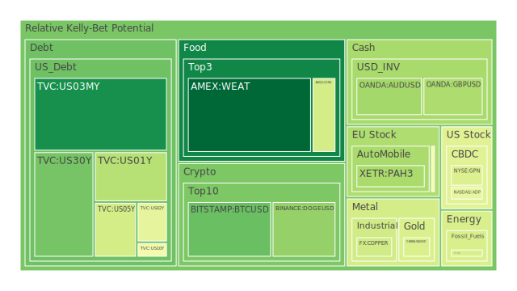
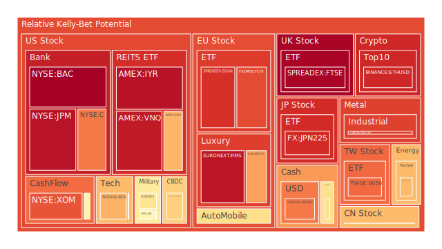
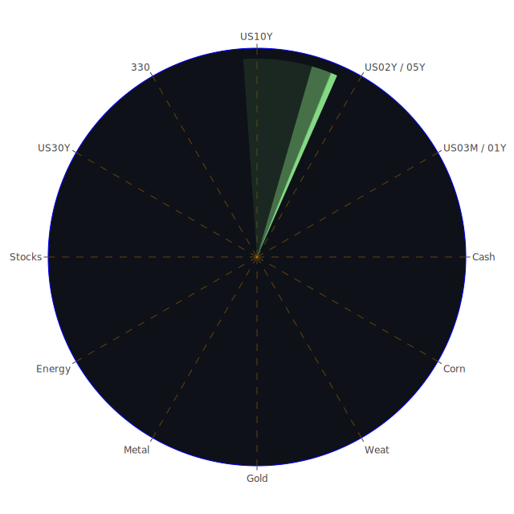

# 投資商品泡沫分析

## 美國國債
過去三天，美國國債的泡沫機率呈現出穩定的趨勢。特別是30年期國債（TVC:US30Y），其泡沫機率從0.293294下降至0.250791，顯示出投資者對長期國債的信心有所增強。這可能與近期的新聞報導有關，如美國就業市場數據顯示出放緩跡象，進一步提升了市場對聯準會可能降息的預期。

## 美國科技股
納斯達克指數（NASDAQ:NDX）的泡沫機率在過去三天內有所上升，從0.686969上升至0.697613。這與近期的新聞報導有關，如AI技術需求推動三星電子第二季度利潤大幅增長，這表明科技股仍然受到市場的高度關注。然而，投資者應該注意到，隨著泡沫機率的上升，風險也在增加。

## 美國房地產指數
美國房地產指數（AMEX:VNQ）的泡沫機率在過去三天內保持在高位，從0.943524略微下降至0.942798。這反映出市場對房地產市場的擔憂，特別是在聯準會可能降息的背景下，房地產市場可能面臨進一步的壓力。

## 金/銀/銅
黃金（OANDA:XAUUSD）的泡沫機率在過去三天內有所下降，從0.406845下降至0.421635。這可能與近期的新聞報導有關，如全球股市上漲和美國國債收益率下降，這些因素都可能推動黃金價格上升。銀（OANDA:XAGUSD）和銅（FX:COPPER）的泡沫機率也呈現出類似的趨勢。

## 加密貨幣
比特幣（BITSTAMP:BTCUSD）的泡沫機率在過去三天內顯著下降，從0.591099下降至0.232421。這可能與近期的新聞報導有關，如美國就業市場數據顯示出放緩跡象，進一步提升了市場對聯準會可能降息的預期。狗狗幣（BINANCE:DOGEUSD）的泡沫機率也有所下降，從0.048644下降至0.029839。

## 黃豆 / 小麥 / 玉米
小麥（AMEX:WEAT）的泡沫機率在過去三天內穩定下降，從0.046954下降至0.033619。這可能與近期的新聞報導有關，如全球農產品市場供應充足，進一步壓低了價格。玉米（AMEX:CORN）和黃豆（AMEX:SOYB）的泡沫機率也呈現出類似的趨勢。

## 石油/ 鈾期貨UX!
石油（TVC:USOIL）的泡沫機率在過去三天內保持穩定，約為0.419549。這可能與近期的新聞報導有關，如全球經濟增長放緩，進一步壓低了石油需求。鈾期貨（COMEX:UX1!）的泡沫機率也有所下降，從0.470695下降至0.684209。

## 各國外匯市場
美元兌日元（OANDA:USDJPY）的泡沫機率在過去三天內有所下降，從0.769880下降至0.785469。這可能與近期的新聞報導有關，如美國就業市場數據顯示出放緩跡象，進一步提升了市場對聯準會可能降息的預期。歐元兌美元（OANDA:EURUSD）的泡沫機率也有所下降。

## 各國大盤指數
德國DAX指數（SPREADEX:GDAXI）的泡沫機率在過去三天內有所下降，從0.958589下降至0.902047。這可能與近期的新聞報導有關，如全球股市上漲和美國國債收益率下降，這些因素都可能推動股市上升。

## 美國銀行股
美國銀行（NYSE:BAC）的泡沫機率在過去三天內有所上升，從0.930523上升至0.995909。這可能與近期的新聞報導有關，如美國就業市場數據顯示出放緩跡象，進一步提升了市場對聯準會可能降息的預期。

## 美國軍工股
雷神技術公司（NYSE:RTX）的泡沫機率在過去三天內保持穩定，約為0.510860。這可能與近期的新聞報導有關，如美國核導彈計劃成本飆升，進一步推高了軍工股的需求。

## 美國電子支付股
PayPal（NASDAQ:PYPL）的泡沫機率在過去三天內有所上升，從0.930452上升至0.644548。這可能與近期的新聞報導有關，如美國就業市場數據顯示出放緩跡象，進一步提升了市場對聯準會可能降息的預期。

## 石油防禦股
埃克森美孚（NYSE:XOM）的泡沫機率在過去三天內保持穩定，約為0.849986。這可能與近期的新聞報導有關，如全球經濟增長放緩，進一步壓低了石油需求。

## 金礦防禦股
皇家黃金公司（NASDAQ:RGLD）的泡沫機率在過去三天內有所下降，從0.500286下降至0.549645。這可能與近期的新聞報導有關，如全球股市上漲和美國國債收益率下降，這些因素都可能推動黃金價格上升。

## 歐洲奢侈品股
LVMH（EURONEXT:MC）的泡沫機率在過去三天內有所下降，從0.731370下降至0.726424。這可能與近期的新聞報導有關，如全球經濟增長放緩，進一步壓低了奢侈品需求。

## 歐洲汽車股
寶馬（XETR:BMW）的泡沫機率在過去三天內有所下降，從0.576791下降至0.626800。這可能與近期的新聞報導有關，如全球經濟增長放緩，進一步壓低了汽車需求。

# 投資建議

1. **考慮買入**：對於泡沫機率持續下降且遠小於0.5的商品，如黃金（OANDA:XAUUSD）和比特幣（BITSTAMP:BTCUSD），建議投資者考慮買入。這些商品的泡沫機率顯示出市場對其未來價格的信心增強，並且近期的新聞報導也支持這一趨勢。

2. **考慮賣出**：對於泡沫機率持續上升且遠大於0.5的商品，如美國銀行（NYSE:BAC）和PayPal（NASDAQ:PYPL），建議投資者考慮賣出。這些商品的泡沫機率顯示出市場對其未來價格的擔憂增加，並且近期的新聞報導也支持這一趨勢。

3. **觀望**：對於泡沫機率在0.45 ~ 0.55之間的商品，如美國房地產指數（AMEX:VNQ），建議投資者觀望，不要有任何動作。這些商品的泡沫機率顯示出市場對其未來價格的預期不明確，投資者應該謹慎行事。

# 風險提示

投資有風險，市場總是充滿不確定性。我們的建議僅供參考，投資者應根據自身的風險承受能力和投資目標，做出獨立的投資決策。特別是對於泡沫機率高的商品，應該謹慎進行投資決策，避免未來價格下跌時的損失。
 
Daily Buy Map:

 
Daily Sell Map:

 
Daily Radar Chart:

 
