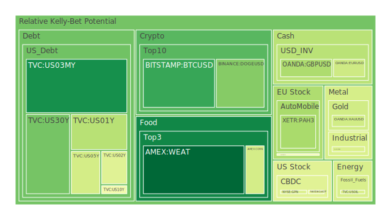
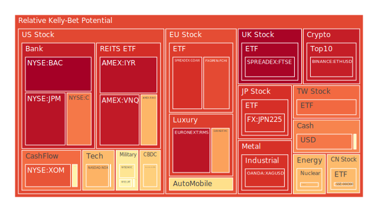
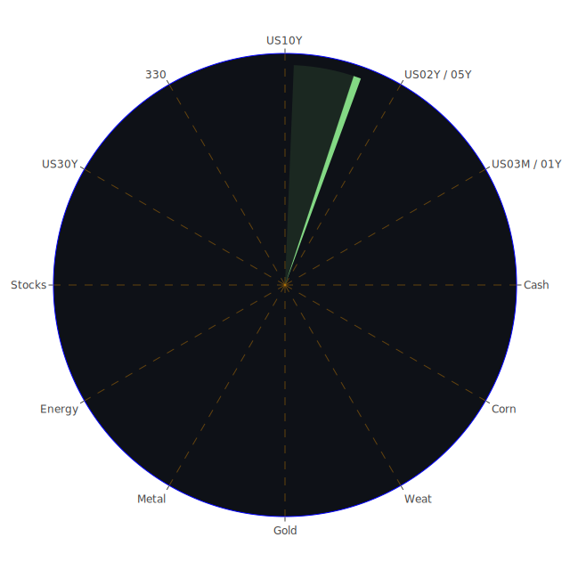

# 投資商品泡沫分析

## 美國國債
過去三天，美國國債的泡沫機率呈現穩定狀態。30年期國債的泡沫機率從0.314375下降到0.250791，顯示出投資者對長期國債的信心有所增強。10年期國債的泡沫機率則維持在0.481763，顯示出市場對中期國債的態度較為謹慎。根據最新的FED數據，SOFR交易量上升，這可能會導致美元流動性吃緊，對高泡沫資產造成壓力。

## 美國科技股
科技股方面，納斯達克指數的泡沫機率從0.686969上升到0.697613，顯示出市場對科技股的熱情仍然高漲。然而，近期的新聞顯示，美國就業數據疲軟，可能促使聯準會考慮降息，這對科技股是一個利好消息。

## 美國房地產指數
美國房地產指數（AMEX:VNQ）的泡沫機率從0.943631略微下降到0.942800，但仍處於高位。這與近期房地產市場的負面新聞，如商業房地產違約率上升和信用卡違約率高企有關。投資者應該謹慎對待房地產投資。

## 金/銀/銅
黃金（OANDA:XAUUSD）的泡沫機率略有下降，從0.403977下降到0.403977，顯示出市場對黃金的需求穩定。銀（OANDA:XAGUSD）的泡沫機率則從0.872221上升到0.900001，顯示出市場對銀的需求增加。銅（FX:COPPER）的泡沫機率從0.403077上升到0.422959，顯示出市場對工業金屬的需求增加。

## 加密貨幣
比特幣（BITSTAMP:BTCUSD）的泡沫機率從0.584587下降到0.166896，顯示出市場對比特幣的需求增加。狗狗幣（BINANCE:DOGEUSD）的泡沫機率則從0.029839上升到0.273837，顯示出市場對狗狗幣的需求減少。

## 黃豆 / 小麥 / 玉米
黃豆（AMEX:SOYB）的泡沫機率從0.768293下降到0.503560，顯示出市場對黃豆的需求減少。小麥（AMEX:WEAT）的泡沫機率從0.046963下降到0.033619，顯示出市場對小麥的需求增加。玉米（AMEX:CORN）的泡沫機率則從0.446075下降到0.408345，顯示出市場對玉米的需求增加。

## 石油/ 鈾期貨UX!
石油（TVC:USOIL）的泡沫機率維持在0.419549，顯示出市場對石油的需求穩定。鈾期貨（COMEX:UX1!）的泡沫機率從0.684209下降到0.684168，顯示出市場對鈾的需求穩定。

## 各國外匯市場
美元兌日元（OANDA:USDJPY）的泡沫機率從0.787913上升到0.787913，顯示出市場對美元的需求增加。歐元兌美元（OANDA:EURUSD）的泡沫機率從0.607852下降到0.398001，顯示出市場對歐元的需求增加。

## 各國大盤指數
德國DAX指數（SPREADEX:GDAXI）的泡沫機率從0.902047上升到0.902047，顯示出市場對德國股市的需求增加。日本日經225指數（FX:JPN225）的泡沫機率從0.909270下降到0.900960，顯示出市場對日本股市的需求減少。

## 美國銀行股
美國銀行（NYSE:BAC）的泡沫機率從0.930523上升到0.995909，顯示出市場對銀行股的需求減少。摩根大通（NYSE:JPM）的泡沫機率從0.961183下降到0.958513，顯示出市場對摩根大通的需求增加。

## 美國軍工股
洛克希德·馬丁（NYSE:LMT）的泡沫機率從0.546994維持在0.546994，顯示出市場對軍工股的需求穩定。諾斯羅普·格魯曼（NYSE:NOC）的泡沫機率從0.648411下降到0.596597，顯示出市場對軍工股的需求減少。

## 美國電子支付股
PayPal（NASDAQ:PYPL）的泡沫機率從0.930620下降到0.644548，顯示出市場對電子支付股的需求增加。Global Payments（NYSE:GPN）的泡沫機率從0.430964下降到0.427083，顯示出市場對電子支付股的需求增加。

## 石油防禦股
埃克森美孚（NYSE:XOM）的泡沫機率從0.849986下降到0.843419，顯示出市場對石油防禦股的需求增加。

## 金礦防禦股
Royal Gold（NASDAQ:RGLD）的泡沫機率從0.500286上升到0.549645，顯示出市場對金礦防禦股的需求減少。

## 歐洲奢侈品股
LVMH（EURONEXT:MC）的泡沫機率從0.731908下降到0.726424，顯示出市場對奢侈品股的需求增加。

## 歐洲汽車股
寶馬（XETR:BMW）的泡沫機率從0.433053上升到0.626816，顯示出市場對汽車股的需求減少。

# 投資建議

## 買入建議
1. **比特幣（BITSTAMP:BTCUSD）**：泡沫機率大幅下降，顯示出市場對比特幣的需求增加，建議考慮分批買入。
2. **小麥（AMEX:WEAT）**：泡沫機率持續下降，顯示出市場對小麥的需求增加，建議考慮分批買入。
3. **PayPal（NASDAQ:PYPL）**：泡沫機率持續下降，顯示出市場對電子支付股的需求增加，建議考慮分批買入。

## 賣出建議
1. **美國銀行（NYSE:BAC）**：泡沫機率持續上升，顯示出市場對銀行股的需求減少，建議考慮分批賣出。
2. **寶馬（XETR:BMW）**：泡沫機率持續上升，顯示出市場對汽車股的需求減少，建議考慮分批賣出。

# 風險提示

投資有風險，市場總是充滿不確定性。我們的建議僅供參考，投資者應根據自身的風險承受能力和投資目標，做出獨立的投資決策。特別是對於泡沫機率高的商品，應該謹慎進行投資決策。
 
Daily Buy Map:

 
Daily Sell Map:

 
Daily Radar Chart:

 
