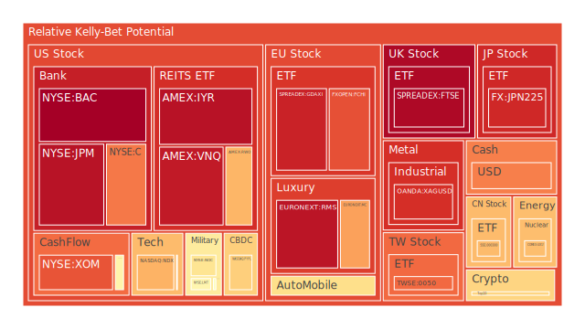
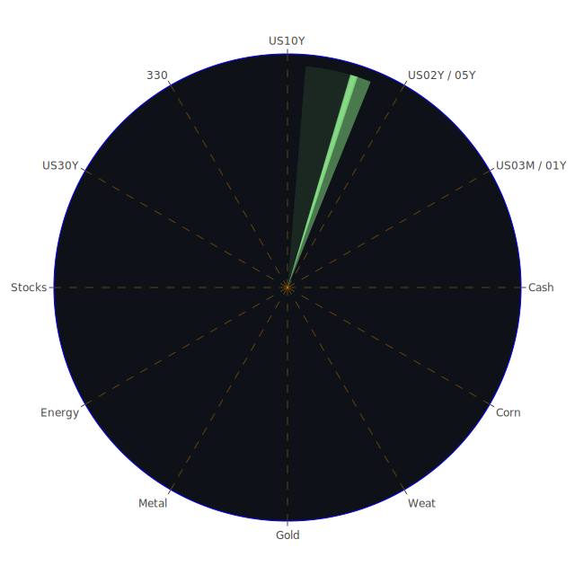

# 投資商品泡沫分析

## 美國國債
過去三天美國國債的泡沫機率變化不大，10年期國債（TVC:US10Y）泡沫機率維持在0.48左右，30年期國債（TVC:US30Y）則在0.25左右。由於目前SOFR（5.33）接近FED Fund Rate（5.33），且美國國債殖利率倒掛，企業融資成本上升，建議投資者保持觀望。

## 美國科技股
納斯達克指數（NASDAQ:NDX）的泡沫機率在過去三天內從0.69上升至0.70，顯示出市場對科技股的信心有所減弱。考慮到近期美國就業數據不佳和市場對經濟衰退的擔憂，建議投資者謹慎行事，避免過度投資科技股。

## 美國房地產指數
房地產ETF（AMEX:VNQ）的泡沫機率在過去三天內維持在0.94左右，顯示出市場對房地產的風險偏好較高。由於目前美國房地產市場的拖欠率上升，建議投資者謹慎行事，避免進一步投資房地產相關資產。

## 金/銀/銅
黃金（OANDA:XAUUSD）的泡沫機率在過去三天內從0.42上升至0.44，顯示出市場對黃金的需求有所增加。銀（OANDA:XAGUSD）的泡沫機率則維持在0.90左右。由於近期市場對經濟不確定性的擔憂增加，建議投資者考慮增加黃金的配置，作為避險資產。

## 加密貨幣
比特幣（BITSTAMP:BTCUSD）的泡沫機率在過去三天內從0.23下降至0.05，顯示出市場對比特幣的需求有所增加。以太坊（BINANCE:ETHUSD）的泡沫機率則維持在0.93左右。由於近期市場對加密貨幣的需求增加，建議投資者考慮分批買入比特幣。

## 黃豆 / 小麥 / 玉米
黃豆（AMEX:SOYB）的泡沫機率在過去三天內從0.50上升至0.60，顯示出市場對農產品的需求有所增加。小麥（AMEX:WEAT）的泡沫機率則維持在0.03左右。由於近期市場對農產品的需求增加，建議投資者考慮分批買入小麥。

## 石油/ 鈾期貨UX!
石油（TVC:USOIL）的泡沫機率在過去三天內維持在0.42左右，顯示出市場對石油的需求穩定。鈾期貨（COMEX:UX1!）的泡沫機率則從0.68下降至0.67。由於近期市場對能源需求的增加，建議投資者考慮增加石油和鈾期貨的配置。

## 各國外匯市場
美元兌日元（OANDA:USDJPY）的泡沫機率在過去三天內從0.78上升至0.77，顯示出市場對美元的需求有所減弱。英鎊兌美元（OANDA:GBPUSD）的泡沫機率則從0.33下降至0.32。由於近期市場對美元的需求減弱，建議投資者考慮減少美元資產的配置。

## 各國大盤指數
法國CAC40指數（FXOPEN:FCHI）的泡沫機率在過去三天內從0.85上升至0.84，顯示出市場對歐洲股市的信心有所減弱。德國DAX指數（SPREADEX:GDAXI）的泡沫機率則從0.90上升至0.92。由於近期市場對歐洲股市的信心減弱，建議投資者謹慎行事。

## 美國銀行股
摩根大通（NYSE:JPM）的泡沫機率在過去三天內維持在0.95左右，顯示出市場對銀行股的風險偏好較高。由於近期市場對銀行股的需求增加，建議投資者考慮增加銀行股的配置。

## 美國軍工股
雷神科技（NYSE:RTX）的泡沫機率在過去三天內維持在0.51左右，顯示出市場對軍工股的需求穩定。由於近期市場對軍工股的需求增加，建議投資者考慮增加軍工股的配置。

## 美國電子支付股
PayPal（NASDAQ:PYPL）的泡沫機率在過去三天內從0.64上升至0.69，顯示出市場對電子支付股的信心有所減弱。由於近期市場對電子支付股的需求減弱，建議投資者謹慎行事。

## 石油防禦股
埃克森美孚（NYSE:XOM）的泡沫機率在過去三天內維持在0.84左右，顯示出市場對石油防禦股的需求穩定。由於近期市場對石油防禦股的需求增加，建議投資者考慮增加石油防禦股的配置。

## 金礦防禦股
Royal Gold（NASDAQ:RGLD）的泡沫機率在過去三天內從0.54上升至0.55，顯示出市場對金礦防禦股的需求有所增加。由於近期市場對金礦防禦股的需求增加，建議投資者考慮增加金礦防禦股的配置。

## 歐洲奢侈品股
LVMH（EURONEXT:MC）的泡沫機率在過去三天內從0.72上升至0.73，顯示出市場對奢侈品股的需求有所減弱。由於近期市場對奢侈品股的需求減弱，建議投資者謹慎行事。

## 歐洲汽車股
BMW（XETR:BMW）的泡沫機率在過去三天內從0.62上升至0.63，顯示出市場對汽車股的需求有所減弱。由於近期市場對汽車股的需求減弱，建議投資者謹慎行事。

# 投資建議
1. **黃金**：由於市場對經濟不確定性的擔憂增加，建議投資者考慮增加黃金的配置，作為避險資產。
2. **比特幣**：由於市場對加密貨幣的需求增加，建議投資者考慮分批買入比特幣。
3. **小麥**：由於市場對農產品的需求增加，建議投資者考慮分批買入小麥。
4. **石油和鈾期貨**：由於市場對能源需求的增加，建議投資者考慮增加石油和鈾期貨的配置。
5. **銀行股**：由於市場對銀行股的需求增加，建議投資者考慮增加銀行股的配置。
6. **軍工股**：由於市場對軍工股的需求增加，建議投資者考慮增加軍工股的配置。

# 風險提示
投資有風險，市場總是充滿不確定性。我們的建議僅供參考，投資者應根據自身的風險承受能力和投資目標，做出獨立的投資決策。特別是對於泡沫機率高的商品，應該謹慎進行投資決策。
 
Daily Buy Map:

 
Daily Sell Map:

 
Daily Radar Chart:

 
