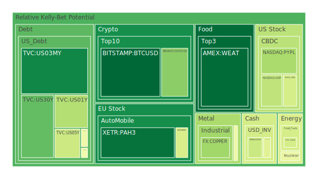
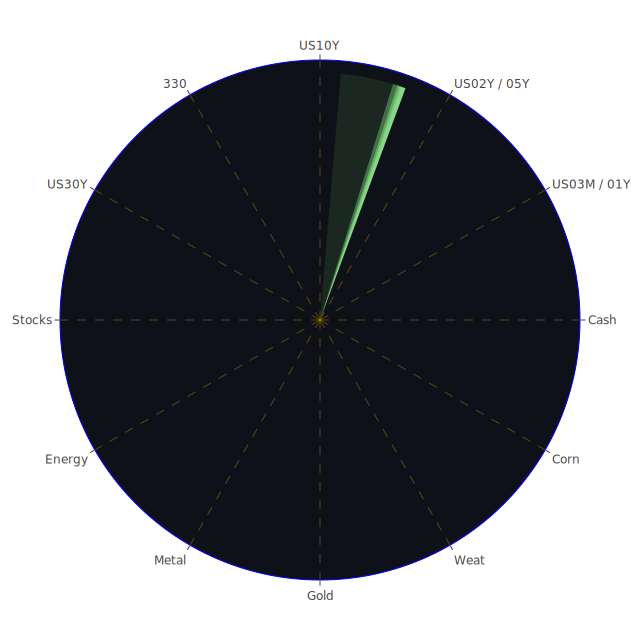

# 投資商品泡沫分析

## 美國國債
過去三天，美國國債的泡沫機率有所下降，特別是30年期國債（TVC:US30Y）從0.250791下降到0.233337。這可能是由於市場對長期經濟前景的擔憂減少，並且投資者轉向更安全的資產。然而，短期國債（TVC:US02Y）的泡沫機率略有上升，這可能反映了市場對短期利率上升的預期。

## 美國科技股
科技股的泡沫機率呈現下降趨勢，特別是PayPal（NASDAQ:PYPL）從0.644548下降到0.337582。這可能是由於市場對科技股的信心增強，特別是在S&P 500和Nasdaq創下新高的背景下。

## 美國房地產指數
房地產指數（AMEX:VNQ）的泡沫機率仍然很高，從0.942800上升到0.945323。這反映了市場對房地產市場的擔憂，特別是在固定抵押貸款利率上升的情況下。

## 金/銀/銅
金價（OANDA:XAUUSD）的泡沫機率有所下降，從0.474960下降到0.441425，這可能是由於市場對黃金的避險需求減少。相反，銀價（OANDA:XAGUSD）的泡沫機率仍然很高，從0.946110上升到0.946110。

## 加密貨幣
比特幣（BITSTAMP:BTCUSD）的泡沫機率大幅下降，從0.166896下降到0.044968，這可能是由於市場對加密貨幣的信心增強。然而，以太坊（BINANCE:ETHUSD）的泡沫機率仍然很高，從0.935245上升到0.641810。

## 黃豆 / 小麥 / 玉米
小麥（AMEX:WEAT）的泡沫機率有所上升，但仍處於較低水平，從0.033619上升到0.052430。玉米（AMEX:CORN）的泡沫機率略有上升，從0.408345上升到0.520077。

## 石油/ 鈾期貨UX!
石油（TVC:USOIL）的泡沫機率保持穩定，約為0.419549。鈾期貨（COMEX:UX1!）的泡沫機率有所下降，從0.684168下降到0.468611。

## 各國外匯市場
英鎊兌美元（OANDA:GBPUSD）的泡沫機率大幅上升，從0.336554上升到0.907829，這可能是由於英國經濟數據不佳以及政治不確定性增加所致。

## 各國大盤指數
德國DAX指數（SPREADEX:GDAXI）的泡沫機率仍然很高，從0.902047上升到0.936239。這可能是由於歐洲經濟的不確定性增加。

## 美國銀行股
摩根大通（NYSE:JPM）的泡沫機率略有下降，從0.958513下降到0.956230。這可能反映了市場對銀行業的信心有所恢復。

## 美國軍工股
雷神技術（NYSE:RTX）的泡沫機率保持穩定，約為0.510860。這可能是由於市場對軍工股的需求穩定。

## 美國電子支付股
PayPal（NASDAQ:PYPL）的泡沫機率大幅下降，從0.644548下降到0.337582。這可能是由於市場對電子支付行業的信心增強。

## 石油防禦股
埃克森美孚（NYSE:XOM）的泡沫機率略有下降，從0.843419下降到0.833452。這可能反映了市場對石油防禦股的需求減少。

## 金礦防禦股
皇家黃金（NASDAQ:RGLD）的泡沫機率略有下降，從0.549645下降到0.507083。這可能是由於市場對金礦防禦股的需求減少。

## 歐洲奢侈品股
愛馬仕（EURONEXT:RMS）的泡沫機率略有下降，從0.954082下降到0.958344。這可能反映了市場對奢侈品股的需求減少。

## 歐洲汽車股
寶馬（XETR:BMW）的泡沫機率略有下降，從0.626816下降到0.421766。這可能是由於市場對汽車行業的信心增強。

# 投資建議

## 買入建議
- **比特幣（BITSTAMP:BTCUSD）**：泡沫機率大幅下降，市場對加密貨幣的信心增強，建議考慮分批買入。
- **PayPal（NASDAQ:PYPL）**：泡沫機率大幅下降，市場對電子支付行業的信心增強，建議考慮分批買入。

## 賣出建議
- **英鎊兌美元（OANDA:GBPUSD）**：泡沫機率大幅上升，英國經濟數據不佳，建議考慮賣出。
- **德國DAX指數（SPREADEX:GDAXI）**：泡沫機率仍然很高，歐洲經濟不確定性增加，建議考慮賣出。

# 風險提示

投資有風險，市場總是充滿不確定性。我們的建議僅供參考，投資者應根據自身的風險承受能力和投資目標，做出獨立的投資決策。

---

# 新聞現況與經濟數據

## SOFR與FED Fund Rate
目前SOFR為5.32，略低於FED Fund Rate的5.33，這意味著美元流動性尚未出現嚴重緊縮，但需密切關注未來的變化。

## 近期新聞
- **負面新聞**：包括英國消費者支出減少、法國選舉結果導致政治僵局、以及熱帶風暴Beryl對德州的影響，這些都可能對市場情緒產生負面影響。
- **正面新聞**：包括巴西Petrobras提高汽油價格、S&P 500和Nasdaq創新高，這些消息可能對市場情緒產生正面影響。

總結來說，投資者應該根據泡沫機率的變化和新聞現況，謹慎做出投資決策，特別是在市場波動較大的時期。
 
Daily Buy Map:

 
Daily Sell Map:

 
Daily Radar Chart:

 
