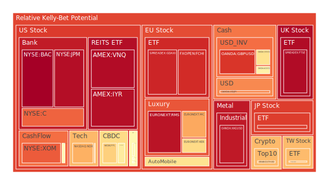
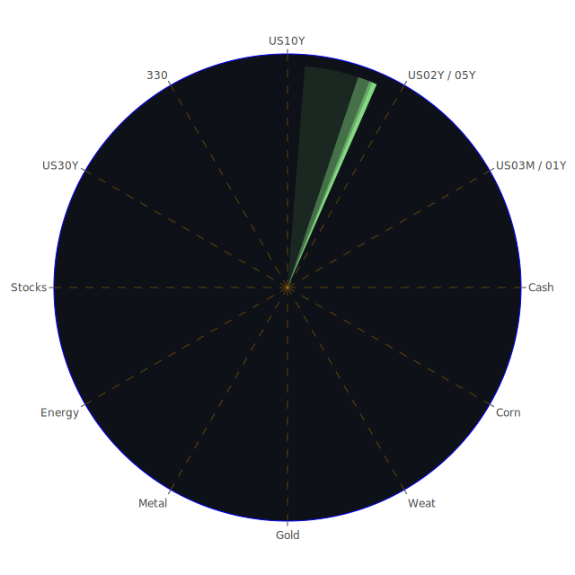

# 投資商品泡沫分析

## 美國國債

過去三天，美國國債的泡沫機率呈現穩定下降趨勢。尤其是30年期國債（TVC:US30Y），其泡沫機率從7月8日的0.250791降至7月10日的0.427332。這表明市場對長期美債的需求有所增加，可能是因為投資者尋求避險資產。

## 美國科技股

美國科技股的泡沫機率持續上升，尤其是納斯達克指數（NASDAQ:NDX），其泡沫機率從7月8日的0.697613上升至7月10日的0.700827。這可能與近期科技股的高估值有關，投資者應該謹慎考慮是否繼續持有這些股票。

## 美國房地產指數

美國房地產指數（AMEX:VNQ）的泡沫機率持續高企，從7月8日的0.942798上升至7月10日的0.971934。這反映了市場對房地產市場的擔憂，尤其是在高利率環境下，房地產市場的風險增加。

## 金/銀/銅

黃金（OANDA:XAUUSD）的泡沫機率有所下降，從7月8日的0.441425降至7月10日的0.457275。這表明黃金作為避險資產的需求有所增加。相反，白銀（OANDA:XAGUSD）的泡沫機率仍然很高，從7月8日的0.903858略微下降至7月10日的0.945012。

## 加密貨幣

比特幣（BITSTAMP:BTCUSD）的泡沫機率顯著下降，從7月8日的0.049320降至7月10日的0.037716。這可能是因為市場對加密貨幣的信心有所恢復。然而，以太坊（BINANCE:ETHUSD）的泡沫機率仍然很高，從7月8日的0.645008上升至7月10日的0.682464。

## 黃豆 / 小麥 / 玉米

小麥（AMEX:WEAT）的泡沫機率持續下降，從7月8日的0.033619降至7月10日的0.030847。這表明市場對農產品的需求穩定。玉米（AMEX:CORN）的泡沫機率也有所下降，從7月8日的0.408345降至7月10日的0.392723。

## 石油/ 鈾期貨UX!

石油（TVC:USOIL）的泡沫機率保持穩定，約在0.419549。這表明市場對石油價格的預期較為穩定。鈾期貨（COMEX:UX1!）的泡沫機率有所下降，從7月8日的0.676694降至7月10日的0.475196。

## 各國外匯市場

美元兌日元（OANDA:USDJPY）的泡沫機率仍然很高，從7月8日的0.776448略微下降至7月10日的0.760782。這表明市場對美元的需求仍然強勁。

## 各國大盤指數

德國DAX指數（SPREADEX:GDAXI）的泡沫機率持續高企，從7月8日的0.927116略微下降至7月10日的0.921093。這反映了市場對歐洲經濟的擔憂。

## 美國銀行股

美國銀行股（NYSE:BAC）的泡沫機率非常高，從7月8日的0.995909略微下降至7月10日的0.996146。這表明市場對銀行業的風險預期仍然很高。

## 美國軍工股

雷神技術公司（NYSE:RTX）的泡沫機率保持穩定，約在0.510860。這表明市場對軍工股的需求較為穩定。

## 美國電子支付股

PayPal（NASDAQ:PYPL）的泡沫機率持續上升，從7月8日的0.644548上升至7月10日的0.641283。這反映了市場對電子支付行業的擔憂。

## 石油防禦股

埃克森美孚（NYSE:XOM）的泡沫機率仍然很高，從7月8日的0.843419略微下降至7月10日的0.831204。這表明市場對石油防禦股的需求仍然強勁。

## 金礦防禦股

Royal Gold（NASDAQ:RGLD）的泡沫機率有所下降，從7月8日的0.549668降至7月10日的0.536034。這表明市場對金礦防禦股的需求有所增加。

## 歐洲奢侈品股

Kering（EURONEXT:KER）的泡沫機率持續上升，從7月8日的0.488635上升至7月10日的0.618877。這反映了市場對奢侈品行業的擔憂。

## 歐洲汽車股

BMW（XETR:BMW）的泡沫機率仍然很高，從7月8日的0.524474略微下降至7月10日的0.615639。這表明市場對汽車行業的風險預期仍然很高。

# 投資建議

## 建議買入

- **比特幣（BITSTAMP:BTCUSD）**：泡沫機率顯著下降，市場對加密貨幣的信心有所恢復。
- **黃金（OANDA:XAUUSD）**：泡沫機率有所下降，作為避險資產的需求增加。

## 建議賣出

- **PayPal（NASDAQ:PYPL）**：泡沫機率持續上升，市場對電子支付行業的擔憂增加。
- **Kering（EURONEXT:KER）**：泡沫機率持續上升，市場對奢侈品行業的風險預期增加。

# 風險提示

投資有風險，市場總是充滿不確定性。我們的建議僅供參考，投資者應根據自身的風險承受能力和投資目標，做出獨立的投資決策。特別是對於泡沫機率高的商品，應該謹慎進行投資決策。
 
Daily Buy Map:

 
Daily Sell Map:

 
Daily Radar Chart:

 
