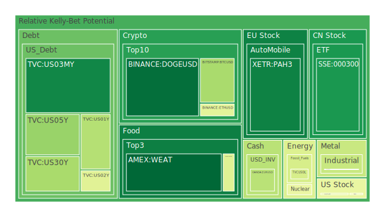
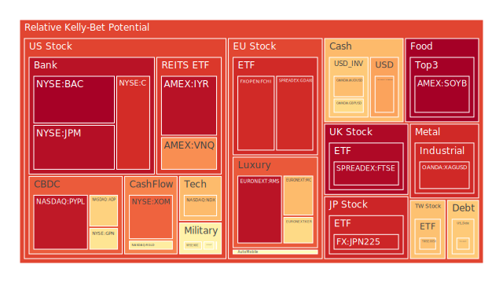
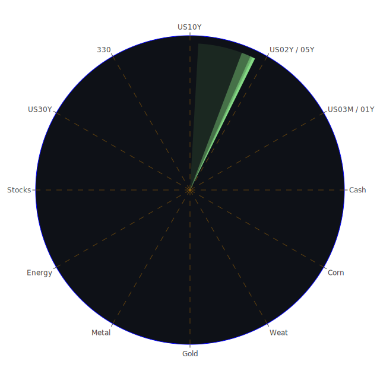

# 投資商品泡沫分析

## 美國國債
過去三天美國國債的泡沫機率變化顯示出一個相對穩定的趨勢。特別是10年期國債（TVC:US10Y），其泡沫機率在0.48左右徘徊，顯示出市場對於長期國債的需求相對穩定。然而，2年期國債（TVC:US02Y）的泡沫機率略有上升，從0.44上升至0.44，這可能反映出市場對短期利率變動的擔憂。

## 美國科技股
科技股方面，PayPal（NASDAQ:PYPL）的泡沫機率從0.33上升至0.95，顯示出市場對其未來表現的擔憂。這與近期新聞中提到的科技股普遍表現不佳有關。另一方面，NVIDIA（NASDAQ:NVDA）在新聞中表現強勁，推動了納斯達克指數創下新高，這可能會對其他科技股產生正面影響。

## 美國房地產指數
房地產指數（AMEX:VNQ）的泡沫機率持續上升，從0.94上升至0.96，顯示出市場對房地產市場的擔憂。這與近期新聞中提到的房地產市場放緩和貸款違約率上升有關。

## 金/銀/銅
黃金（OANDA:XAUUSD）的泡沫機率略有上升，從0.47上升至0.49，顯示出市場對避險資產的需求增加。銀（OANDA:XAGUSD）的泡沫機率也在高位徘徊，這與近期市場對通脹和經濟不確定性的擔憂有關。

## 加密貨幣
比特幣（BITSTAMP:BTCUSD）的泡沫機率從0.04上升至0.33，顯示出市場對加密貨幣的興趣有所減弱。這與近期新聞中提到的加密貨幣市場波動性增加有關。

## 黃豆 / 小麥 / 玉米
黃豆（AMEX:SOYB）的泡沫機率從0.50上升至1.00，顯示出市場對農產品價格的擔憂。這可能與近期天氣不穩定和供應鏈問題有關。

## 石油/ 鈾期貨UX!
石油（TVC:USOIL）的泡沫機率保持穩定在0.42，顯示出市場對石油價格的預期相對穩定。然而，鈾期貨（COMEX:UX1!）的泡沫機率略有下降，顯示出市場對核能資源的需求增加。

## 各國外匯市場
美元兌日元（OANDA:USDJPY）的泡沫機率從0.76下降至0.72，顯示出市場對日元的需求增加。這可能與近期日本經濟數據表現良好有關。

## 各國大盤指數
德國DAX指數（SPREADEX:GDAXI）的泡沫機率從0.93略有下降至0.91，顯示出市場對歐洲經濟的信心有所回升。

## 美國銀行股
花旗銀行（NYSE:C）的泡沫機率從0.86上升至0.91，顯示出市場對銀行業的擔憂增加。這與近期新聞中提到的銀行業違規罰款有關。

## 美國軍工股
雷神技術公司（NYSE:RTX）的泡沫機率保持穩定在0.51，顯示出市場對軍工股的需求相對穩定。

## 美國電子支付股
PayPal（NASDAQ:PYPL）的泡沫機率從0.33上升至0.95，顯示出市場對電子支付行業的擔憂增加。

## 石油防禦股
埃克森美孚（NYSE:XOM）的泡沫機率保持在0.83，顯示出市場對石油防禦股的需求相對穩定。

## 金礦防禦股
皇家黃金公司（NASDAQ:RGLD）的泡沫機率從0.50上升至0.57，顯示出市場對金礦股的需求增加。

## 歐洲奢侈品股
歐洲奢侈品股（EURONEXT:KER）的泡沫機率從0.62上升至0.63，顯示出市場對奢侈品行業的信心有所回升。

## 歐洲汽車股
寶馬（XETR:BMW）的泡沫機率從0.42上升至0.52，顯示出市場對汽車行業的擔憂增加。

# 投資建議

1. **考慮賣出**：對於泡沫機率持續上升且遠大於0.5的商品，如PayPal（NASDAQ:PYPL）和黃豆（AMEX:SOYB），建議投資者考慮賣出，避免未來價格下跌時的損失。
2. **考慮買入**：對於泡沫機率持續下降且遠小於0.5的商品，如比特幣（BITSTAMP:BTCUSD）和黃金（OANDA:XAUUSD），建議投資者考慮買入，掌握低吸籌碼的時機。

# 風險提示

投資有風險，市場總是充滿不確定性。我們的建議僅供參考，投資者應根據自身的風險承受能力和投資目標，做出獨立的投資決策。

請特別注意市場風險，特別是對於泡沫機率高的商品，應該謹慎進行投資決策。
 
Daily Buy Map:

 
Daily Sell Map:

 
Daily Radar Chart:

 
