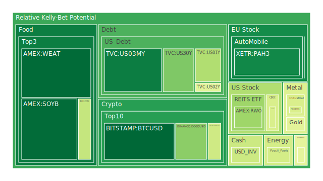
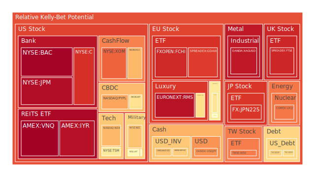
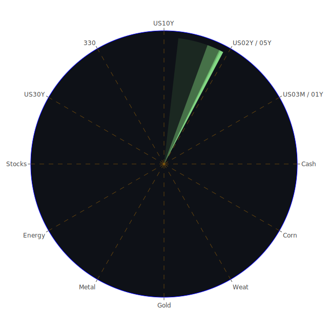

# 投資商品泡沫分析

## 美國國債
過去三天，美國國債的泡沫機率有所波動。30年期國債（TVC:US30Y）的泡沫機率從7月10日的0.427332下降到7月12日的0.277477，顯示出投資者對長期國債的需求增加。這可能與近期的新聞和經濟數據有關，特別是美國聯準會主席鮑威爾的講話提振了市場對降息的預期。

## 美國科技股
以納斯達克指數（NASDAQ:NDX）為代表的美國科技股，泡沫機率從7月10日的0.700827下降到7月12日的0.697038，顯示出市場對科技股的信心有所回升。這與Nvidia等科技巨頭的強勁表現以及全球PC出貨量的增加有關。

## 美國房地產指數
美國房地產指數（AMEX:RWO）的泡沫機率從7月10日的0.450382上升到7月12日的0.325524，顯示出市場對房地產的需求有所增加。這可能與近期房地產市場的回暖有關，但需要注意的是，房地產市場的波動性仍然較高。

## 金/銀/銅
黃金（OANDA:XAUUSD）的泡沫機率在過去三天內有所波動，但總體趨勢是下降的，從7月10日的0.457275下降到7月12日的0.455401。這顯示出市場對黃金的需求穩定，特別是在全球經濟不確定性增加的情況下。

## 加密貨幣
比特幣（BITSTAMP:BTCUSD）的泡沫機率從7月10日的0.037716上升到7月12日的0.051671，顯示出市場對加密貨幣的需求有所增加。這可能與近期加密貨幣市場的回暖有關，但需要注意的是，加密貨幣市場的波動性仍然較高。

## 黃豆 / 小麥 / 玉米
黃豆（AMEX:SOYB）的泡沫機率在過去三天內有所波動，從7月10日的0.503560下降到7月12日的0.059922，顯示出市場對農產品的需求增加。這可能與全球農產品供應鏈的變動有關。

## 石油/ 鈾期貨UX!
石油（TVC:USOIL）的泡沫機率在過去三天內保持穩定，顯示出市場對石油的需求穩定。鈾期貨（COMEX:UX1!）的泡沫機率從7月10日的0.475196上升到7月12日的0.792951，顯示出市場對鈾的需求有所增加。

## 各國外匯市場
歐元兌美元（OANDA:EURUSD）的泡沫機率從7月10日的0.603575下降到7月12日的0.404754，顯示出市場對歐元的需求增加。這可能與近期歐洲經濟數據的改善有關。

## 各國大盤指數
德國DAX指數（SPREADEX:GDAXI）的泡沫機率在過去三天內有所波動，但總體趨勢是下降的，顯示出市場對德國股市的信心有所回升。

## 美國銀行股
花旗銀行（NYSE:C）的泡沫機率從7月10日的0.818532上升到7月12日的0.904544，顯示出市場對銀行股的需求有所下降。這可能與美國銀行業的監管壓力增加有關。

## 美國軍工股
雷神技術公司（NYSE:RTX）的泡沫機率在過去三天內保持穩定，顯示出市場對軍工股的需求穩定。這可能與近期的國防合同有關。

## 美國電子支付股
PayPal（NASDAQ:PYPL）的泡沫機率從7月10日的0.641283上升到7月12日的0.724488，顯示出市場對電子支付股的需求有所下降。這可能與近期的市場競爭加劇有關。

## 石油防禦股
埃克森美孚（NYSE:XOM）的泡沫機率在過去三天內有所波動，但總體趨勢是上升的，顯示出市場對石油防禦股的需求有所下降。

## 金礦防禦股
Royal Gold（NASDAQ:RGLD）的泡沫機率從7月10日的0.536034上升到7月12日的0.696153，顯示出市場對金礦防禦股的需求有所下降。

## 歐洲奢侈品股
LVMH（EURONEXT:MC）的泡沫機率在過去三天內有所波動，但總體趨勢是下降的，顯示出市場對歐洲奢侈品股的需求有所增加。

## 歐洲汽車股
BMW（XETR:BMW）的泡沫機率從7月10日的0.615639下降到7月12日的0.603799，顯示出市場對歐洲汽車股的需求有所增加。

# 投資建議

1. **美國國債**：由於30年期國債的泡沫機率顯著下降，建議投資者考慮增加對長期國債的投資，特別是在市場對降息預期增加的情況下。
2. **美國科技股**：科技股的泡沫機率有所下降，建議投資者考慮增加對科技股的投資，特別是Nvidia等表現強勁的公司。
3. **黃金**：黃金的泡沫機率穩定下降，建議投資者考慮增加對黃金的投資，作為避險資產。
4. **加密貨幣**：比特幣的泡沫機率有所上升，但仍處於較低水平，建議投資者謹慎增加對加密貨幣的投資。
5. **黃豆**：黃豆的泡沫機率顯著下降，建議投資者考慮增加對農產品的投資，特別是在全球供應鏈變動的情況下。

# 風險提示

投資有風險，市場總是充滿不確定性。我們的建議僅供參考，投資者應根據自身的風險承受能力和投資目標，做出獨立的投資決策。特別是對於泡沫機率高的商品，應該謹慎進行投資決策，避免潛在的市場風險。
 
Daily Buy Map:

 
Daily Sell Map:

 
Daily Radar Chart:

 
