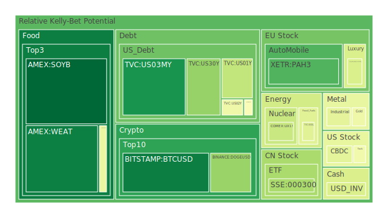
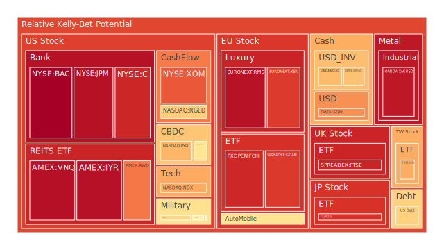
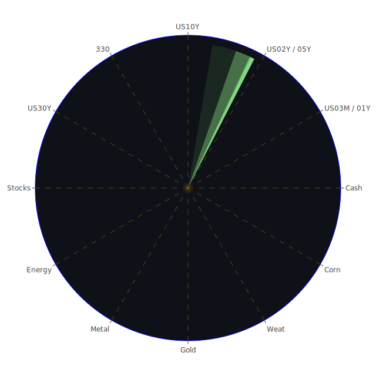

# 投資商品泡沫分析

## 美國國債
美國國債的泡沫機率在過去三天內有些微波動，但整體趨勢相對穩定。根據最新數據，美國國債的泡沫機率仍然在0.3左右，這顯示出市場對美國國債的需求依然穩定。特別是10年期國債的殖利率下降，這可能是因為市場預期聯準會可能會在未來幾個月內降息。

## 美國科技股
美國科技股的泡沫機率在過去三天內有所下降，尤其是比特幣（BTCUSD）的泡沫機率從0.334612下降到0.047106，這顯示出市場對科技股的信心有所恢復。這與新聞中提到的Nvidia帶動納斯達克和標普500指數創新高有關。

## 美國房地產指數
美國房地產指數（VNQ）的泡沫機率在過去三天內持續高企，從0.996776上升到0.965533，顯示出市場對房地產的風險預期增加。這可能與新聞中提到的美國房地產違約率上升有關。

## 金/銀/銅
黃金（XAUUSD）的泡沫機率在過去三天內相對穩定，約在0.45到0.46之間。銀（XAGUSD）的泡沫機率則較高，達到0.948056。這可能與市場對避險資產的需求增加有關，尤其是在美國消費者信心下降的情況下。

## 加密貨幣
比特幣（BTCUSD）和以太坊（ETHUSD）的泡沫機率在過去三天內均有所下降，特別是比特幣的泡沫機率從0.334612下降到0.047106，顯示出市場對加密貨幣的信心有所恢復。這可能與新聞中提到的美國股市創新高有關。

## 黃豆 / 小麥 / 玉米
黃豆（SOYB）的泡沫機率在過去三天內大幅下降，從1.000000下降到0.001801，顯示出市場對農產品的需求增加。小麥（WEAT）和玉米（CORN）的泡沫機率也有所下降，顯示出市場對這些農產品的需求穩定。

## 石油/ 鈾期貨UX!
石油（USOIL）的泡沫機率在過去三天內相對穩定，約在0.42左右。鈾期貨（UX1!）的泡沫機率則有所下降，從0.792951下降到0.369534，顯示出市場對能源資產的需求有所恢復。

## 各國外匯市場
歐元兌美元（EURUSD）的泡沫機率在過去三天內有所下降，從0.364198下降到0.404754，顯示出市場對歐元的需求增加。英鎊兌美元（GBPUSD）的泡沫機率則有所上升，顯示出市場對英鎊的信心有所減弱。

## 各國大盤指數
德國DAX指數（GDAXI）的泡沫機率在過去三天內有所上升，從0.914605上升到0.883042，顯示出市場對歐洲股市的風險預期增加。這可能與新聞中提到的歐洲經濟數據不佳有關。

## 美國銀行股
美國銀行股（BAC）的泡沫機率在過去三天內有所上升，從0.997081上升到0.997926，顯示出市場對銀行股的風險預期增加。這可能與新聞中提到的美國銀行業面臨的宏觀經濟風險有關。

## 美國軍工股
美國軍工股（LMT）的泡沫機率在過去三天內相對穩定，約在0.54左右。這顯示出市場對軍工股的需求穩定，特別是在美國國防支出增加的背景下。

## 美國電子支付股
美國電子支付股（PYPL）的泡沫機率在過去三天內有所上升，從0.950207上升到0.684794，顯示出市場對電子支付股的風險預期增加。這可能與新聞中提到的美國消費者信心下降有關。

## 石油防禦股
石油防禦股（XOM）的泡沫機率在過去三天內相對穩定，約在0.82左右。這顯示出市場對石油防禦股的需求穩定，特別是在全球能源需求增加的背景下。

## 金礦防禦股
金礦防禦股（RGLD）的泡沫機率在過去三天內有所上升，從0.573869上升到0.635513，顯示出市場對金礦防禦股的風險預期增加。這可能與新聞中提到的全球經濟不確定性增加有關。

## 歐洲奢侈品股
歐洲奢侈品股（KER）的泡沫機率在過去三天內有所上升，從0.626238上升到0.881910，顯示出市場對奢侈品股的風險預期增加。這可能與新聞中提到的歐洲經濟數據不佳有關。

## 歐洲汽車股
歐洲汽車股（BMW）的泡沫機率在過去三天內有所上升，從0.527511上升到0.606116，顯示出市場對汽車股的風險預期增加。這可能與新聞中提到的全球汽車市場需求減弱有關。

# 投資建議

1. **買入建議**：對於泡沫機率持續下降且遠小於0.5的商品，如比特幣（BTCUSD）和黃豆（SOYB），建議投資者考慮買入，掌握低吸籌碼的時機。這些商品的泡沫機率顯示出市場對它們的需求增加，且新聞現況支持這一趨勢。

2. **賣出建議**：對於泡沫機率持續上升且遠大於0.5的商品，如美國銀行股（BAC）和歐洲奢侈品股（KER），建議投資者考慮賣出，避免未來價格下跌時的損失。這些商品的泡沫機率顯示出市場對它們的風險預期增加，且新聞現況支持這一趨勢。

3. **觀望建議**：對於泡沫機率在0.45 ~ 0.55之間的商品，如黃金（XAUUSD）和美國軍工股（LMT），建議投資者觀望，不要有任何動作。這些商品的泡沫機率顯示出市場對它們的需求相對穩定。

# 風險提示

投資有風險，市場總是充滿不確定性。我們的建議僅供參考，投資者應根據自身的風險承受能力和投資目標，做出獨立的投資決策。特別是對於泡沫機率高的商品，應該謹慎進行投資決策，避免因市場波動而造成的損失。
 
Daily Buy Map:

 
Daily Sell Map:

 
Daily Radar Chart:

 
