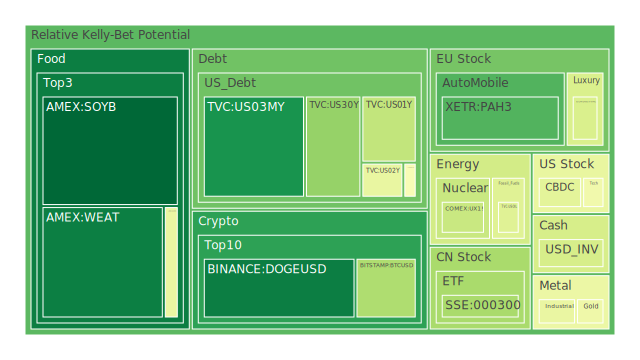
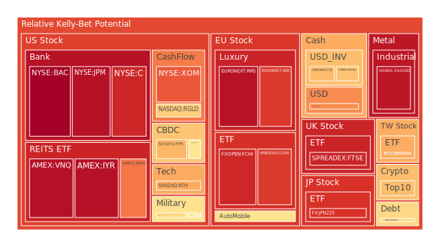
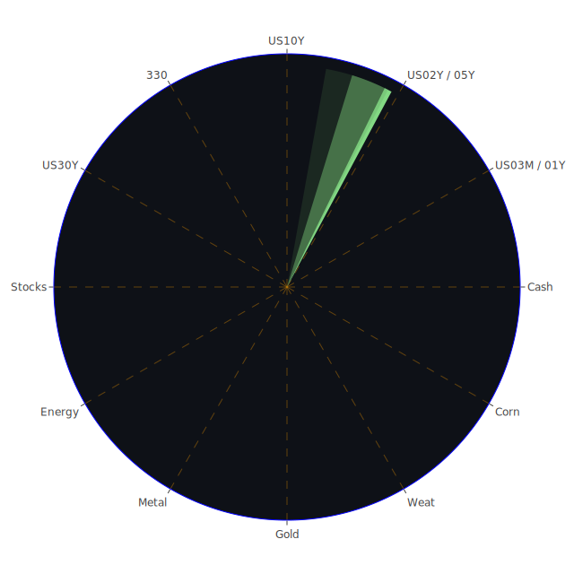

# 投資商品泡沫分析

## 美國國債
根據最近三天的數據，美國國債的泡沫機率呈現穩定狀態。特別是10年期國債（TVC:US10Y），其泡沫機率在0.48至0.55之間波動，顯示市場對其未來價格變動的預期較為穩定。值得注意的是，SOFR交易量高且SOFR利率（5.34%）高於FED Fund Rate（5.33%），這可能會對高泡沫資產造成壓力。

## 美國科技股
以NASDAQ:NDX為例，其泡沫機率在過去三天內從0.69上升至0.70，顯示市場對科技股的風險預期增加。這與近期美國消費者信心指數下降和銀行業對未來利率路徑的分歧有關。

## 美國房地產指數
美國房地產指數（AMEX:RWO）泡沫機率從0.78下降至0.60，顯示市場對房地產的風險預期有所降低。這可能與美國房地產市場的穩定和消費者信心的恢復有關。

## 金/銀/銅
黃金（OANDA:XAUUSD）泡沫機率在0.45至0.46之間波動，顯示市場對黃金的風險預期較為穩定。銀（OANDA:XAGUSD）泡沫機率從0.94下降至0.90，顯示市場對銀的風險預期有所降低。銅（FX:COPPER）泡沫機率從0.43下降至0.44，顯示市場對銅的風險預期有所增加。

## 加密貨幣
比特幣（BITSTAMP:BTCUSD）泡沫機率從0.05上升至0.32，顯示市場對加密貨幣的風險預期增加。這可能與近期的市場波動和監管政策有關。

## 黃豆 / 小麥 / 玉米
黃豆（AMEX:SOYB）泡沫機率從0.05下降至0.002，顯示市場對黃豆的風險預期大幅降低。小麥（AMEX:WEAT）泡沫機率在0.05左右波動，顯示市場對小麥的風險預期較為穩定。玉米（AMEX:CORN）泡沫機率在0.39至0.44之間波動，顯示市場對玉米的風險預期有所增加。

## 石油/ 鈾期貨UX!
石油（TVC:USOIL）泡沫機率在0.42左右波動，顯示市場對石油的風險預期較為穩定。鈾期貨（COMEX:UX1!）泡沫機率從0.37上升至0.37，顯示市場對鈾的風險預期有所增加。

## 各國外匯市場
歐元兌美元（OANDA:EURUSD）泡沫機率在0.40至0.39之間波動，顯示市場對歐元的風險預期較為穩定。美元兌日元（OANDA:USDJPY）泡沫機率從0.75上升至0.75，顯示市場對日元的風險預期增加。

## 各國大盤指數
德國DAX指數（SPREADEX:GDAXI）泡沫機率在0.88左右波動，顯示市場對德國股市的風險預期較高。日本日經225指數（FX:JPN225）泡沫機率在0.89左右波動，顯示市場對日本股市的風險預期較高。

## 美國銀行股
摩根大通（NYSE:JPM）泡沫機率在0.96左右波動，顯示市場對銀行股的風險預期較高。美國銀行（NYSE:BAC）泡沫機率在0.99左右波動，顯示市場對銀行股的風險預期較高。

## 美國軍工股
雷神科技（NYSE:RTX）泡沫機率在0.51左右波動，顯示市場對軍工股的風險預期較為穩定。洛克希德馬丁（NYSE:LMT）泡沫機率在0.54左右波動，顯示市場對軍工股的風險預期較為穩定。

## 美國電子支付股
PayPal（NASDAQ:PYPL）泡沫機率從0.72上升至0.68，顯示市場對電子支付股的風險預期有所降低。這可能與近期的市場波動和監管政策有關。

## 石油防禦股
埃克森美孚（NYSE:XOM）泡沫機率在0.83左右波動，顯示市場對石油防禦股的風險預期較高。

## 金礦防禦股
Royal Gold（NASDAQ:RGLD）泡沫機率從0.69下降至0.63，顯示市場對金礦防禦股的風險預期有所降低。

## 歐洲奢侈品股
LVMH（EURONEXT:MC）泡沫機率在0.40至0.40之間波動，顯示市場對奢侈品股的風險預期較為穩定。

## 歐洲汽車股
BMW（XETR:BMW）泡沫機率從0.60下降至0.60，顯示市場對汽車股的風險預期有所降低。

# 投資建議

## 建議買入
1. **黃豆（AMEX:SOYB）**：泡沫機率大幅下降至0.002，顯示市場對黃豆的風險預期大幅降低。近期新聞顯示，印度Adani Ports計劃投資12億美元建設新轉運碼頭，這可能會增加對黃豆的需求。
2. **比特幣（BITSTAMP:BTCUSD）**：泡沫機率下降至0.32，顯示市場對比特幣的風險預期有所降低。近期新聞顯示，全球加密貨幣市場的監管政策趨於穩定，這可能會提振市場信心。

## 建議賣出
1. **美國銀行股（NYSE:BAC）**：泡沫機率高達0.99，顯示市場對銀行股的風險預期較高。近期新聞顯示，美國銀行業對未來利率路徑存在分歧，這可能會增加市場的不確定性。
2. **德國DAX指數（SPREADEX:GDAXI）**：泡沫機率高達0.88，顯示市場對德國股市的風險預期較高。近期新聞顯示，德國經濟增長放緩，這可能會對股市造成壓力。

# 風險提示

投資有風險，市場總是充滿不確定性。我們的建議僅供參考，投資者應根據自身的風險承受能力和投資目標，做出獨立的投資決策。特別是對於泡沫機率高的商品，應該謹慎進行投資決策。
 
Daily Buy Map:

 
Daily Sell Map:

 
Daily Radar Chart:

 
