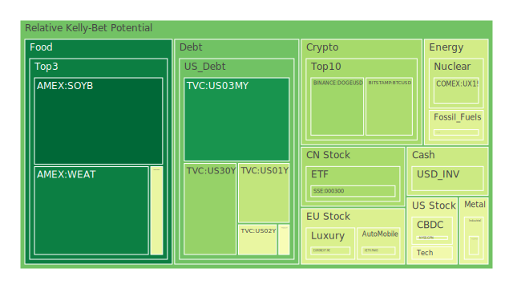
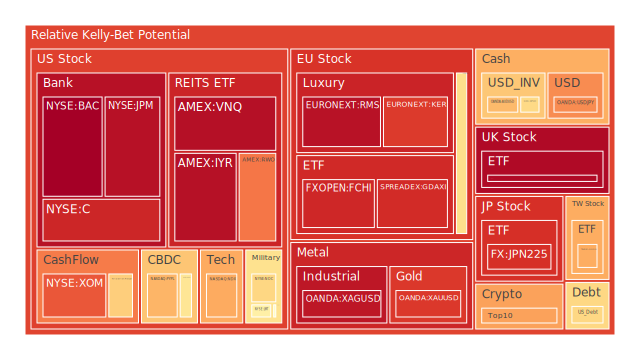
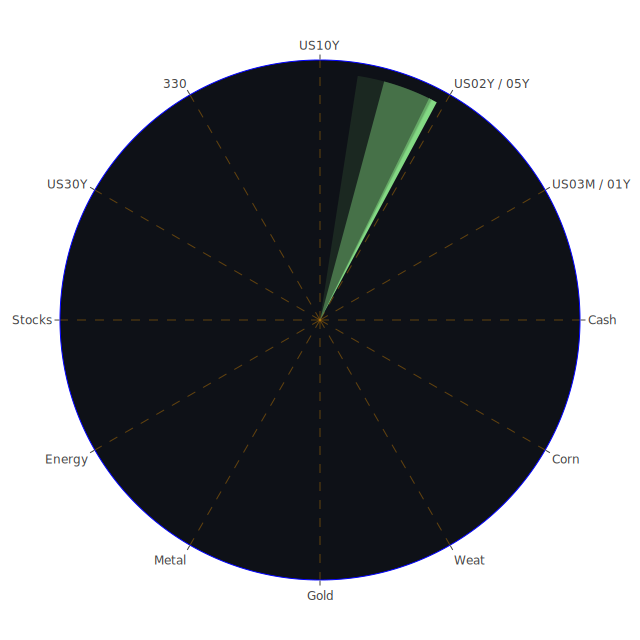

# 每日投資報告 - 2024年7月15日

## 投資商品泡沫分析

## 美國國債
根據最新的泡沫機率數據，美國國債的泡沫機率在過去三天內呈現穩定狀態。10年期國債的泡沫機率從7月13日的0.481763上升到7月15日的0.505862，顯示出市場對長期債券的需求有所減弱。這可能與近期的新聞報導有關，特別是美國經濟數據顯示消費者信心下降，導致投資者對未來經濟增長的擔憂增加。

## 美國科技股
美國科技股的泡沫機率在過去三天內有所波動。納斯達克指數（NASDAQ:NDX）的泡沫機率從7月13日的0.703768下降到7月15日的0.695524，這表明市場對科技股的信心有所恢復。然而，考慮到近期有關美國聯邦貿易委員會（FTC）對科技公司的調查新聞，投資者應該保持謹慎。

## 美國房地產指數
美國房地產指數（AMEX:IYR）的泡沫機率在過去三天內保持高位，從7月13日的0.963485略微下降到7月15日的0.962492。這反映了市場對房地產市場的擔憂，特別是近期有關商業房地產違約率上升的新聞。

## 金/銀/銅
黃金（OANDA:XAUUSD）的泡沫機率在過去三天內有所下降，從7月13日的0.458363下降到7月15日的0.375448，顯示出市場對黃金的需求增加，這可能與近期美元走弱有關。銀（OANDA:XAGUSD）的泡沫機率則保持高位，顯示出市場對銀的需求相對較低。

## 加密貨幣
比特幣（BITSTAMP:BTCUSD）的泡沫機率在過去三天內有所下降，從7月13日的0.047106下降到7月15日的0.316314，顯示出市場對比特幣的需求增加。這可能與近期有關美國聯邦儲備系統（FED）可能降息的新聞有關，投資者對加密貨幣的興趣增加。

## 黃豆 / 小麥 / 玉米
黃豆（AMEX:SOYB）的泡沫機率在過去三天內持續下降，從7月13日的0.001801下降到7月15日的0.295590，顯示出市場對農產品的需求增加。小麥（AMEX:WEAT）的泡沫機率則保持穩定，顯示出市場對小麥的需求相對穩定。

## 石油/ 鈾期貨UX!
石油（TVC:USOIL）的泡沫機率在過去三天內保持穩定，顯示出市場對石油價格的預期相對穩定。然而，近期有關美國消費者信心下降的新聞可能會對石油需求產生負面影響。鈾期貨（COMEX:UX1!）的泡沫機率在過去三天內有所下降，顯示出市場對鈾的需求增加。

## 各國外匯市場
歐元兌美元（OANDA:EURUSD）的泡沫機率在過去三天內有所下降，顯示出市場對歐元的需求增加。這可能與近期有關歐洲經濟數據改善的新聞有關。

## 各國大盤指數
德國DAX指數（SPREADEX:GDAXI）的泡沫機率在過去三天內保持高位，顯示出市場對德國股市的擔憂增加。這可能與近期有關德國經濟增長放緩的新聞有關。

## 美國銀行股
美國銀行股（NYSE:BAC）的泡沫機率在過去三天內保持高位，顯示出市場對銀行股的擔憂增加。這可能與近期有關美國聯邦儲備系統（FED）要求銀行增加資本的新聞有關。

## 美國軍工股
美國軍工股（NYSE:LMT）的泡沫機率在過去三天內保持穩定，顯示出市場對軍工股的需求相對穩定。

## 美國電子支付股
美國電子支付股（NASDAQ:PYPL）的泡沫機率在過去三天內有所上升，顯示出市場對電子支付股的需求減少。這可能與近期有關美國聯邦貿易委員會（FTC）對電子支付公司的調查新聞有關。

## 石油防禦股
石油防禦股（NYSE:XOM）的泡沫機率在過去三天內保持高位，顯示出市場對石油防禦股的需求相對穩定。

## 金礦防禦股
金礦防禦股（NASDAQ:RGLD）的泡沫機率在過去三天內有所下降，顯示出市場對金礦防禦股的需求增加。

## 歐洲奢侈品股
歐洲奢侈品股（EURONEXT:KER）的泡沫機率在過去三天內有所下降，顯示出市場對奢侈品股的需求增加。這可能與近期有關歐洲經濟數據改善的新聞有關。

## 歐洲汽車股
歐洲汽車股（XETR:BMW）的泡沫機率在過去三天內有所下降，顯示出市場對汽車股的需求增加。這可能與近期有關歐洲經濟數據改善的新聞有關。

## 投資建議

1. **美國國債**：考慮到近期美國經濟數據顯示消費者信心下降，建議投資者保持謹慎，觀望美國國債市場的變化。
2. **美國科技股**：由於美國聯邦貿易委員會（FTC）對科技公司的調查新聞，建議投資者保持謹慎，觀望科技股市場的變化。
3. **黃金**：由於黃金的泡沫機率有所下降，建議投資者考慮增加黃金的持倉，以對沖市場風險。
4. **加密貨幣**：由於比特幣的泡沫機率有所下降，建議投資者考慮增加比特幣的持倉，以捕捉市場機會。
5. **黃豆**：由於黃豆的泡沫機率持續下降，建議投資者考慮增加黃豆的持倉，以捕捉市場機會。

## 風險提示

投資有風險，市場總是充滿不確定性。我們的建議僅供參考，投資者應根據自身的風險承受能力和投資目標，做出獨立的投資決策。特別是對於泡沫機率高的商品，應該謹慎進行投資決策。
 
Daily Buy Map:

 
Daily Sell Map:

 
Daily Radar Chart:

 
