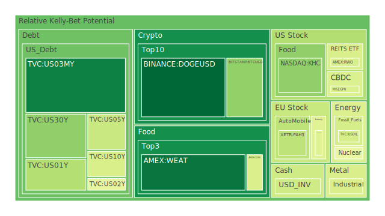
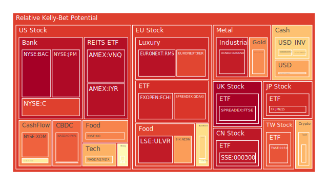
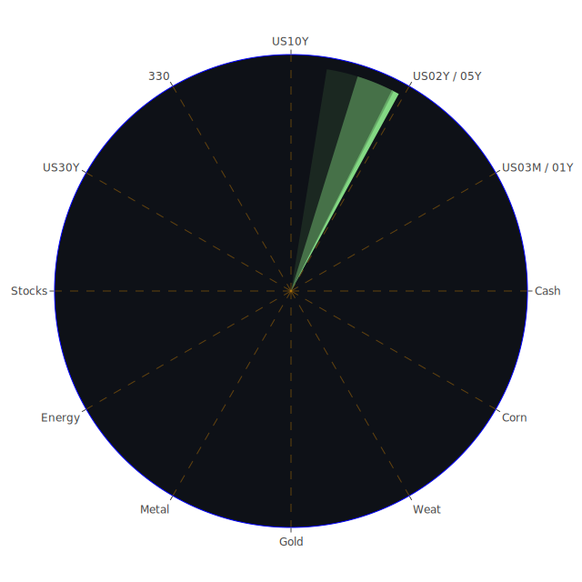

# 投資商品泡沫分析

## 美國國債
過去三天，美國國債的泡沫機率變化不大，10年期國債（TVC:US10Y）泡沫機率在0.422至0.481之間波動，30年期國債（TVC:US30Y）則在0.275至0.299之間。根據FED的數據，SOFR為5.34，略高於FED Fund Rate的5.33，顯示美元流動性吃緊，這可能會導致高泡沫資產被拋售以換取美元。建議投資者對於高泡沫機率的資產保持謹慎。

## 美國科技股
美國科技股的泡沫機率整體上升，特別是納斯達克指數（NASDAQ:NDX）從0.703上升至0.702。新聞顯示，市場對於特朗普勝選的預期增加，這可能會帶來更寬鬆的監管環境，對科技股有利。然而，泡沫機率仍然較高，建議投資者謹慎操作。

## 美國房地產指數
美國房地產指數（AMEX:RWO）的泡沫機率從0.785下降至0.425，顯示出一定的投資機會。根據新聞，房地產市場的違約率上升，這可能會對房地產市場造成壓力，但短期內可能是低吸籌碼的好時機。

## 金/銀/銅
黃金（OANDA:XAUUSD）的泡沫機率從0.885下降至0.758，顯示出一定的投資機會。根據新聞，市場對於特朗普勝選的預期增加，這可能會帶來更高的避險需求，對黃金有利。銀（OANDA:XAGUSD）和銅（FX:COPPER）的泡沫機率也有所下降，建議投資者可以考慮分批買入。

## 加密貨幣
比特幣（BITSTAMP:BTCUSD）的泡沫機率從0.319下降至0.299，顯示出一定的投資機會。根據新聞，市場對於特朗普勝選的預期增加，這可能會帶來更高的避險需求，對加密貨幣有利。狗狗幣（BINANCE:DOGEUSD）的泡沫機率也有所下降，建議投資者可以考慮分批買入。

## 黃豆 / 小麥 / 玉米
黃豆（AMEX:SOYB）的泡沫機率從0.001上升至0.502，小麥（AMEX:WEAT）的泡沫機率從0.048上升至0.073，玉米（AMEX:CORN）的泡沫機率則維持在0.429左右。根據新聞，全球經濟的不確定性增加，這可能會對農產品市場造成壓力，建議投資者謹慎操作。

## 石油/ 鈾期貨UX!
石油（TVC:USOIL）的泡沫機率維持在0.419左右，鈾期貨（COMEX:UX1!）的泡沫機率從0.369上升至0.465。根據新聞，全球經濟的不確定性增加，這可能會對能源市場造成壓力，建議投資者謹慎操作。

## 各國外匯市場
歐元兌美元（OANDA:EURUSD）的泡沫機率從0.395下降至0.406，英鎊兌美元（OANDA:GBPUSD）的泡沫機率從0.656下降至0.634。根據新聞，全球經濟的不確定性增加，這可能會對外匯市場造成壓力，建議投資者謹慎操作。

## 各國大盤指數
德國DAX指數（SPREADEX:GDAXI）的泡沫機率從0.883上升至0.889，法國CAC指數（FXOPEN:FCHI）的泡沫機率從0.916上升至0.921。根據新聞，全球經濟的不確定性增加，這可能會對大盤指數造成壓力，建議投資者謹慎操作。

## 美國銀行股
美國銀行股（NYSE:BAC）的泡沫機率從0.997下降至0.993，摩根大通（NYSE:JPM）的泡沫機率從0.962上升至0.973。根據新聞，市場對於特朗普勝選的預期增加，這可能會帶來更寬鬆的監管環境，對銀行股有利。然而，泡沫機率仍然較高，建議投資者謹慎操作。

## 美國軍工股
雷神公司（NYSE:RTX）的泡沫機率維持在0.510左右，洛克希德馬丁（NYSE:LMT）的泡沫機率從0.546下降至0.546。根據新聞，全球地緣政治的不確定性增加，這可能會對軍工股有利，建議投資者可以考慮分批買入。

## 美國電子支付股
PayPal（NASDAQ:PYPL）的泡沫機率從0.684上升至0.829。根據新聞，市場對於特朗普勝選的預期增加，這可能會帶來更寬鬆的監管環境，對電子支付股有利。然而，泡沫機率仍然較高，建議投資者謹慎操作。

## 石油防禦股
埃克森美孚（NYSE:XOM）的泡沫機率從0.834下降至0.819。根據新聞，全球經濟的不確定性增加，這可能會對能源市場造成壓力，建議投資者謹慎操作。

## 金礦防禦股
Royal Gold（NASDAQ:RGLD）的泡沫機率從0.635下降至0.574。根據新聞，市場對於特朗普勝選的預期增加，這可能會帶來更高的避險需求，對金礦股有利，建議投資者可以考慮分批買入。

## 歐洲奢侈品股
LVMH（EURONEXT:MC）的泡沫機率從0.403上升至0.443。根據新聞，全球經濟的不確定性增加，這可能會對奢侈品市場造成壓力，建議投資者謹慎操作。

## 歐洲汽車股
寶馬（XETR:BMW）的泡沫機率從0.606下降至0.632。根據新聞，全球經濟的不確定性增加，這可能會對汽車市場造成壓力，建議投資者謹慎操作。

## 歐美食品股
雀巢（SIX:NESN）的泡沫機率從0.733上升至0.733。根據新聞，全球經濟的不確定性增加，這可能會對食品市場造成壓力，建議投資者謹慎操作。

# 投資建議
1. **低吸籌碼**：對於泡沫機率持續下降且遠小於0.5的商品，如黃金、比特幣和房地產指數，建議投資者可以考慮分批買入。
2. **謹慎操作**：對於泡沫機率持續上升且遠大於0.5的商品，如美國科技股、電子支付股和歐洲奢侈品股，建議投資者謹慎操作，避免未來價格下跌時的損失。

# 風險提示
投資有風險，市場總是充滿不確定性。我們的建議僅供參考，投資者應根據自身的風險承受能力和投資目標，做出獨立的投資決策。請特別注意市場風險，特別是對於泡沫機率高的商品，應該謹慎進行投資決策。
 
Daily Buy Map:

 
Daily Sell Map:

 
Daily Radar Chart:

 
