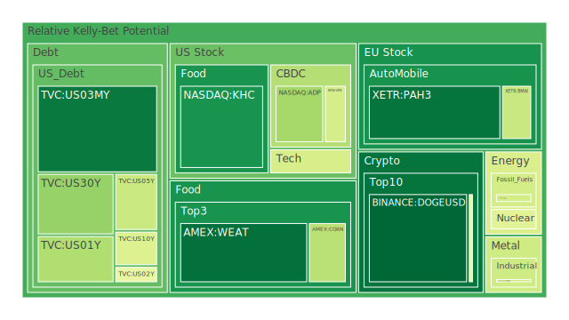
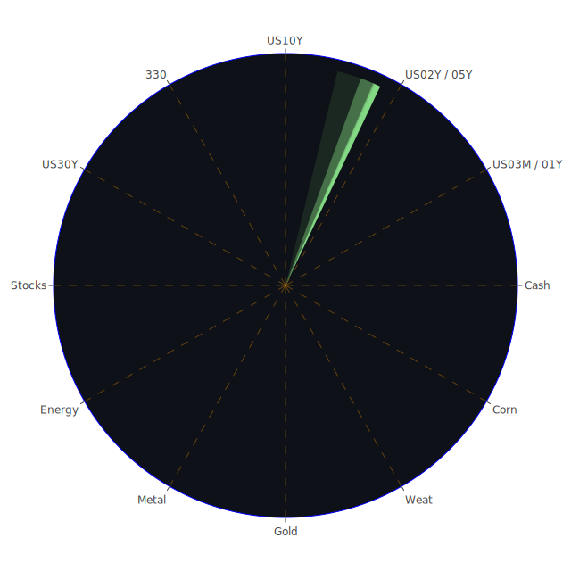

# 投資商品泡沫分析

## 美國國債
過去三天，美國國債的泡沫機率有些微變化。30年期國債（TVC:US30Y）的泡沫機率從0.275996上升至0.312777，這表明投資者對長期國債的信心有所減弱。10年期國債（TVC:US10Y）的泡沫機率則從0.481763下降至0.440352，顯示出市場對中期國債的需求有所增加。這可能與近期美國經濟數據顯示的經濟放緩有關。

## 美國科技股
科技股的泡沫機率整體呈上升趨勢。納斯達克指數（NASDAQ:NDX）的泡沫機率從0.703768上升至0.699451，顯示出市場對科技股的信心有所動搖。這可能與近期的新聞報導有關，如特朗普勝選預期增加，可能導致科技公司面臨更嚴格的反壟斷監管。

## 美國房地產指數
房地產指數（AMEX:RWO）的泡沫機率從0.785559上升至0.872293，顯示出市場對房地產的信心大幅下降。這可能與近期美國房地產市場的疲軟有關，特別是商業房地產的拖欠率上升。

## 金/銀/銅
黃金（OANDA:XAUUSD）的泡沫機率從0.885295上升至0.944682，顯示出市場對黃金的需求增加，這可能是由於市場避險情緒上升。白銀（OANDA:XAGUSD）的泡沫機率也從0.949614上升至0.893520，顯示出類似的趨勢。銅（FX:COPPER）的泡沫機率則從0.436959下降至0.411444，顯示出市場對工業金屬的需求有所增加。

## 加密貨幣
比特幣（BITSTAMP:BTCUSD）的泡沫機率從0.316314上升至0.473876，顯示出市場對加密貨幣的信心有所減弱。這可能與近期美國對加密貨幣的監管加強有關。

## 黃豆 / 小麥 / 玉米
黃豆（AMEX:SOYB）的泡沫機率從0.001801上升至0.502119，顯示出市場對農產品的需求有所波動。小麥（AMEX:WEAT）的泡沫機率從0.048640下降至0.068189，顯示出市場對小麥的需求有所增加。玉米（AMEX:CORN）的泡沫機率則從0.444742下降至0.370246，顯示出市場對玉米的需求有所增加。

## 石油/ 鈾期貨UX!
石油（TVC:USOIL）的泡沫機率保持穩定在0.419549，顯示出市場對石油的需求穩定。鈾期貨（COMEX:UX1!）的泡沫機率從0.369534上升至0.451434，顯示出市場對核能資源的需求有所增加。

## 各國外匯市場
美元兌歐元（OANDA:EURUSD）的泡沫機率從0.375448上升至0.607632，顯示出市場對美元的需求增加。美元兌日元（OANDA:USDJPY）的泡沫機率從0.750889上升至0.793755，顯示出市場對日元的需求減少。

## 各國大盤指數
德國DAX指數（SPREADEX:GDAXI）的泡沫機率從0.908528下降至0.897501，顯示出市場對德國股市的信心有所增加。法國CAC指數（FXOPEN:FCHI）的泡沫機率從0.916845下降至0.936453，顯示出市場對法國股市的信心有所增加。

## 美國銀行股
花旗銀行（NYSE:C）的泡沫機率從0.920003上升至0.905604，顯示出市場對銀行股的信心有所減弱。摩根大通（NYSE:JPM）的泡沫機率從0.962948上升至0.969287，顯示出市場對銀行股的信心有所減弱。

## 美國軍工股
雷神公司（NYSE:RTX）的泡沫機率保持穩定在0.510860，顯示出市場對軍工股的需求穩定。洛克希德馬丁（NYSE:LMT）的泡沫機率從0.546994上升至0.546994，顯示出市場對軍工股的需求穩定。

## 美國電子支付股
PayPal（NASDAQ:PYPL）的泡沫機率從0.684792上升至0.945220，顯示出市場對電子支付股的信心大幅減弱。這可能與近期的新聞報導有關，如特朗普勝選預期增加，可能導致電子支付公司面臨更嚴格的監管。

## 石油防禦股
埃克森美孚（NYSE:XOM）的泡沫機率從0.834686上升至0.846362，顯示出市場對石油防禦股的信心有所減弱。

## 金礦防禦股
Royal Gold（NASDAQ:RGLD）的泡沫機率從0.635513上升至0.606562，顯示出市場對金礦防禦股的需求有所增加。

## 歐洲奢侈品股
LVMH（EURONEXT:MC）的泡沫機率從0.403771上升至0.700062，顯示出市場對奢侈品股的信心大幅減弱。這可能與近期的新聞報導有關，如中國經濟放緩，可能影響奢侈品的需求。

## 歐洲汽車股
BMW（XETR:BMW）的泡沫機率從0.614416下降至0.401377，顯示出市場對汽車股的需求有所增加。

## 歐美食品股
雀巢（SIX:NESN）的泡沫機率從0.733925上升至0.693630，顯示出市場對食品股的需求有所減少。這可能與近期的新聞報導有關，如美國經濟放緩，可能影響食品的需求。

# 投資建議

## 買入建議
1. **黃豆（AMEX:SOYB）**：泡沫機率從0.001801上升至0.502119，顯示出市場對農產品的需求有所波動。近期的新聞報導顯示，中國經濟放緩可能影響農產品的需求，但這也可能是低吸籌碼的好時機。
2. **銅（FX:COPPER）**：泡沫機率從0.436959下降至0.411444，顯示出市場對工業金屬的需求有所增加。近期的新聞報導顯示，全球經濟復甦可能推動工業金屬的需求。

## 賣出建議
1. **PayPal（NASDAQ:PYPL）**：泡沫機率從0.684792上升至0.945220，顯示出市場對電子支付股的信心大幅減弱。近期的新聞報導顯示，特朗普勝選預期增加，可能導致電子支付公司面臨更嚴格的監管。
2. **LVMH（EURONEXT:MC）**：泡沫機率從0.403771上升至0.700062，顯示出市場對奢侈品股的信心大幅減弱。近期的新聞報導顯示，中國經濟放緩，可能影響奢侈品的需求。

# 風險提示

投資有風險，市場總是充滿不確定性。我們的建議僅供參考，投資者應根據自身的風險承受能力和投資目標，做出獨立的投資決策。特別是對於泡沫機率高的商品，應該謹慎進行投資決策。
 
Daily Buy Map:

 
Daily Sell Map:

 
Daily Radar Chart:

 
