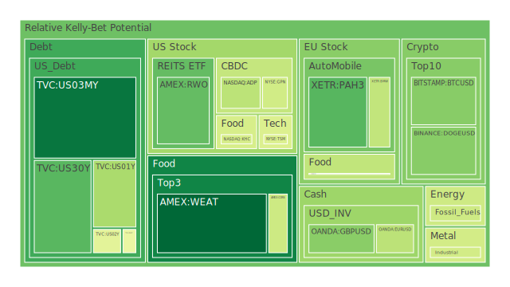
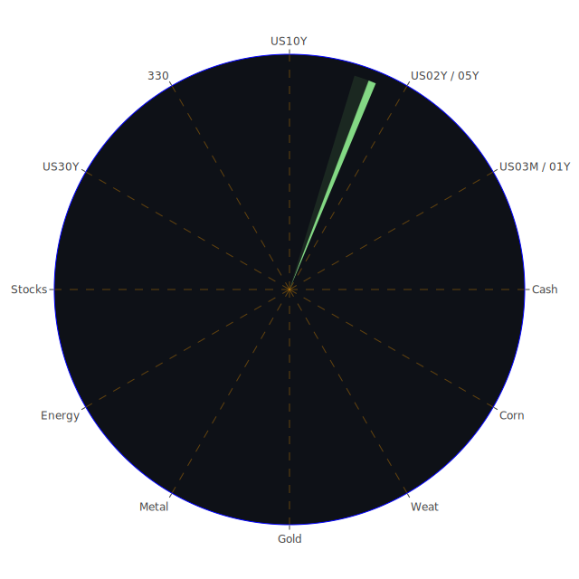

# 投資商品泡沫分析

## 美國國債
過去三天，美國國債的泡沫機率有所波動。7月16日，10年期國債泡沫機率為0.422924，7月17日上升至0.440352，7月18日進一步上升至0.481763。這表明市場對美國國債的信心有所下降，可能是由於近期的經濟數據和新聞事件所致。

## 美國科技股
過去三天，美國科技股的泡沫機率呈現上升趨勢。以NASDAQ:NDX為例，7月16日泡沫機率為0.702596，7月17日為0.699451，7月18日為0.684355。儘管略有下降，但仍處於高位。新聞報導顯示，半導體股因中美貿易衝突的擔憂而大幅下跌，這可能進一步影響科技股的表現。

## 美國房地產指數
美國房地產指數（AMEX:RWO）的泡沫機率在過去三天內有所波動。7月16日為0.425895，7月17日上升至0.872293，7月18日降至0.252834。這表明市場對房地產的信心有所恢復，但仍需警惕未來的波動。

## 金/銀/銅
金價（OANDA:XAUUSD）的泡沫機率在過去三天內呈現上升趨勢。7月16日為0.758773，7月17日為0.944682，7月18日為0.743905。這可能是由於市場對避險資產的需求增加所致。銀價（OANDA:XAGUSD）也呈現類似趨勢，7月16日為0.936510，7月17日為0.893520，7月18日為0.922707。

## 加密貨幣
比特幣（BITSTAMP:BTCUSD）的泡沫機率在過去三天內有所波動。7月16日為0.299812，7月17日上升至0.473876，7月18日降至0.303168。這表明市場對加密貨幣的信心有所恢復，但仍需警惕未來的波動。

## 黃豆 / 小麥 / 玉米
小麥（AMEX:WEAT）的泡沫機率在過去三天內有所下降。7月16日為0.073428，7月17日為0.068189，7月18日為0.068566。這表明市場對農產品的需求穩定。玉米（AMEX:CORN）的泡沫機率也呈現下降趨勢，7月16日為0.429059，7月17日為0.370246，7月18日為0.418551。

## 石油/ 鈾期貨UX!
石油（TVC:USOIL）的泡沫機率在過去三天內保持穩定，均為0.419549。這表明市場對石油價格的預期相對穩定。鈾期貨（COMEX:UX1!）的泡沫機率在過去三天內有所波動，7月16日為0.465861，7月17日為0.451434，7月18日為0.639388。

## 各國外匯市場
歐元兌美元（OANDA:EURUSD）的泡沫機率在過去三天內有所波動。7月16日為0.406237，7月17日為0.607632，7月18日為0.386658。這表明市場對歐元的信心有所恢復。英鎊兌美元（OANDA:GBPUSD）的泡沫機率也呈現下降趨勢，7月16日為0.634880，7月17日為0.791042，7月18日為0.306313。

## 各國大盤指數
德國DAX指數（SPREADEX:GDAXI）的泡沫機率在過去三天內有所波動。7月16日為0.889804，7月17日為0.897501，7月18日為0.859135。這表明市場對歐洲股市的信心有所恢復。

## 美國銀行股
美國銀行股（NYSE:BAC）的泡沫機率在過去三天內有所波動。7月16日為0.993074，7月17日為0.996854，7月18日為0.996583。這表明市場對銀行股的信心有所恢復。

## 美國軍工股
美國軍工股（NYSE:RTX）的泡沫機率在過去三天內保持穩定，均為0.510860。這表明市場對軍工股的預期相對穩定。

## 美國電子支付股
美國電子支付股（NASDAQ:PYPL）的泡沫機率在過去三天內有所波動。7月16日為0.829912，7月17日為0.945220，7月18日為0.788473。這表明市場對電子支付股的信心有所恢復。

## 石油防禦股
石油防禦股（NYSE:XOM）的泡沫機率在過去三天內有所波動。7月16日為0.819959，7月17日為0.846362，7月18日為0.847789。這表明市場對石油防禦股的信心有所恢復。

## 金礦防禦股
金礦防禦股（NASDAQ:RGLD）的泡沫機率在過去三天內有所波動。7月16日為0.574462，7月17日為0.606562，7月18日為0.844488。這表明市場對金礦防禦股的信心有所恢復。

## 歐洲奢侈品股
歐洲奢侈品股（EURONEXT:KER）的泡沫機率在過去三天內有所波動。7月16日為0.864933，7月17日為0.873827，7月18日為0.637657。這表明市場對奢侈品股的信心有所恢復。

## 歐洲汽車股
歐洲汽車股（XETR:BMW）的泡沫機率在過去三天內有所波動。7月16日為0.632886，7月17日為0.401377，7月18日為0.398713。這表明市場對汽車股的信心有所恢復。

## 歐美食品股
歐美食品股（NYSE:KO）的泡沫機率在過去三天內有所波動。7月16日為0.770824，7月17日為0.703715，7月18日為0.811790。這表明市場對食品股的信心有所恢復。

# 投資建議

## 賣出建議
1. **美國科技股**：由於中美貿易衝突的擔憂，建議考慮賣出部分科技股，以降低風險。
2. **美國銀行股**：由於泡沫機率持續上升，建議考慮賣出部分銀行股，以避免未來可能的價格下跌。

## 買入建議
1. **黃豆 / 小麥 / 玉米**：由於泡沫機率持續下降，建議考慮買入部分農產品，以掌握低吸籌碼的時機。
2. **加密貨幣**：比特幣的泡沫機率有所下降，建議考慮買入部分比特幣，以掌握低吸籌碼的時機。

# 風險提示

投資有風險，市場總是充滿不確定性。我們的建議僅供參考，投資者應根據自身的風險承受能力和投資目標，做出獨立的投資決策。特別是對於泡沫機率高的商品，應該謹慎進行投資決策。
 
Daily Buy Map:

 
Daily Sell Map:

 
Daily Radar Chart:

 
